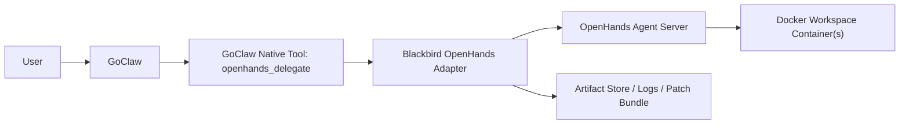

# OpenHands Remote Coding Specialist for GoClaw

Date: 2026-04-12

## 1. Executive Decision

Using OpenHands as a dedicated remote coding specialist for GoClaw is a viable
direction, but only if it is deployed as a separate execution service behind a
Blackbird-controlled adapter.

Recommended production shape:

```text
GoClaw (orchestrator / UX / approval authority)
  -> Blackbird OpenHands Adapter (stable API + auth + policy + artifact contract)
    -> OpenHands Agent Server (stateful coding runtime)
      -> Per-workspace Docker containers
```

Do **not** let GoClaw call a raw OpenHands UI process or a raw evolving internal
OpenHands runtime directly over the public internet.

Do **not** expose the OpenHands agent server directly as the public contract if
this is meant to become a long-lived Blackbird platform capability.

## 2. Why This Direction Is Attractive

OpenHands is specifically optimized for software work:

- it ships a dedicated agent SDK and remote agent server model for coding tasks
- it supports remote execution over HTTP and WebSocket streaming
- it is built for isolated workspaces and multi-user execution
- it has built-in action confirmation and layered security analyzers
- it already assumes Docker-backed workspace isolation, which fits coding-agent
  workloads better than a generic chat gateway

Official references:

- OpenHands Agent Server architecture:
  [docs.openhands.dev/sdk/arch/agent-server](https://docs.openhands.dev/sdk/arch/agent-server)
- OpenHands security and action confirmation:
  [docs.openhands.dev/sdk/guides/security](https://docs.openhands.dev/sdk/guides/security)
- OpenHands CLI modes and headless entry points:
  [docs.openhands.dev/openhands/usage/cli/quick-start](https://docs.openhands.dev/openhands/usage/cli/quick-start)

## 3. What You Gain

### 3.1 Better coding specialization

GoClaw today is a strong orchestrator, tool router, memory gateway, and
multi-agent shell. OpenHands is stronger as a sustained code worker for:

- multi-step implementation in a repo
- code editing and file iteration
- repeated fix-run-fix loops
- long-running code tasks with a dedicated workspace lifecycle
- specialized action confirmation and security analysis per tool action

### 3.2 Better fault isolation

Running the coding specialist outside GoClaw helps when:

- GoClaw hits loop-quality regressions
- you want to scale coding workloads independently
- you want a different model mix and timeout budget for code work
- you need a separate runtime host with more CPU/RAM/disk

### 3.3 Clearer separation of concerns

Best division of labor:

- GoClaw owns user session, memory, routing, approvals, product context
- OpenHands owns deep code execution, workspace mutation, artifact generation

This separation is cleaner than trying to turn GoClaw itself into the full code
execution engine for every heavy coding task.

## 4. What You Lose / What Gets Harder

### 4.1 New infrastructure surface area

You are introducing:

- one more service
- one more auth boundary
- one more event stream
- one more place where runs can hang
- one more storage/workspace lifecycle to operate

### 4.2 Workspace synchronization becomes the core problem

This is the real engineering problem, not “how to call an API”.

If GoClaw and OpenHands do not operate on the same repo state, you will get:

- edits applied against stale files
- diffs that do not match the user’s active branch
- test results that do not reproduce locally
- merge conflicts and invisible drift

### 4.3 The Docker socket trust boundary is serious

The OpenHands agent server model assumes Docker-backed workspaces. In practice,
that means the service managing workspaces is very high-trust. If you mount
`/var/run/docker.sock`, you are effectively giving that service host-level power.

That is why the safest production recommendation is:

- run OpenHands on a dedicated worker VM or dedicated Docker host
- do not co-host it casually beside your public app stack
- do not let it share sensitive host volumes with GoClaw

### 4.4 API coupling risk

OpenHands is evolving quickly. If GoClaw couples directly to OpenHands’ raw API,
you will absorb that volatility inside the GoClaw codebase.

This is the main reason to put a Blackbird adapter in front.

## 5. Recommendation

### 5.1 Recommended architecture

Use a dedicated Linux VM for OpenHands execution, but expose only a Blackbird
adapter as the public contract.

Recommended domains:

- `https://openhands.blackbirdzzzz.art`:
  public Blackbird adapter API for GoClaw and admin debugging
- `https://openhands-ui.blackbirdzzzz.art`:
  optional human UI later, disabled by default in MVP

Internal only:

- `http://openhands-agent-server:8000`:
  raw OpenHands service on private Docker network

### 5.2 Why the adapter is mandatory

The adapter gives you:

- stable Blackbird-owned API contract
- token verification and tenant scoping
- profile mapping from GoClaw task classes to OpenHands runtime/model config
- workspace sync policy
- artifact normalization
- retry / timeout / stuck-run policy
- future freedom to swap OpenHands version or even another code engine

Without the adapter, GoClaw becomes tightly coupled to OpenHands runtime
behavior, event format, authentication, and workspace semantics.

## 6. Integration Options and Decision

### Option A — GoClaw calls OpenHands directly

Pros:

- fastest to prototype
- fewer components

Cons:

- tight API coupling
- weak policy boundary
- harder to normalize artifacts and retries
- harder to swap runtime later

Verdict:

- acceptable for throwaway experiments
- not recommended for Blackbird production

### Option B — Expose OpenHands as MCP to GoClaw

Pros:

- conceptually aligned with “external tools”
- lighter integration vocabulary inside GoClaw

Cons:

- OpenHands is not a simple stateless tool
- stateful conversations, workspace lifecycles, diffs, logs, uploads, and
  streaming do not fit cleanly into a thin MCP function surface
- operational debugging gets much harder

Verdict:

- not recommended as the primary integration path

### Option C — Blackbird adapter in front of OpenHands

Pros:

- best contract stability
- clean security boundary
- easiest place to implement workspace sync and artifact packaging
- easiest place to enforce Blackbird conventions and quotas

Cons:

- one extra service to build and operate

Verdict:

- recommended

## 7. Detailed Technical Solution

## 7.1 Service topology



Responsibilities:

- GoClaw:
  routing, approval policy, user context, memory, UI, final synthesis
- `openhands_delegate` tool:
  one GoClaw-native tool for request/stream/result bridging
- adapter:
  normalization layer and trust boundary
- OpenHands:
  code worker runtime
- workspace container:
  actual repo execution and edits

## 7.2 Adapter API contract

Blackbird-owned API, not raw OpenHands API.

Suggested endpoints:

### `POST /v1/jobs`

Create a remote coding job.

Request shape:

```json
{
  "tenant_id": "blackbird",
  "request_id": "uuid",
  "caller": {
    "system": "goclaw",
    "agent_key": "coder",
    "user_id": "system"
  },
  "profile": "implement_deep",
  "workspace_mode": "git_ref",
  "repo": {
    "git_url": "git@github.com:org/repo.git",
    "branch": "feature/x",
    "commit": "abc123"
  },
  "task": {
    "title": "Implement X",
    "objective": "Detailed task prompt",
    "constraints": [
      "Do not push directly to main",
      "Run tests before finishing"
    ],
    "expected_outputs": [
      "patch",
      "test_report",
      "summary"
    ],
    "test_commands": [
      "go test ./...",
      "npm test -- --runInBand"
    ]
  },
  "timeouts": {
    "queue_sec": 30,
    "run_sec": 1800
  }
}
```

Response:

```json
{
  "job_id": "ohj_123",
  "status": "queued",
  "stream_url": "/v1/jobs/ohj_123/events",
  "result_url": "/v1/jobs/ohj_123"
}
```

### `GET /v1/jobs/{job_id}`

Returns normalized job state:

- `queued`
- `running`
- `waiting_approval`
- `succeeded`
- `failed`
- `cancelled`
- `timed_out`

### `GET /v1/jobs/{job_id}/events`

SSE or WebSocket stream with normalized events:

- `job.started`
- `workspace.ready`
- `agent.progress`
- `agent.request_approval`
- `agent.log`
- `artifact.ready`
- `job.completed`
- `job.failed`

### `POST /v1/jobs/{job_id}/approve`

Approve risky pending action if Blackbird policy allows human-in-loop.

### `POST /v1/jobs/{job_id}/cancel`

Terminate run and cleanup.

### `GET /v1/jobs/{job_id}/artifacts/{name}`

Download:

- `patch.diff`
- `summary.md`
- `test-report.json`
- `logs.ndjson`
- `final-result.json`

## 7.3 Workspace transport modes

This must be explicit from day one.

### Mode 1 — `git_ref` (recommended MVP)

OpenHands clones repo/branch itself.

Best for:

- onboarded repos
- clean branch-based development
- reproducible runs

Pros:

- stable and reproducible
- simplest operationally
- easiest to verify and replay

Cons:

- cannot see unstaged local-only edits unless they are pushed or bundled

### Mode 2 — `bundle_upload` (phase 2)

GoClaw uploads a tarball or selected file bundle, OpenHands works on that
snapshot, returns patch bundle.

Best for:

- dirty worktrees
- local-only repos
- non-Git source snapshots

Pros:

- flexible

Cons:

- significantly more complexity
- harder patch application story
- more upload/download overhead

Recommendation:

- start with `git_ref`
- add `bundle_upload` only after the core pipeline is stable

## 7.4 Output contract

OpenHands should never return only free-form text.

Minimum required artifacts:

- `summary.md`:
  what changed, why, residual risks
- `patch.diff`:
  unified diff or commit patch
- `test-report.json`:
  commands run, exit codes, key output excerpts
- `final-result.json`:
  machine-readable terminal state
- `logs.ndjson`:
  normalized execution log for audit/debug

Suggested `final-result.json`:

```json
{
  "job_id": "ohj_123",
  "status": "succeeded",
  "repo": {
    "branch": "feature/x",
    "base_commit": "abc123",
    "head_commit": null
  },
  "files_changed": [
    "internal/foo.go",
    "ui/web/src/bar.tsx"
  ],
  "tests": [
    {
      "command": "go test ./...",
      "exit_code": 0,
      "passed": true
    }
  ],
  "needs_human_review": true,
  "summary_artifact": "summary.md",
  "patch_artifact": "patch.diff"
}
```

## 7.5 GoClaw integration shape

### MVP integration

Add one native GoClaw tool:

- `openhands_delegate`

Parameters:

- `objective`
- `repo_url`
- `branch`
- `commit`
- `profile`
- `tests`
- `mode`
- `timeout_sec`

Behavior:

- submits remote job to adapter
- streams progress into GoClaw tool events
- returns normalized artifacts

### Recommended UX shape

Expose OpenHands to users through a dedicated predefined specialist agent:

- agent key: `openhands-coder`

This agent is still orchestrated by GoClaw, but its core action is to call
`openhands_delegate` instead of performing heavy code work locally.

Why this is better than exposing the tool alone:

- cleaner mental model
- compatible with existing GoClaw delegate patterns
- easier to permission and rate-limit

### Phase 2 shape

Make `openhands-coder` a first-class delegate target from `coder`, `architect`,
or team leads using the existing GoClaw `delegate` and agent link model.

## 7.6 Approval and safety model

There are four safety layers, not one:

### Layer 1 — GoClaw task gating

GoClaw should reject or downgrade tasks that are clearly outside policy before
they ever leave the platform.

### Layer 2 — Adapter policy rails

The adapter should enforce deterministic denies for:

- destructive host operations
- credential scraping
- infrastructure mutation outside allowed repo scope
- unsupported repo targets
- unapproved push/deploy actions

### Layer 3 — OpenHands security analyzer

OpenHands supports confirmation policies and security analyzers, including
deterministic pattern analyzers and confirmation thresholds.

Recommended baseline:

- deterministic analyzers enabled
- `ConfirmRisky(threshold=HIGH)`
- no direct auto-approval for high-risk actions

### Layer 4 — Workspace sandbox

Per-workspace Docker constraints:

- CPU/memory limits
- disk quota
- idle timeout
- network disabled by default or allowlisted
- no host secret mounts

## 7.7 Identity, auth, and tenancy

Recommended auth:

- public adapter endpoint protected by Blackbird-issued bearer token or
  Cloudflare Access service token
- raw OpenHands agent server is private on Docker network
- adapter maps caller identity to workspace namespace and quota bucket

Recommended tenancy keys:

- `tenant_id`
- `project_id`
- `repo_slug`
- `user_id`
- `goclaw_session_key`
- `goclaw_run_id`

These keys must appear in adapter logs and job records for correlation.

## 7.8 Observability

Minimum observability requirements:

- request log with `job_id`, `goclaw_run_id`, `repo_slug`, `profile`
- streaming event log
- artifact manifest log
- workspace lifecycle log
- failure category:
  `auth`, `workspace`, `llm`, `timeout`, `approval`, `artifact`, `network`
- Prometheus metrics:
  run count, success rate, duration, queue depth, active workspaces, stuck jobs

## 7.9 Deployment topology on Linux VM

Recommended VM role:

- dedicated OpenHands worker VM

Docker Compose stack:

- `bb-openhands-adapter`
- `openhands-agent-server`
- `redis` for queue/state
- optional `postgres` if adapter state outgrows SQLite
- reverse proxy if not terminating TLS elsewhere

Important:

- only the OpenHands agent server gets Docker socket access
- adapter should not get Docker socket access
- workspaces stored on a dedicated volume with retention policy

## 7.10 Domain and network recommendation

Recommended production routing:

```text
openhands.blackbirdzzzz.art -> reverse proxy -> bb-openhands-adapter
bb-openhands-adapter -> internal Docker network -> openhands-agent-server:8000
```

Optional later:

```text
openhands-ui.blackbirdzzzz.art -> OpenHands UI or admin console
```

Security recommendations:

- Cloudflare proxied DNS
- Cloudflare Access service token or mTLS for machine-to-machine calls
- rate limit on public endpoint
- IP allowlist for admin paths
- no direct public access to raw agent server

## 8. Rollout Strategy

### Stage 1 — isolated pilot

- one repo only
- one specialist profile only
- no auto-push, no auto-deploy
- patch and summary only

### Stage 2 — delegated coding worker

- GoClaw can route selected code tasks automatically
- limited test execution allowed
- human approval still required for risky actions

### Stage 3 — production-grade specialist

- multi-profile routing
- persistent artifacts
- SLOs, quotas, stuck-run recovery, dashboard integration

## 9. Key Design Rules

These are the rules I recommend locking before implementation:

1. GoClaw remains the orchestrator, never the thin proxy.
2. OpenHands is an execution specialist, not the platform brain.
3. The public contract belongs to Blackbird, not raw OpenHands.
4. `git_ref` is the only MVP workspace mode.
5. No direct push to protected branches in MVP.
6. No direct production deploy from OpenHands in MVP.
7. No public exposure of raw OpenHands agent server.
8. No co-hosting with sensitive production services unless you accept the
   Docker-socket trust boundary explicitly.

## 10. Bottom-Line Recommendation

The proposed direction is good, but only in this refined form:

- deploy OpenHands on a dedicated Linux VM or dedicated Docker host
- put a Blackbird adapter in front of it
- expose the adapter at `openhands.blackbirdzzzz.art`
- keep raw OpenHands private
- integrate GoClaw through a native tool plus a dedicated `openhands-coder`
  specialist agent
- ship MVP in `git_ref` mode with artifact-return workflow, not direct push or
  deploy

That gives you the upside of OpenHands without letting its operational and API
complexity leak directly into the GoClaw core.
