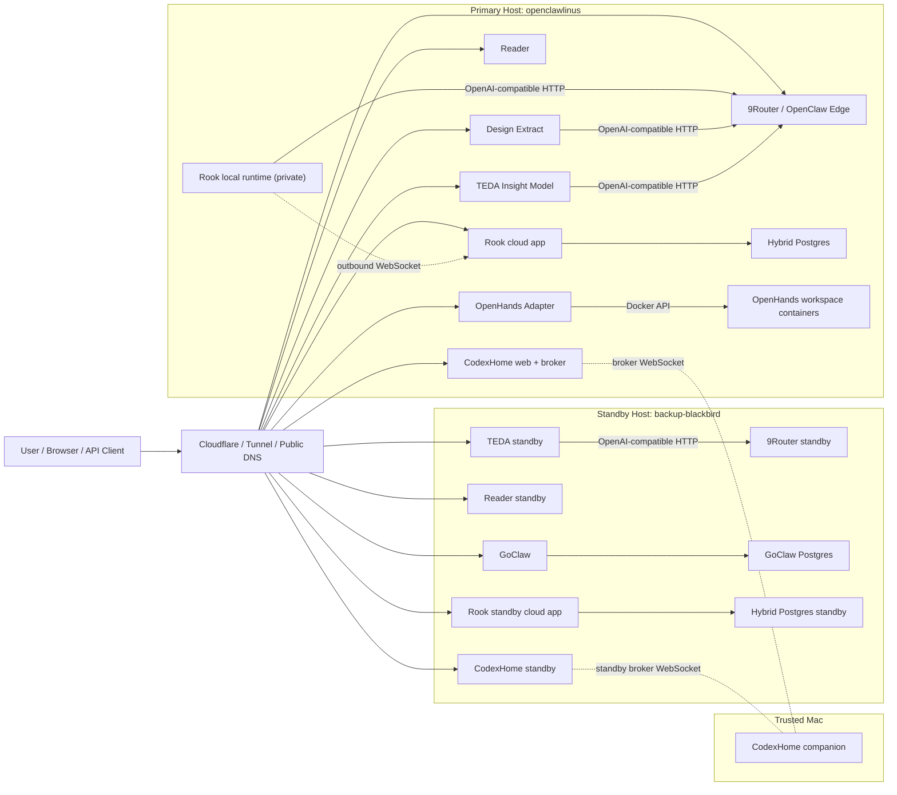
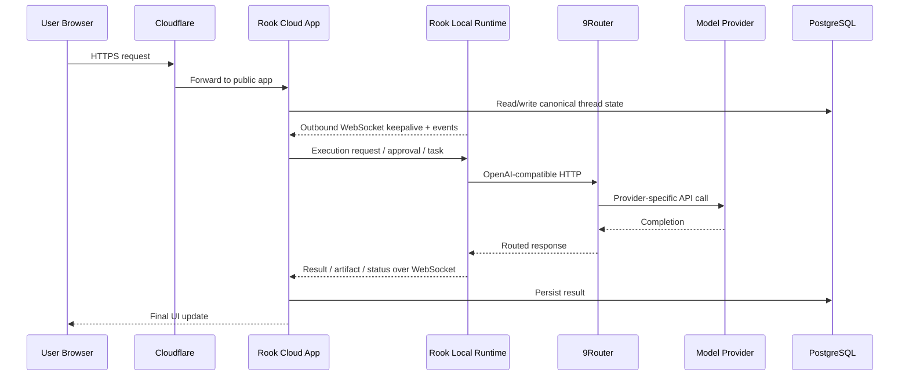
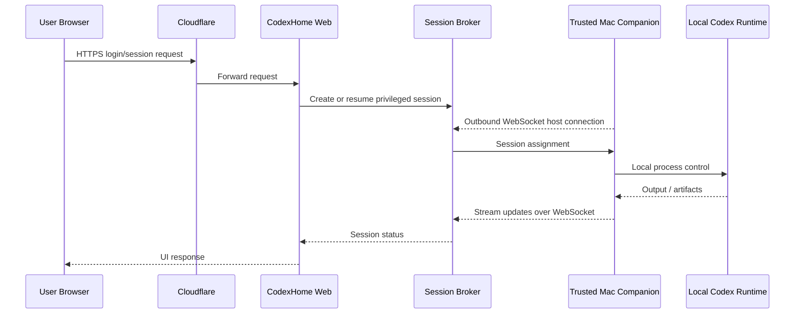

# Ban do Production Blackbird hien tai

_Verified on April 12, 2026 from live public health checks plus running host inventory on `openclawlinus` and `backup-blackbird`._

## Easy view

Neu nhin don gian, production hien tai giong mot cum co 2 tang:

- Tang 1 la **cua truoc cho nguoi dung**: domain public di qua Cloudflare roi vao web app hoac API.
- Tang 2 la **may thuc thi o ben trong**: mot host primary tren `openclawlinus`, mot host standby tren `backup-blackbird`, va mot vai runtime private khong mo truc tiep ra Internet.

Khong phai moi app deu noi truc tiep voi nhau. Hien tai co 3 kieu lien ket chinh:

1. **HTTPS / HTTP API** cho browser va public app.
2. **WebSocket outbound** cho runtime private noi vao cloud app.
3. **OpenAI-compatible HTTP** de nhieu app dung chung mot LLM gateway la `9router.blackbirdzzzz.art`.

Noi ngan gon:

- `Rook` la app hybrid co cloud app public va runtime private.
- `9Router` la cong vao chung cho traffic LLM.
- `Reader`, `TEDA`, `CodexHome` co primary + standby.
- `Design Extract` va `OpenHands Adapter` dang chay tren primary.
- `GoClaw` dang chay standalone tren standby host.
- `social-listening-v3` hien la entry legacy, public route dang loi `502`, nen khong thuoc active production set nua.

## System picture

## Inventory by app

| App / public name | Host hien tai | Vai tro | Cach no noi chuyen |
| --- | --- | --- | --- |
| `rook.blackbirdzzzz.art` | Primary: `openclawlinus`; standby cloud node: `backup-blackbird` | Public cloud app cho hybrid agent platform | Browser vao qua `HTTPS`; runtime private noi vao cloud bang `outbound WebSocket`; cloud app ghi state vao PostgreSQL; runtime goi `9Router` bang OpenAI-compatible HTTP |
| `9router.blackbirdzzzz.art` | Primary: `openclawlinus`; standby: `backup-blackbird` | Shared LLM gateway / router | Cac app khac goi qua `HTTP` kieu OpenAI-compatible, thay vi moi app giu mot layer provider rieng |
| `reader.blackbirdzzzz.art` | Primary: `openclawlinus`; standby: `backup-blackbird` | Reader/public article surface | Browser vao qua `HTTPS`; active/passive failover qua host standby |
| `design-extract.blackbirdzzzz.art` | `openclawlinus` | Web console + API wrapper quanh CLI pipeline | Browser vao qua `HTTPS`; backend goi `9Router` bang OpenAI-compatible HTTP |
| `teda.blackbirdzzzz.art` | Primary: `openclawlinus`; standby: `backup-blackbird` | TEDA assistant/model app | Browser/API vao qua `HTTPS`; model traffic route qua `9Router` |
| `codexhome.blackbirdzzzz.art` | Primary: `openclawlinus`; standby: `backup-blackbird`; companion tren Trusted Mac | Privileged remote Codex boundary | Browser vao web qua `HTTPS`; web noi voi session broker; Trusted Mac noi outbound `WebSocket` vao broker |
| `openhands.blackbirdzzzz.art` | `openclawlinus` | Adapter layer cho OpenHands-style jobs | Public caller vao qua `HTTPS`; adapter noi local service bang `HTTP`; adapter dung Docker API de spin workspace/job runtimes |
| `goclaw.blackbirdzzzz.art` | `backup-blackbird` | Standalone AI gateway + dashboard | Browser/API vao qua `HTTPS`; chat client co the vao `HTTP API` hoac `WebSocket /ws`; backend ghi vao PostgreSQL + pgvector |

## Main flow

### 1. Luong chinh cua Rook

`Rook` la app co kien truc “mat tien cloud, nha may runtime”.

### 2. Luong chinh cua CodexHome

`CodexHome` khong phai app chat public thong thuong. No la mot “cau noi an toan” giua browser va mot companion dang song o may Mac tin cay.

## Technical terms

- **Primary host**: may chay service chinh trong ngay thuong. Hien tai la `openclawlinus`.
- **Standby host**: may dung san de failover. Hien tai la `backup-blackbird`.
- **Cloudflare Tunnel**: cach dua service local ra public domain ma khong mo cong truc tiep.
- **OpenAI-compatible HTTP**: API layer co hinh dang giong OpenAI `/v1`, de app doi gateway ma khong doi nhieu code.
- **Outbound WebSocket**: runtime private tu chu dong ket noi ra cloud app. Cach nay an toan hon viec mo cong de cloud chui vao runtime.
- **PostgreSQL sidecar**: database container chay kem app tren cung host.
- **pgvector**: extension PostgreSQL de luu vector cho semantic search.

## Verified public signals

- `https://goclaw.blackbirdzzzz.art/health` -> `200`
- `https://design-extract.blackbirdzzzz.art/healthz` -> `200`
- `https://rook.blackbirdzzzz.art/healthz` -> `200`
- `https://rook.blackbirdzzzz.art/api/runtime/health` -> runtime connected and routing through `9Router`
- `https://openhands.blackbirdzzzz.art/health` -> healthy JSON response
- `https://reader.blackbirdzzzz.art/api/health` -> `200`
- `https://teda.blackbirdzzzz.art/healthz` -> `200`
- `https://codexhome.blackbirdzzzz.art/healthz` -> `200`
- `https://codexhome-standby.blackbirdzzzz.art/healthz` -> `200`
- `https://social-listening-v3.blackbirdzzzz.art/api/health/status` -> `502`

## What is active, and what is not

### Active production set

- `Rook`
- `9Router`
- `Reader`
- `Design Extract`
- `TEDA Insight Model`
- `CodexHome`
- `OpenHands Adapter`
- `GoClaw`

### Khong nen coi la active production hien tai

- `social-listening-v3.blackbirdzzzz.art`
  Hien la legacy ChiaseGPU entry. Public health dang tra `502`, va inventory hien tai danh dau no la `retired-chiasegpu`.
- `live-browser.blackbirdzzzz.art`
  Thuoc cung nhom legacy voi `social-listening-v3`, khong nam trong active Linux VM production set.
- `macvm`
  Da xac nhan co the SSH vao, nhung khong thay production container stack. Vai tro cua no hien tai la companion/trusted device, khong phai cloud host production.

## What this means in practice

1. Production hien tai khong phai mot monolith. No la mot **fleet** co nhieu app doc lap, nhung chia se mot so ha tang chung nhu Cloudflare, standby pattern, va `9Router`.
2. Thanh phan “dinh nhau” nhat hien tai la:
   - `Rook runtime -> 9Router`
   - `Design Extract -> 9Router`
   - `TEDA -> 9Router`
   - `CodexHome broker <-> Trusted Mac companion`
3. `GoClaw` dang ton tai nhu mot he thong gateway rieng, khong thay dau hieu no dang lam backend cho `Rook` hay `CodexHome` trong topology active vua verify.
4. `social-listening-v3` nen duoc xem la inventory lich su, khong nen ve no nhu mot service active trong so do production hien tai.

## Quick takeaway

Neu phai mo ta bang ngon ngu rat doi thuong:

- `openclawlinus` la nha may chinh.
- `backup-blackbird` la nha may du phong va dong thoi dang nuoi `GoClaw`.
- `9Router` la tong dai model dung chung.
- `Rook` la app hybrid co cloud mat tien va runtime private.
- `CodexHome` la cau noi an toan den may Mac tin cay.
- `Reader`, `Design Extract`, `TEDA`, `OpenHands Adapter` la cac app/public service xep quanh cum do.
