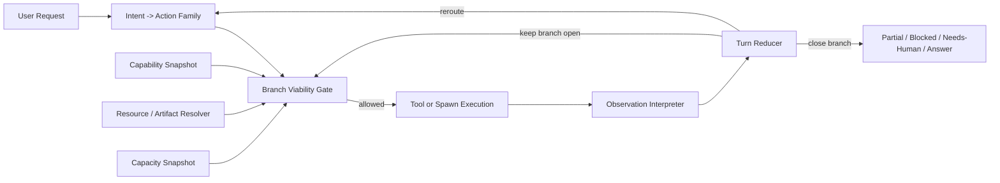

# Branch Viability Control for GoClaw

**Date:** April 12, 2026  
**Author:** Codex  
**Status:** Design review note  
**Audience:** Runtime/agent architects, loop/orchestration maintainers, production reliability reviewers  
**Repository:** `goclaw`  
**Related design spec:** [CP-09-capability-gating-state-policy.md](./CP-09-capability-gating-state-policy.md)

---

## Executive Summary

GoClaw currently has a solid **late-stage safety system**:

- it can detect repeated no-progress tool loops
- it can force answer-only closeout
- it can produce honest partial or blocked outputs instead of leaking raw guard text

That is a real improvement over the previous behavior. However, the production sessions reviewed on April 12, 2026 show that the system still fails one level earlier in the control loop:

> The runtime does not yet own branch viability strongly enough.

In practice, the LLM is still allowed to keep exploring a branch that has already become non-viable, low-signal, or capacity-exhausted. The runtime stops it eventually, but only after a lot of wasted steps.

This note describes:

1. the concrete failures observed in production
2. the current GoClaw runtime model and its strengths
3. the architectural gap behind those failures
4. the proposed design: **Branch Viability Control**
5. why this design is preferable to narrower case-by-case patches
6. a staged implementation plan suitable for expert review

The short version is:

- **Current runtime behavior**: detect loops late, close out honestly
- **Required next step**: detect non-viable branches early, reroute or terminate them before the LLM keeps retrying

---

## Why This Note Exists

Three separate production sessions exposed different symptoms that share the same control-system flaw:

1. a local Git bootstrap branch kept running after the runtime already had enough evidence that `git` was missing
2. a remote repo-inspection branch kept re-reading low-signal GitHub page artifacts instead of moving to a more useful retrieval path or summarizing
3. a parallel research branch kept trying to spawn more subagents after the runtime had already hit the per-parent child limit

At first glance these look like independent bugs:

- tool missing
- bad HTML extraction
- subagent quota exhaustion

But from an Agentic OS perspective they are the same class of failure:

> the model keeps choosing actions from a branch that the runtime should already know is not worth continuing.

That is why the fix should not be a set of isolated heuristics. It should be a runtime design change.

---

## Current System Context

This section summarizes the current GoClaw runtime architecture as it exists today, specifically the pieces relevant to the observed failures.

### 1. Shared pipeline run state

The v3 pipeline stores per-turn state in [`internal/pipeline/run_state.go`](../../internal/pipeline/run_state.go).

Current relevant properties:

- `RunState` carries:
  - `Input`
  - `Workspace`
  - `Model`
  - `Provider`
  - `Messages`
  - per-stage substates such as `Think`, `Tool`, `Observe`, `Compact`, `Turn`
- `Turn` is already a runtime-owned concept, not just a loose text convention

Relevant code:

- [`internal/pipeline/run_state.go:11`](../../internal/pipeline/run_state.go:11)

### 2. Existing turn state and closeout

GoClaw already has a good start on runtime-owned completion semantics in [`internal/pipeline/turn_state.go`](../../internal/pipeline/turn_state.go).

Today it already supports:

- `running`
- `partial`
- `blocked`
- `needs_human`
- `completed`

And it already supports forced closeout reasons such as:

- `read_only_budget_exhausted`
- `no_progress_loop`
- `tool_budget_exhausted`

This is one of the strongest existing pieces of the system because it moves completion ownership out of prompt wording and into runtime state.

Relevant code:

- [`internal/pipeline/turn_state.go:8`](../../internal/pipeline/turn_state.go:8)
- [`internal/pipeline/turn_state.go:30`](../../internal/pipeline/turn_state.go:30)

### 3. Existing tool metadata

GoClaw also has coarse tool metadata in [`internal/tools/capability.go`](../../internal/tools/capability.go).

Current capability classes are:

- `read-only`
- `mutating`
- `async`
- `mcp-bridged`

This is useful, but it is not enough to drive branch viability because it says nothing about:

- whether `git` is actually available in the runtime
- whether GitHub is reachable
- whether README retrieval succeeded
- whether the subagent quota is full
- whether the current branch is producing new evidence

Relevant code:

- [`internal/tools/capability.go:5`](../../internal/tools/capability.go:5)
- [`internal/tools/capability.go:15`](../../internal/tools/capability.go:15)

### 4. Existing loop protection

Tool execution is routed through [`internal/agent/loop_pipeline_tool_callbacks.go`](../../internal/agent/loop_pipeline_tool_callbacks.go), and tool-stage exit conditions are checked in [`internal/pipeline/tool_stage.go`](../../internal/pipeline/tool_stage.go).

Important current behaviors:

- every tool result is recorded as an observation string
- loop-kill conditions can be promoted into runtime closeout
- tool-call budget exhaustion can switch the turn into answer-only mode

Relevant code:

- [`internal/agent/loop_pipeline_tool_callbacks.go:18`](../../internal/agent/loop_pipeline_tool_callbacks.go:18)
- [`internal/agent/loop_pipeline_tool_callbacks.go:179`](../../internal/agent/loop_pipeline_tool_callbacks.go:179)
- [`internal/pipeline/tool_stage.go:213`](../../internal/pipeline/tool_stage.go:213)

### 5. Existing targeted recovery heuristic

GoClaw has at least one specific recovery heuristic for read-only shell probing in [`internal/agent/exec_probe_recovery.go`](../../internal/agent/exec_probe_recovery.go).

That heuristic is useful, but it demonstrates the current architectural problem:

- it is narrow
- it is tool-specific
- it reacts after a pattern already happened
- it does not generalize to other branch types such as repo inspection or spawn admission

Relevant code:

- [`internal/agent/exec_probe_recovery.go:12`](../../internal/agent/exec_probe_recovery.go:12)
- [`internal/agent/exec_probe_recovery.go:86`](../../internal/agent/exec_probe_recovery.go:86)

### 6. Existing subagent admission limit

The `spawn` tool already has a hard runtime ceiling in [`internal/tools/subagent_spawn.go`](../../internal/tools/subagent_spawn.go).

Current admission checks include:

- max depth
- max concurrent subagents
- max children per parent agent

Specifically, the current per-parent admission failure is emitted at:

- [`internal/tools/subagent_spawn.go:57`](../../internal/tools/subagent_spawn.go:57)
- [`internal/tools/subagent_spawn.go:64`](../../internal/tools/subagent_spawn.go:64)

This is a good safety boundary. The problem is not that the boundary does not exist. The problem is that the runtime does not yet propagate that boundary into branch policy strongly enough, so the LLM keeps trying to spawn again.

---

## Production Sessions Reviewed

The following sessions were reviewed from production on April 12, 2026.

### Session A: Missing local prerequisites, repeated local bootstrap attempts

**Session key:** `agent:coder:ws:direct:170b6e5b-5b52-438e-b4f2-07be21a274d9`  
**Trace run_id:** `1a0621ce-92f4-4bca-857f-3a1a86a8e214`

Observed behavior:

- user asked what auth/setup would be required to work on a GitHub repo
- the agent inspected repo visibility and then ran environment probes
- after learning the environment lacked `git`, it still retried `git clone`
- the same local-bootstrap branch kept running even after the runtime had decisive blocker evidence
- the loop ended only after no-progress detection and forced closeout

Key signal:

- the environment effectively returned `sh: git: not found`
- the runtime eventually closed out, but too late

Correct behavior should have been:

- detect `git` is unavailable
- block the `repo_bootstrap_local` branch
- reroute to either:
  - `explain_setup`
  - `repo_inspect_remote`
  - or an explicit “you need Git/GH available in this runtime” answer

### Session B: Re-reading low-signal repo page artifacts

**Session key:** `agent:coder:ws:direct:8bcebd84-fd62-4620-a050-3982964d03d4`  
**Trace run_id:** `48fc19ce-3b59-46d0-b331-e06e1b13c6f0`

Observed behavior:

- user asked: “read the repo and tell me what it is”
- the agent repeatedly consumed low-signal GitHub page content
- the evidence contained generic site chrome such as sign-in prompts and GitHub page wrapper content
- the retrieval path did not converge on high-signal artifacts like repository metadata or README
- the runtime eventually stopped the turn using read-only streak closeout

Key signal:

- repeated read-only calls with little or no novelty
- the final partial answer quoted raw low-value page artifacts

Correct behavior should have been:

- classify the URL as a `repo_root`
- resolve a repository-specific artifact plan
- fetch:
  - repo metadata
  - README
  - tree summary
- stop retrieval as soon as enough evidence existed to describe the repo

### Session C: Hitting subagent capacity and still trying to spawn

**Session key:** `agent:coder:ws:direct:7da22894-9bbc-4611-be43-34377fc45e1b`  
**Trace run_id:** `ad23d16e-5b9b-4e99-bc3c-527791262a38`

Observed behavior:

- the agent correctly recognized a large research task
- it successfully spawned five subagents
- after the parent-agent child limit was reached, the runtime returned:
  - `max children per agent reached (5/5)`
- the agent still attempted additional `spawn` calls
- the runtime finally stopped it with no-progress closeout

Key signal:

- the runtime already had decisive capacity information
- but the branch policy did not use that information to terminate the `spawn_more_workers` path

Correct behavior should have been:

- stop spawning immediately after the first capacity-exhausted result
- keep the existing children running
- switch the parent to coordinator fallback mode:
  - synthesize locally
  - or wait for subagent completion events

---

## The Common Failure Pattern

These incidents are not three unrelated bugs. They are one architectural gap showing up in three different domains.

### Common pattern

1. the runtime gets decisive evidence that the current branch is non-viable or low-value
2. that evidence exists only as tool output text or a narrow heuristic
3. the LLM remains free to keep selecting actions from the same branch
4. the runtime steps in only later via generic loop protection

### The real issue

The current GoClaw loop is stronger at **stopping bad loops** than at **preventing the loop from remaining selectable after decisive evidence has arrived**.

In other words:

- current system strength: late safety
- current system gap: early branch viability control

---

## Problem Statement

GoClaw needs a runtime subsystem that decides, per turn:

- which branches are viable
- which branches are blocked
- which branches are exhausted
- which branches should reroute

That subsystem must be runtime-owned, typed, traceable, and independent of prompt wording.

Without it, the system keeps drifting toward heuristic accumulation:

- one fix for read-only shell probes
- one fix for GitHub page loops
- one fix for subagent quota loops
- and eventually one fix per repeated symptom

That is not sustainable and does not match Agentic OS principles.

---

## Proposed Design: Branch Viability Control

### Core idea

Add a runtime subsystem that governs whether an action branch is still worth exploring.

The runtime should make branch-level decisions based on four kinds of state:

1. **Capability truth**
2. **Resource/artifact truth**
3. **Capacity truth**
4. **Evidence novelty**

The LLM should still reason, but only within the currently viable branch set.

### High-level architecture



---

## Why This Is the Right Abstraction

The proposed abstraction is intentionally broader than any single bug.

It is meant to cover:

- missing binaries
- policy denial
- low-signal retrieval loops
- repeated artifact misses
- subagent quota exhaustion
- future cases such as:
  - network unreachable
  - unavailable delegate path
  - empty workspace
  - exhausted approval budget

This is what makes it an Agentic OS design, rather than a patch set.

---

## Proposed Runtime Model

### 1. Action Family

Every meaningful turn should resolve into one or more action families.

Examples:

- `explain_setup`
- `repo_bootstrap_local`
- `repo_inspect_remote`
- `repo_delegate`
- `market_research_parallel`
- `spawn_more_workers`
- `coordinator_local_synthesis`

The purpose is not to create a symbolic planner. The purpose is to give the runtime a stable vocabulary for branch management.

### 2. Capability Snapshot

This captures static or semi-static runtime facts such as:

- `binary.git = available | missing | blocked | unknown`
- `binary.gh = available | missing | blocked | unknown`
- `delegate.openhands = available | unavailable`
- `workspace.present = true | false`
- `workspace.writable = true | false`

This should be stored in run state, not inferred ad hoc from tool output each time.

### 3. Resource / Artifact Resolver

This captures what kind of external object the user is asking about and what artifacts should be preferred.

Examples:

- `repo_root`
- `raw_markdown_file`
- `article_page`
- `generic_html_page`

For `repo_root`, the runtime should not let the LLM keep treating it as just another webpage. It should generate a repository-specific artifact plan.

### 4. Capacity Snapshot

This captures dynamic admission information such as:

- subagent available slots
- per-parent child limit remaining
- depth limit remaining

The runtime already knows this internally at spawn time. The problem is that this knowledge is not yet promoted into stable branch policy state.

### 5. Observation Interpreter

All tool results should be normalized into typed observations.

Examples:

- `missing_prereq(binary=git)`
- `policy_blocked(command=...)`
- `repo_public`
- `repo_readme_resolved`
- `low_signal_html`
- `artifact_miss(readme)`
- `capacity_exhausted(kind=subagent_children)`

This should happen centrally, not through many small string-matching helpers.

### 6. Branch Policy Engine

This component decides whether an action family is:

- `open`
- `blocked`
- `exhausted`
- `satisfied`

It should combine:

- preconditions
- observations
- novelty budget
- capacity constraints

### 7. Turn Reducer

The reducer owns turn transitions such as:

- `running -> blocked`
- `running -> needs_human`
- `running -> partial`
- `running -> completed`

Critically, it also owns family-level transitions such as:

- `repo_bootstrap_local -> blocked`
- `repo_inspect_remote -> exhausted`
- `spawn_more_workers -> blocked`
- `coordinator_local_synthesis -> open`

---

## Proposed Data Model

The concrete data model proposal is already sketched in [CP-09](./CP-09-capability-gating-state-policy.md). This note extends that proposal in two ways:

- resource-aware retrieval
- subagent admission-aware orchestration

### A. Runtime branch state

Per run, maintain:

```go
type ActionFamilyStatus string

const (
    ActionFamilyOpen      ActionFamilyStatus = "open"
    ActionFamilyBlocked   ActionFamilyStatus = "blocked"
    ActionFamilyExhausted ActionFamilyStatus = "exhausted"
    ActionFamilySatisfied ActionFamilyStatus = "satisfied"
)
```

Stored in turn state:

- current family
- known families
- status per family
- blockers per family

### B. Capability state

Per run, maintain:

- capability key
- status
- evidence
- source

The first implementation should remain runtime-only and write only compact summaries into trace metadata.

### C. Resource state

Per run, maintain:

- resource kind
- resolved artifact plan
- artifacts attempted
- artifact success/failure
- signal score

Example:

```go
type ResourceKind string

const (
    ResourceRepoRoot    ResourceKind = "repo_root"
    ResourceRawMarkdown ResourceKind = "raw_markdown"
    ResourceGenericPage ResourceKind = "generic_page"
)
```

### D. Capacity state

Per run, maintain:

- available spawn slots
- child limit remaining
- concurrent limit remaining
- depth limit remaining

This allows the runtime to treat `capacity_exhausted` as a branch policy fact, not just a transient tool error.

### E. Evidence state

Per branch, maintain:

- whether a tool result added novel evidence
- number of consecutive non-novel steps
- last high-signal artifact resolved

This enables semantic no-progress detection instead of exact command repetition only.

---

## Required New Subsystems

### 1. Branch viability gate

This is the new runtime gate that sits before the next action is exposed to the LLM.

Responsibilities:

- evaluate current branch preconditions
- evaluate whether the branch is already exhausted
- hide non-viable branches from the tool/action surface
- reroute if an alternate branch is available

### 2. Resource-aware retrieval

This is needed specifically for failures like the repo-page loop.

Responsibilities:

- classify external URLs into resource kinds
- map resource kind to artifact plans
- prefer high-signal artifacts over generic page fetches
- mark repeated low-signal fetches as branch exhaustion evidence

### 3. Subagent admission-aware orchestration

This is needed specifically for failures like the `spawn` quota loop.

Responsibilities:

- surface capacity facts before the next spawn attempt
- terminate `spawn_more_workers` when capacity is exhausted
- open `coordinator_local_synthesis` or `wait_for_children` instead

---

## How the Proposed Design Handles Each Observed Failure

### Failure A: Missing `git`, repeated local bootstrap attempts

#### Current behavior

- environment probe discovers or implies `git` missing
- model still tries `git clone`
- runtime eventually stops the loop

#### Proposed behavior

1. capability snapshot marks `binary.git=missing`
2. observation interpreter emits `missing_prereq(binary=git)`
3. branch policy engine marks `repo_bootstrap_local=blocked`
4. tool surface for that branch is removed
5. turn reroutes to:
   - `explain_setup`, or
   - `repo_inspect_remote`, or
   - `repo_delegate`

#### Why this is better

Because the branch becomes non-selectable after decisive evidence arrives.

---

### Failure B: Repo page re-read loop

#### Current behavior

- generic page fetch returns low-signal HTML/chrome
- model keeps reading
- runtime eventually hits read-only closeout

#### Proposed behavior

1. URL classified as `repo_root`
2. artifact plan generated:
   - metadata
   - README
   - tree summary
3. observation interpreter scores outputs:
   - `repo_metadata_resolved`
   - `repo_readme_resolved`
   - or `low_signal_html`
4. after repeated low-signal results, `repo_inspect_remote=exhausted`
5. runtime closes that branch and answers from evidence already gathered

#### Why this is better

Because the system stops asking the model to solve a resource-selection problem that belongs to the runtime.

---

### Failure C: Subagent child limit loop

#### Current behavior

- five child spawns succeed
- `spawn` returns `max children per agent reached (5/5)`
- model still attempts more spawns
- runtime eventually stops the loop

#### Proposed behavior

1. spawn failure emits `capacity_exhausted(subagent_children)`
2. capacity snapshot marks:
   - `subagent.child_slots = 0`
3. branch policy engine marks `spawn_more_workers=blocked`
4. runtime activates:
   - `coordinator_local_synthesis`, or
   - `wait_for_children`
5. the LLM no longer sees spawning as a viable immediate branch

#### Why this is better

Because the admission control boundary becomes part of the planning state, not just a tool error.

---

## Why Ad Hoc Fixes Are Not Enough

There are several tempting fixes that should be explicitly rejected.

### Bad fix 1: Lower the read-only threshold

This only changes when the system stops wasting effort. It does not change why the wrong branch remained viable.

### Bad fix 2: Add more prompt warnings

Prompt warnings are advisory. The failures reviewed here require enforcement by runtime state.

### Bad fix 3: Add case-specific string checks everywhere

Examples:

- if output contains `git: not found`, tell the model to stop
- if output contains `Sign in`, assume GitHub page chrome
- if output contains `5/5`, tell the model not to spawn again

This will work temporarily, but it creates a fragmented recovery layer and does not scale.

### Bad fix 4: Ban certain tools broadly

Examples:

- “just stop using `spawn` so much”
- “disable web fetch for repo URLs”
- “ban `exec`”

These avoid symptoms at the cost of reducing legitimate capability.

### Bad fix 5: Store raw tool output as the final evidence summary

This is how a partial answer can remain technically honest yet operationally weak.

The runtime should summarize the evidence into structured state first, then close out from that state.

---

## Why the Proposed Design Fits Agentic OS Principles

The design is aligned with core Agentic OS principles in the following ways.

### 1. Runtime owns truth, model owns reasoning

The model should not need to rediscover environment facts, capacity constraints, or resource kinds by repeated trial.

### 2. State must be typed, not inferred from prose

This is already partially true in current `TurnState`, and the proposal extends that principle to:

- capability truth
- resource truth
- capacity truth
- evidence novelty
- branch status

### 3. No-progress must be semantic

Exact repeat detection is not enough.

The following are different commands but the same failed branch:

- `git --version`
- `gh auth status`
- `git clone ...`

The following are different fetches but the same failed retrieval branch:

- GitHub root page
- overflow file from the same page
- another wrapper page from the same repo URL

The following are different spawn prompts but the same failed orchestration branch:

- spawn task A
- spawn task B
- spawn task C

once capacity is already exhausted

### 4. Closeout is not the planner

The current closeout logic is valuable and should remain. But it should be the last safety layer, not the primary way the system learns that a branch is bad.

---

## Interaction with Existing GoClaw Components

The proposal is intentionally additive and compatible with the current runtime architecture.

### Existing components to retain

- `TurnState` partial/blocked/needs-human/completed model
- loop-kill promotion to closeout
- tool budget closeout
- tracing and session persistence
- tool metadata

### Components to extend

- `RunState`
  - add capability, resource, capacity, branch, and evidence state
- tool result processing
  - add centralized observation interpretation
- tool filtering
  - filter based on viable branch, not only static policy
- finalize
  - use summarized evidence rather than raw last observation

### Components to add

- branch viability gate
- resource resolver
- capacity snapshot
- evidence novelty tracker
- branch reducer

---

## Proposed Interface Set

The CP-09 document already defines most of the runtime-facing interfaces. This note recommends the following final interface set.

### Capability snapshotter

```go
type CapabilitySnapshotter interface {
    Seed(ctx context.Context, state *pipeline.RunState) error
    UpdateFromObservation(state *pipeline.RunState, facts []pipeline.ObservationFact)
}
```

### Resource resolver

```go
type ResourceResolver interface {
    Classify(input string, state *pipeline.RunState) ResourceKind
    BuildArtifactPlan(kind ResourceKind, input string, state *pipeline.RunState) ArtifactPlan
}
```

### Capacity snapshotter

```go
type CapacitySnapshotter interface {
    Seed(ctx context.Context, state *pipeline.RunState) error
    UpdateFromObservation(state *pipeline.RunState, facts []pipeline.ObservationFact)
}
```

### Observation interpreter

```go
type ObservationInterpreter interface {
    Interpret(
        toolName string,
        args map[string]any,
        result *tools.Result,
        currentFamily pipeline.ActionFamily,
    ) []pipeline.ObservationFact
}
```

### Branch policy engine

```go
type BranchPolicyEngine interface {
    Evaluate(
        state *pipeline.RunState,
        family pipeline.ActionFamily,
    ) BranchDecision
}
```

### Turn reducer

```go
type TurnReducer interface {
    ApplyObservation(state *pipeline.RunState, facts []pipeline.ObservationFact)
    ApplyBranchDecision(state *pipeline.RunState, decision BranchDecision)
}
```

---

## Proposed Phased Rollout

### Phase 1: CP-09A through CP-09F

Implement the baseline branch viability control:

- capability snapshot
- observation facts
- action family registry
- branch policy engine
- family-level no-progress
- trace metadata visibility

This work is already captured in [CP-09](./CP-09-capability-gating-state-policy.md).

### Phase 2: Resource-aware retrieval

Add:

- `ResourceKind`
- `ArtifactPlan`
- `SignalScore`
- `EvidenceSummary`

Start with the `repo_root` adapter because that is already a production pain point.

### Phase 3: Subagent admission-aware orchestration

Add:

- `CapacitySnapshot`
- `SpawnAdmissionPolicy`
- `CoordinatorFallbackMode`
- branch closure for `spawn_more_workers`

### Phase 4: Refine closeout synthesis

Change closeout to prefer structured evidence summaries over raw last observations.

---

## Risks and Trade-Offs

### Risk 1: More runtime complexity

Yes, this adds more state and more explicit policy.

Why it is acceptable:

- the current failures are already proving that prompt-only and heuristic-only control is insufficient
- this is exactly the kind of complexity an Agentic OS is supposed to own

### Risk 2: Over-constraining the model

If branch policy is too rigid, the system may block creative or unconventional successful paths.

Mitigation:

- use `unknown` as a first-class capability/resource state
- allow alternates rather than hard-failing too early
- keep branch policies small and auditable

### Risk 3: Branch taxonomy explosion

If action families become too fine-grained, the runtime becomes difficult to reason about.

Mitigation:

- start with a small number of stable high-level families
- only split a family when branch viability behavior genuinely differs

### Risk 4: Premature persistence design

If relational storage is added too early, the runtime design may get locked before the state model stabilizes.

Mitigation:

- keep phase 1 runtime-only
- persist only summaries into traces

---

## Reviewer Checklist

An expert reviewer evaluating this design should be able to answer the following:

1. Does the proposal correctly identify the common failure class behind the three sessions?
2. Does the proposed branch viability model improve correctness without replacing the current loop architecture?
3. Are the proposed state types and interfaces sufficiently narrow to implement incrementally?
4. Is the split between runtime-owned truth and model-owned reasoning correct?
5. Does the design preserve useful existing behavior such as closeout and tracing?
6. Are resource-aware retrieval and capacity-aware orchestration correctly framed as general runtime concerns rather than one-off patches?

---

## Acceptance Criteria for the New Design

The design should be considered successful when the following hold in production:

### Case A: Missing local prerequisites

- after `git` is known missing, the system never retries local bootstrap within the same turn

### Case B: Repo page inspection

- the system fetches high-signal repository artifacts first
- repeated low-signal page reads close the retrieval branch early
- closeout evidence is a structured summary, not a raw HTML fragment

### Case C: Subagent child limit

- after child capacity is exhausted, the system does not retry `spawn`
- the parent transitions into a coordinator fallback mode

### General

- loop prevention becomes earlier and more semantic
- closeout remains honest but becomes less dependent on raw last-output text
- traces show branch status, blockers, and reroute decisions clearly

---

## Recommendation

Proceed with the CP-09 baseline and treat the following as first-class extensions to that work:

1. **resource-aware retrieval**
2. **subagent admission-aware orchestration**
3. **branch-level evidence novelty control**

Do not treat the reviewed failures as isolated bugs.

They are a signal that GoClaw now needs the next level of runtime maturity:

> not just loop stopping, but branch viability control.

