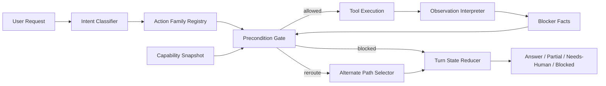
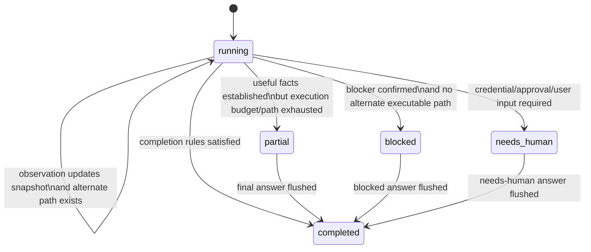

# CP-09: Capability Gating, Blocker State, and Action Policy

**Pattern**: Runtime foundation across Query Loop, Tool Orchestration, Recovery, and Permission
**Priority**: HIGH — prevents semantic loops and impossible action plans
**Dependencies**: CP-02 (tool metadata), CP-04 (recovery), CP-06 (permission classification)
**Estimated effort**: 2 weeks
**Branch**: `feature/cp-09-capability-state-policy`

---

## Objective

Move GoClaw from late loop-kill recovery to **runtime-owned action gating**.

Today the system can stop a bad loop and close the turn honestly. That is good, but it is still
reactive. The missing runtime layer is:

1. a **capability snapshot** of the current execution environment
2. a **structured observation model** that converts tool output into typed facts
3. a **precondition gate** that blocks impossible action families before the model retries them
4. a **turn state reducer** that owns blocked / needs-human / partial transitions as machine state

This checkpoint is the design answer to failures like:
- agent asks a shell to use `git`
- shell does not have `git`
- model retries `git clone` five times
- runtime only stops it after a no-progress loop warning

The correct Agentic OS behavior is:
- detect the missing prerequisite early
- convert it into a typed blocker
- mark the affected action family as unavailable for this turn
- reroute to an alternate path or answer directly

---

## Design Principles

1. **Capability truth belongs to runtime, not to the model**
   The model may reason about plans, but the runtime owns facts such as `git.available=false`.

2. **Tool output must be normalized into typed observations**
   Strings like `sh: git: not found` are not enough. The runtime must derive `missing_binary/git`.

3. **Preconditions are checked before action selection is allowed to repeat**
   If an action family requires `git.available=true`, the loop must not keep offering that branch.

4. **No-progress is semantic, not only syntactic**
   `git --version`, `gh auth status`, and `git clone` are different commands but the same failed branch.

5. **Completion, blocking, and needs-human are typed states**
   They are not inferred from wording in the final answer.

6. **Closeout is the last safety layer, not the primary planner**
   Current closeout logic remains, but it should fire after gating and rerouting have already failed.

---

## Current Gap in GoClaw

GoClaw already has useful building blocks:

- coarse tool metadata in `internal/tools/capability.go`
- runtime-owned turn closeout in `internal/pipeline/turn_state.go`
- tool-budget closeout in `internal/pipeline/tool_stage.go`
- targeted recovery heuristics such as `internal/agent/exec_probe_recovery.go`

But those pieces still leave a hole:

- tool capabilities are too coarse for environment planning
- tool results are mostly interpreted as strings
- blockers are derived late and mainly influence closeout
- impossible branches are not disabled at the action-family level
- some recovery is still heuristic and tool-specific

This checkpoint closes that hole.

---

## Scope

### In scope

- runtime-only capability snapshot for a single run
- structured observation facts from tool execution
- action family registry with explicit preconditions
- typed blocker ownership in `TurnState`
- semantic no-progress tracking per action family
- planner/tool filtering and reroute hints
- trace/session observability for capability + blocker state

### Out of scope

- full persistent environment inventory database
- arbitrary learned planner
- replacing existing permission engine
- vendor-specific prompt hacks for `git`, `gh`, `docker`, etc.

---

## System Picture



---

## Data Model

### Phase 1: Runtime-only state (no new SQL tables)

The first implementation should stay **in-memory per run** and persist only summary metadata to
traces. This keeps the design aligned with Agentic OS principles without creating storage debt.

### 1. Capability snapshot

Create `internal/pipeline/capability_state.go`:

```go
package pipeline

type CapabilityKey string

const (
    CapKeyGitBinary         CapabilityKey = "binary.git"
    CapKeyGhBinary          CapabilityKey = "binary.gh"
    CapKeyDockerBinary      CapabilityKey = "binary.docker"
    CapKeyWorkspaceWritable CapabilityKey = "workspace.writable"
    CapKeyWorkspacePresent  CapabilityKey = "workspace.present"
    CapKeyGitHubReachable   CapabilityKey = "network.github"
    CapKeyOpenHandsDelegate CapabilityKey = "delegate.openhands"
)

type CapabilityStatus string

const (
    CapabilityUnknown   CapabilityStatus = "unknown"
    CapabilityAvailable CapabilityStatus = "available"
    CapabilityMissing   CapabilityStatus = "missing"
    CapabilityBlocked   CapabilityStatus = "blocked"
    CapabilityDegraded  CapabilityStatus = "degraded"
)

type CapabilityFact struct {
    Key         CapabilityKey
    Status      CapabilityStatus
    Source      string // bootstrap, tool_result, config, policy
    Evidence    string // short human-readable evidence
    LastUpdated int64
}

type CapabilityState struct {
    Snapshot map[CapabilityKey]CapabilityFact
    Probed   map[CapabilityKey]bool
}
```

Notes:
- `unknown` is a first-class state; the runtime should not guess.
- a capability can be `blocked` by policy even when the binary exists
- `Evidence` is short and trace-safe; not a full raw log

### 2. Structured observations

Create `internal/pipeline/observation_state.go`:

```go
package pipeline

type ObservationKind string

const (
    ObsMissingPrereq     ObservationKind = "missing_prereq"
    ObsPolicyBlocked     ObservationKind = "policy_blocked"
    ObsAuthRequired      ObservationKind = "auth_required"
    ObsRepoPublic        ObservationKind = "repo_public"
    ObsRepoPrivate       ObservationKind = "repo_private"
    ObsNetworkReachable  ObservationKind = "network_reachable"
    ObsNetworkUnreachable ObservationKind = "network_unreachable"
    ObsActionSucceeded   ObservationKind = "action_succeeded"
)

type ObservationFact struct {
    Kind         ObservationKind
    Subject      string // git, gh, github.com, repo_clone
    ToolName     string
    ActionFamily ActionFamily
    Confidence   string // low, medium, high
    Evidence     string
}
```

### 3. Action registry and preconditions

Create `internal/pipeline/action_policy.go`:

```go
package pipeline

type ActionFamily string

const (
    ActionExplainSetup       ActionFamily = "explain_setup"
    ActionRepoBootstrapLocal ActionFamily = "repo_bootstrap_local"
    ActionRepoInspectRemote  ActionFamily = "repo_inspect_remote"
    ActionRepoDelegate       ActionFamily = "repo_delegate"
    ActionAuthDiagnose       ActionFamily = "auth_diagnose"
)

type Precondition struct {
    Capability CapabilityKey
    Requires   CapabilityStatus
    Optional   bool
}

type ActionSpec struct {
    Family          ActionFamily
    Description     string
    PreferredTools  []string
    Preconditions   []Precondition
    AlternativePath []ActionFamily
}

type ActionDecision string

const (
    ActionAllowed   ActionDecision = "allowed"
    ActionReroute   ActionDecision = "reroute"
    ActionBlocked   ActionDecision = "blocked"
    ActionNeedsInfo ActionDecision = "needs_info"
)
```

### 4. Blockers owned by turn state

Extend `internal/pipeline/turn_state.go`:

```go
type TurnBlockerKind string

const (
    TurnBlockerMissingPrereq TurnBlockerKind = "missing_prereq"
    TurnBlockerPolicy        TurnBlockerKind = "policy"
    TurnBlockerNeedsHuman    TurnBlockerKind = "needs_human"
    TurnBlockerAmbiguous     TurnBlockerKind = "ambiguous"
)

type TurnBlocker struct {
    Kind         TurnBlockerKind
    Subject      string
    ActionFamily ActionFamily
    Evidence     string
}

type ActionFamilyStatus string

const (
    ActionFamilyOpen      ActionFamilyStatus = "open"
    ActionFamilyBlocked   ActionFamilyStatus = "blocked"
    ActionFamilyExhausted ActionFamilyStatus = "exhausted"
    ActionFamilySatisfied ActionFamilyStatus = "satisfied"
)
```

Add fields to `TurnState`:

```go
type TurnState struct {
    ...
    CurrentActionFamily ActionFamily
    ActionFamilies      map[ActionFamily]ActionFamilyStatus
    Blockers            []TurnBlocker
}
```

### 5. Trace metadata persistence

No new SQL tables in phase 1. Persist these into trace/span metadata:

- resolved top-level action family
- final capability snapshot (trimmed)
- blockers promoted into turn state
- reroute decision history

This is enough for production debugging without adding permanent relational complexity.

### Phase 2: Optional persistence

Only after phase 1 stabilizes, consider:

- `capability_snapshots` for cached environment facts by workspace/runtime fingerprint
- `run_blockers` for analytics across runs

These are explicitly phase 2, not required for initial correctness.

---

## State Transitions

### Turn phases

Existing phases should remain:

- `running`
- `partial`
- `blocked`
- `needs_human`
- `completed`

### New transition rules



### Transition table

| Event | Condition | Transition | Runtime action |
| --- | --- | --- | --- |
| `ObsMissingPrereq` | blocker affects current action family and no viable alternative | `running -> blocked` | mark family blocked, strip impossible tools, inject blocker-aware answer hint |
| `ObsMissingPrereq` | blocker affects current family but alternative exists | `running -> running` | mark family blocked, switch `CurrentActionFamily` to alternative |
| `ObsPolicyBlocked` | action requires explicit approval/human override | `running -> needs_human` | explain approval gap, stop repeating |
| `ObsAuthRequired` | auth is optional for current user goal but not for current attempted path | `running -> running` | reroute to no-auth explanation path |
| `NoProgressFamilyBudgetExceeded` | family retried without new decisive evidence | `running -> partial` or `blocked` | force answer-only for that family |
| `CompletionSatisfied` | required user question answered truthfully | `running -> completed` | no more tools |

### Key rule

An action family must not return from `blocked` or `exhausted` to `open` within the same turn unless a **new observation changes the capability truth**.

Example:
- `git clone` fails because `git` missing
- `binary.git=missing` is now truth
- every local clone action remains blocked for the rest of the turn

This is the core anti-loop invariant.

---

## Policy Interfaces

### 1. Capability snapshotter

Create `internal/agent/capability_snapshot.go`:

```go
type CapabilitySnapshotter interface {
    Seed(ctx context.Context, state *pipeline.RunState) error
    UpdateFromObservation(state *pipeline.RunState, facts []pipeline.ObservationFact)
    Get(state *pipeline.RunState, key pipeline.CapabilityKey) pipeline.CapabilityFact
}
```

Responsibilities:
- seed obvious facts from runtime config, workspace resolution, tool registry, provider config
- avoid shell-probing when truth is already known
- update capability truth from normalized observations

### 2. Observation interpreter

Create `internal/agent/tool_result_interpreter.go`:

```go
type ObservationInterpreter interface {
    Interpret(
        toolName string,
        args map[string]any,
        result *tools.Result,
        current pipeline.ActionFamily,
    ) []pipeline.ObservationFact
}
```

Responsibilities:
- normalize shell and tool output into typed facts
- classify `git: not found` as `ObsMissingPrereq(subject=git)`
- classify repo page/public API results as `ObsRepoPublic`
- classify permission denials separately from missing prerequisites

### 3. Action catalog

Create `internal/agent/action_catalog.go`:

```go
type ActionCatalog interface {
    ResolveTopLevel(message string, state *pipeline.RunState) pipeline.ActionFamily
    Spec(family pipeline.ActionFamily) (pipeline.ActionSpec, bool)
}
```

Responsibilities:
- map user intent to a stable action family
- express explicit preconditions and alternates

### 4. Action policy engine

Create `internal/agent/action_policy.go`:

```go
type ActionPolicyEngine interface {
    Evaluate(
        state *pipeline.RunState,
        spec pipeline.ActionSpec,
    ) (pipeline.ActionDecision, []pipeline.TurnBlocker, []pipeline.ActionFamily)
}
```

Responsibilities:
- evaluate preconditions against capability snapshot + blockers
- decide `allowed`, `reroute`, `blocked`, or `needs_info`
- produce typed blockers, not prose

### 5. Turn reducer

Create `internal/pipeline/turn_reducer.go`:

```go
type TurnReducer interface {
    ApplyObservation(state *RunState, facts []ObservationFact)
    ApplyActionDecision(state *RunState, family ActionFamily, decision ActionDecision, blockers []TurnBlocker)
}
```

Responsibilities:
- own all transitions into `blocked`, `needs_human`, `partial`, `completed`
- mark action-family statuses
- guarantee append-only audit semantics inside traces

### 6. Tool filter adapter

Extend `buildFilteredTools` integration in `internal/agent/loop_pipeline_callbacks.go`:

```go
type ToolPolicyAugmenter interface {
    FilterForTurnState(
        state *pipeline.RunState,
        defs []providers.ToolDefinition,
    ) ([]providers.ToolDefinition, *providers.Message)
}
```

Responsibilities:
- hide tools that only serve blocked action families
- inject a system hint describing the active viable branch
- do not rely on prompt wording alone

---

## Planning Model for GoClaw

GoClaw does not have a separate symbolic planner today. The LLM selects tools directly.

Therefore CP-09 must introduce **planner control without replacing the LLM**:

1. resolve a top-level `ActionFamily`
2. compute action-family viability from capability snapshot
3. filter tool definitions and inject runtime hints
4. update family status from normalized observations
5. reroute or close out

This keeps the architecture compatible with the current loop while making it much harder for the
LLM to retry impossible branches.

---

## Implementation Plan by Checkpoint

### CP-09A — Capability Snapshot Foundation

**Goal**
- Make runtime capability truth explicit before the first risky tool retry.

**Files to create**
- `internal/pipeline/capability_state.go`
- `internal/agent/capability_snapshot.go`
- `internal/agent/capability_snapshot_test.go`

**Files to modify**
- `internal/pipeline/run_state.go`
- `internal/agent/loop_pipeline_adapter.go`

**Checklist**
- add `CapabilityState` to `RunState`
- seed snapshot from workspace, config, tool registry, delegate availability
- represent `unknown` vs `missing` vs `blocked`
- expose snapshot summary in trace metadata

**Verification**
- run starts with seeded facts for workspace and known runtime tools
- no shell probe is needed to know whether a tool is registered or absent from runtime inventory

### CP-09B — Observation Normalization

**Goal**
- Convert raw tool output into typed facts.

**Files to create**
- `internal/pipeline/observation_state.go`
- `internal/agent/tool_result_interpreter.go`
- `internal/agent/tool_result_interpreter_test.go`

**Files to modify**
- `internal/agent/loop_pipeline_tool_callbacks.go`
- `internal/pipeline/turn_state.go`

**Checklist**
- normalize missing binary, policy blocked, auth required, repo visibility, network reachability
- update capability snapshot from observation facts
- stop relying on string matching in multiple scattered locations

**Verification**
- `git: not found` produces `ObsMissingPrereq(subject=git)`
- permission denial produces `ObsPolicyBlocked`, not `MissingPrereq`
- repo public detection can steer toward no-auth explanation path

### CP-09C — Action Family Registry and Preconditions

**Goal**
- Give the runtime a stable action-space vocabulary.

**Files to create**
- `internal/pipeline/action_policy.go`
- `internal/agent/action_catalog.go`
- `internal/agent/action_catalog_test.go`

**Files to modify**
- `internal/agent/intent_classify.go`
- `internal/agent/loop_pipeline_adapter.go`

**Checklist**
- define high-value action families for repo/setup/auth/debug flows
- map user message to top-level family
- encode preconditions and alternatives explicitly

**Verification**
- setup/auth question resolves to `ActionExplainSetup` first, not `ActionRepoBootstrapLocal`
- local bootstrap actions require `binary.git=available`

### CP-09D — Turn Reducer and Family-Level No-Progress

**Goal**
- Make blockers and exhausted branches runtime-owned state.

**Files to create**
- `internal/pipeline/turn_reducer.go`
- `internal/pipeline/turn_reducer_test.go`

**Files to modify**
- `internal/pipeline/turn_state.go`
- `internal/pipeline/tool_stage.go`
- `internal/agent/turn_closeout.go`

**Checklist**
- add `CurrentActionFamily`, `ActionFamilies`, and typed `Blockers`
- mark families `blocked`, `exhausted`, `satisfied`
- track semantic retry budget per family, not only identical command text
- promote to `blocked` early when decisive blocker exists

**Verification**
- `git --version` + `git clone` failures count against the same family budget
- once `binary.git=missing`, local repo bootstrap family is closed for the turn

### CP-09E — Planner Control and Tool Filtering

**Goal**
- Prevent impossible branches from being re-offered to the model.

**Files to create**
- `internal/agent/action_policy.go`
- `internal/agent/action_policy_test.go`

**Files to modify**
- `internal/agent/loop_pipeline_callbacks.go`
- `internal/agent/systemprompt_sections.go`

**Checklist**
- filter tools using current action-family viability
- inject system hint describing active viable branch
- on reroute, switch `CurrentActionFamily` and continue without re-probing blocked path

**Verification**
- after `git missing`, the runtime no longer encourages local clone/tool paths in the same turn
- the model receives a direct “answer or use alternate path” hint

### CP-09F — Observability, Finalization, and Regression Harness

**Goal**
- Make the new runtime logic debuggable and production-safe.

**Files to create**
- `internal/agent/capability_blocker_trace_test.go`
- `docs/production-audits/2026-04-12-session-170b6e5b-capability-analysis.md` (optional replay note)

**Files to modify**
- `internal/pipeline/finalize_stage.go`
- `internal/agent/loop_tracing.go`
- `docs/17-changelog.md`

**Checklist**
- write snapshot + blocker summary into trace metadata
- preserve honest closeout behavior as final safety layer
- add regression covering the production failure pattern

**Verification**
- trace detail shows: action family, blockers, reroute history, final disposition
- regression proves no repeated impossible `git clone` loop in missing-binary environment

---

## Suggested File Map

| Path | Action | Purpose |
| --- | --- | --- |
| `internal/pipeline/capability_state.go` | create | runtime capability snapshot |
| `internal/pipeline/observation_state.go` | create | typed observation facts |
| `internal/pipeline/action_policy.go` | create | action family + precondition model |
| `internal/pipeline/turn_reducer.go` | create | canonical transition reducer |
| `internal/agent/capability_snapshot.go` | create | seeding + update logic |
| `internal/agent/tool_result_interpreter.go` | create | normalize tool outputs |
| `internal/agent/action_catalog.go` | create | intent -> action family |
| `internal/agent/action_policy.go` | create | evaluate preconditions, reroutes, blockers |
| `internal/pipeline/run_state.go` | modify | add capability + action state |
| `internal/pipeline/turn_state.go` | modify | typed blockers + family statuses |
| `internal/pipeline/tool_stage.go` | modify | family-level no-progress enforcement |
| `internal/agent/loop_pipeline_tool_callbacks.go` | modify | observation normalization hook |
| `internal/agent/loop_pipeline_callbacks.go` | modify | filter tools by viable branch |
| `internal/pipeline/finalize_stage.go` | modify | preserve blocked/partial closeout semantics |

---

## Non-Goals and Anti-Patterns

Do **not** implement CP-09 as:

- another `strings.Contains("git: not found")` patch inside a single recovery helper
- a prompt-only warning telling the model to “please stop retrying”
- a broad ban on `exec`
- a new SQL schema before the runtime model is proven
- a vendor-specific list of commands hardcoded without action-family semantics

Those are tactical patches, not Agentic OS design.

---

## Completion Criteria

CP-09 is done when all of the following are true:

1. the runtime can explain why an action family is blocked using typed facts
2. impossible branches are removed before the model retries them
3. semantic retries are counted at the family level, not only by exact command string
4. blocked / needs-human / partial are machine states with trace visibility
5. existing closeout fallback remains as final defense, not first response

---

## Example: Applying the Design to the Production Failure

User asks:

> `repo này cần auth/setup gì`

Runtime resolves:

- top-level family: `ActionExplainSetup`
- alternate families: `ActionRepoInspectRemote`, `ActionAuthDiagnose`

Observed facts:

- repo page indicates `ObsRepoPublic`
- shell indicates `ObsMissingPrereq(subject=git)`
- shell indicates `ObsMissingPrereq(subject=gh)`

Reducer result:

- `ActionRepoBootstrapLocal = blocked`
- `ActionExplainSetup = open`
- `TurnPhase = running` until answer is ready

User-facing result:

- “repo public nên đọc/plan ban đầu không cần auth”
- “nếu muốn clone/push thì cần GitHub auth”
- “runtime hiện tại thiếu `git`/`gh`, nên local bootstrap path không khả dụng trong turn này”

No loop. No guesswork. No ad hoc patch.
