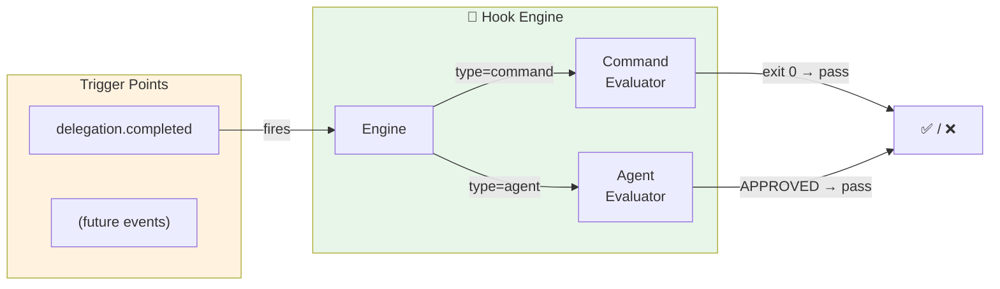
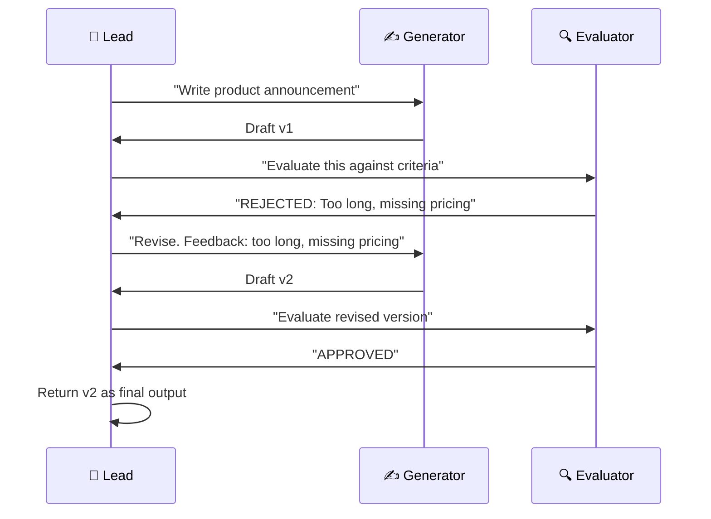
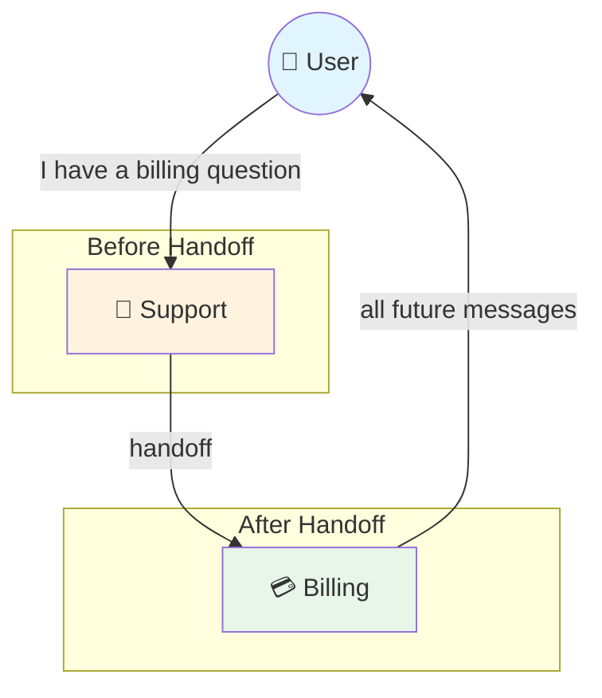
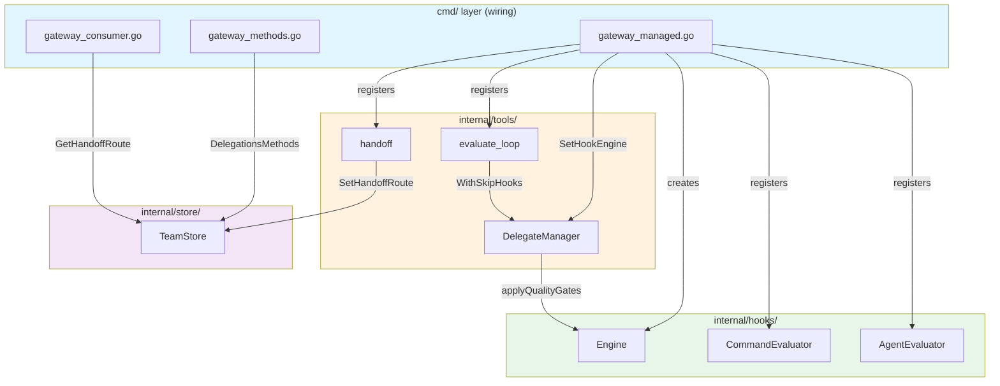

# When Agents Learned to Judge, Hand Off, and Loop

**Date:** 2026-02-26

---

Phase 3 gave agents a shared task board and peer-to-peer messaging. They could collaborate. But collaboration without accountability is just organized chaos.

Picture this: a lead agent delegates "write the product announcement" to a copywriter agent. The copywriter returns a wall of marketing fluff — buzzwords, no substance. The lead faithfully delivers it to the user. Nobody checked. Nobody pushed back. The pipeline had no quality control.

Or this: a customer asks a support agent about billing. The support agent knows nothing about billing, but it has a billing specialist teammate. Today, the only option is delegation — "go ask billing and come back." The support agent stays in the loop, relaying messages like a human switchboard. What if it could just say "let me transfer you to billing" and step away?

Phase 4 adds four things: a hook system for quality gates, an evaluate-revise loop, agent handoff, and delegation history queries. Together they turn the agent network from "agents that can talk" into "agents that can be held accountable, transfer responsibility, and iterate on quality."

---

## Feature 1: Quality Gates

The core question: how do you validate an agent's output before it reaches the user?

We could have bolted validation directly into `DelegateManager.Delegate()`. A few if-statements, some string matching, done. But that would be a dead end — what happens when we need validation on team task completion? On cron job output? On handoff context? Every new validation point would mean copy-pasting the same logic.

Instead, we built a general-purpose hook system: `internal/hooks/`.



Two evaluator types:

| Type | How it works | Example |
|------|-------------|---------|
| **command** | Run a shell command. Exit 0 = pass. Stderr = feedback. | `npm test`, `eslint --stdin` |
| **agent** | Delegate to a reviewer agent. Parse "APPROVED" or "REJECTED: feedback". | QA reviewer agent checks for tone, accuracy |

Quality gates live in the source agent's `other_config` JSON — no migration needed:

```json
{
  "quality_gates": [
    {
      "event": "delegation.completed",
      "type": "agent",
      "agent": "qa-reviewer",
      "block_on_failure": true,
      "max_retries": 2
    }
  ]
}
```

When `block_on_failure` is true and retries remain, the system re-runs the target agent with the evaluator's feedback injected as a revision prompt. The agent gets a second chance — and a third, if configured — before the gate gives up and returns whatever it has.

---

## Feature 2: The Evaluate-Optimize Loop

Quality gates are reactive — they catch bad output after the fact. The evaluate-optimize loop is proactive: two agents working together in a structured revision cycle.



The `evaluate_loop` tool orchestrates this. The calling agent specifies a generator, an evaluator, pass criteria, and a max round count (default 3, cap at 5). Each round is a pair of sync delegations. If the evaluator responds with "APPROVED" (case-insensitive prefix match), the loop exits with the generator's latest output. If "REJECTED: feedback", the generator gets another shot with the feedback injected.

Every internal delegation automatically creates a delegation history record — no extra tracking code. The existing `saveDelegationHistory()` in `DelegateManager` handles it.

---

## Feature 3: Agent Handoff

Delegation keeps the caller in the loop. Handoff removes it entirely.



| | Delegation | Handoff |
|---|---|---|
| Who talks to the user? | Source agent (always) | Target agent (after transfer) |
| Source agent involvement | Waits for result, reformulates | Steps away completely |
| Session | Target runs in source's context | Target gets a new session |
| Duration | One task | Until cleared or handed back |

The hard part: session keys embed the agent ID (`agent:{agentId}:{channel}:{peer}:{chatId}`). They're immutable. You can't just swap the agent in an existing session key.

The solution is a routing override table. When the support agent calls `handoff(agent="billing", reason="billing question")`, three things happen:

1. A row is written to `handoff_routes`: this channel + chat ID now routes to billing.
2. A `handoff` event is broadcast — WS clients can react and switch UI.
3. An initial message is published to the billing agent via the message bus, carrying conversation context from the support agent's session summary.

When the next real message arrives from the user on that channel, the consumer checks `handoff_routes` before normal routing. It finds the override and sends the message to billing instead of support. Billing gets its own fresh session.

The billing agent can hand back to support (another `handoff` call), or call `handoff(action="clear")` to remove the routing override entirely.

---

## Feature 4: Delegation History

Phase 3 already saved every delegation to `delegation_history`. The data was there — just unreachable. Phase 4 exposes it through three channels:

| Channel | Endpoint | Use case |
|---------|----------|----------|
| **WebSocket RPC** | `delegations.list` / `delegations.get` | Dashboard real-time view |
| **HTTP API** | `GET /v1/delegations` / `GET /v1/delegations/{id}` | External integrations, monitoring |
| **Agent tool** | `delegate(action="history")` | Agent self-checking past delegations |

Results are truncated for WS transport (500 runes for list, 8000 for detail) to prevent message bloat. The HTTP API returns full records.

---

## The Recursion Trap

The most dangerous bug in this entire phase was invisible: infinite recursion.

Quality gate with agent evaluator: the gate delegates to a reviewer agent to check output. That delegation itself completes — triggering the quality gate again. The gate delegates to the reviewer again. The reviewer completes. Gate fires again. Stack overflow in slow motion.

Same risk with `evaluate_loop`: each internal delegation could trigger quality gates, which could trigger more delegations, which could trigger more gates.

The fix is a context flag: `hooks.WithSkipHooks(ctx, true)`. Three places set it:

1. **Agent evaluator** — when delegating to the reviewer agent for quality checks
2. **Evaluate loop** — for all internal generator/evaluator delegations
3. **Agent eval callback in cmd layer** — when the hook engine itself triggers delegation

`DelegateManager.Delegate()` checks `hooks.SkipHooksFromContext(ctx)` before applying quality gates. If the flag is set, gates are skipped entirely. No recursion possible.

This is also why the hook engine lives in its own package (`internal/hooks/`) rather than inside `tools`. The agent evaluator needs a callback to delegate — but `tools` can't import `hooks` if `hooks` imports `tools`. The callback pattern (`AgentDelegateFunc`) breaks the cycle: `hooks` defines the function signature, `cmd` provides the implementation at wiring time.

---

## The Wiring

Every feature touches the same nerve center: `cmd/gateway_managed.go`. Hook engine, evaluate loop, and handoff tool all register in `wireManagedExtras()`. Delegation history adds an HTTP handler to `wireManagedHTTP()` and RPC methods to `registerAllMethods()`. The consumer gets a handoff route check and a handoff announce handler.



---

## What Changed

| File | What |
|---|---|
| `internal/hooks/hooks.go` | Core types: HookConfig, HookContext, HookResult, HookEvaluator interface |
| `internal/hooks/engine.go` | Engine: evaluator registry, EvaluateHooks + EvaluateSingleHook |
| `internal/hooks/command_evaluator.go` | Shell command evaluator (stdin content, env vars, exit code) |
| `internal/hooks/agent_evaluator.go` | Agent delegation evaluator (APPROVED/REJECTED parsing) |
| `internal/hooks/context.go` | WithSkipHooks / SkipHooksFromContext (recursion prevention) |
| `internal/tools/evaluate_loop_tool.go` | Generate-evaluate-revise loop (max 5 rounds) |
| `internal/tools/handoff_tool.go` | Conversation transfer (routing override + context carry) |
| `internal/tools/delegate.go` | hookEngine field, applyQualityGates in sync + async paths |
| `internal/gateway/methods/delegations.go` | RPC handlers for delegation history |
| `internal/http/delegations.go` | HTTP API for delegation history |
| `internal/gateway/server.go` | DelegationsHandler field + setter + BuildMux registration |
| `internal/store/team_store.go` | DelegationHistoryListOpts, HandoffRouteData, 5 new interface methods |
| `internal/store/pg/teams.go` | ListDelegationHistory, GetDelegationHistory, handoff route CRUD |
| `migrations/000005_phase4.up.sql` | handoff_routes table |
| `pkg/protocol/methods.go` | delegations.list, delegations.get constants |
| `pkg/protocol/events.go` | EventHandoff constant |
| `cmd/gateway_managed.go` | Hook engine + evaluators + evaluate_loop + handoff tool wiring |
| `cmd/gateway_methods.go` | Delegation RPC method registration |
| `cmd/gateway_consumer.go` | Handoff route check + handoff announce handler |
| `cmd/gateway.go` | teamStore passing + delegations HTTP handler wiring |

---

## Takeaway

Phase 4's biggest lesson: the gap between "agents can work together" and "agents can be trusted to work together" is exactly one hook system wide. Quality gates, evaluate loops, handoff — they're all variations of the same idea: intercept, validate, redirect. The hook engine makes this a first-class pattern instead of ad-hoc if-statements scattered across the codebase. When we need `team_task.completed` gates or `cron.completed` validation, it's one `engine.EvaluateHooks()` call away.

The recursion trap was a reminder that any system where A can trigger B which can trigger A needs an explicit circuit breaker. A context flag is the simplest possible solution — and sometimes the simplest is exactly right.
