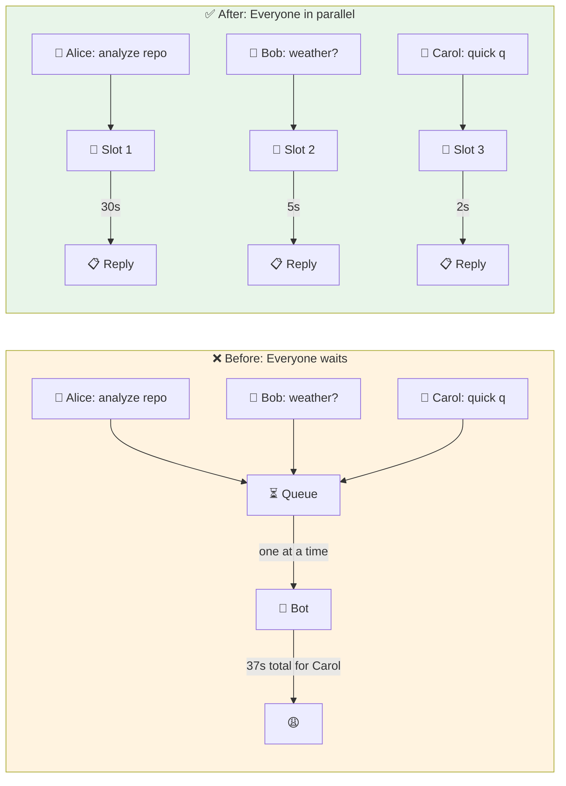
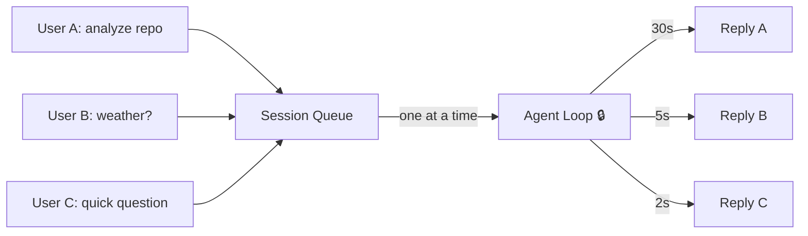
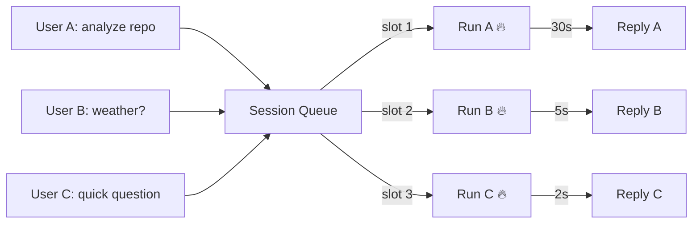
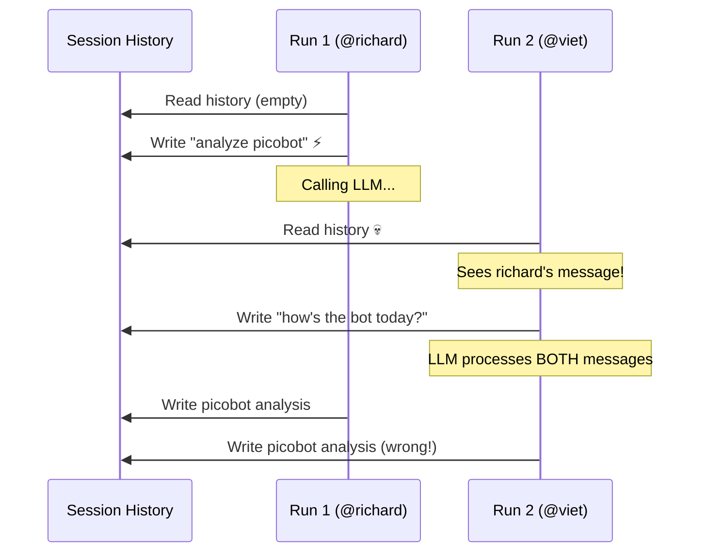
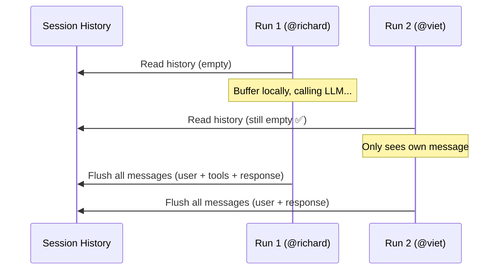

# When the Bot Made Everyone Wait in Line

**Date:** 2026-02-24

---

Imagine a busy group chat. Ten people, one bot. User A asks "analyze this repo", User B asks "how's the weather", User C drops a quick question. The bot? It makes everyone queue up like a government office. B waits for A's 30-second analysis. C waits for B. By the time C gets a reply, they've already Googled it.

This is the story of how we tore down two walls that kept the bot painfully sequential — and the sneaky bugs that appeared once messages started flying in parallel.

---

## The Big Picture



| | Before | After |
|---|---|---|
| Carol's wait time | **37 seconds** (queued behind Alice & Bob) | **2 seconds** (runs immediately) |
| DMs | 1 at a time | 1 at a time (unchanged) |
| Groups | 1 at a time | **Up to 3 parallel** |

---

## The Two Walls

**Wall 1: The Big Mutex.** Deep inside the agent loop sat a `sync.Mutex` that locked on every single run. DM from Alice, group message from Bob, a scheduled cron job — all funneled through one lock. The irony? Every field it "protected" was already thread-safe on its own. The mutex was a leftover safety blanket doing nothing but creating a traffic jam.

**Wall 2: The Serial Queue.** Each session had a queue that processed exactly one request at a time. Fine for DMs (one user, one conversation). Terrible for groups. Three people mention the bot at the same time? Requests 2 and 3 sit in a FIFO queue, staring at the ceiling.



Total time for User C: **37 seconds**. For a 2-second answer.

---

## Tearing Down Wall 1

We deleted the mutex. That's it. Literally removed `mu sync.Mutex` and the `Lock()`/`Unlock()` calls wrapping `Run()`. Replaced the `running bool` with an `activeRuns` atomic counter so we'd still know how many runs are in flight.

The only tricky part: **summarization**. When a session's history gets too long, the bot compresses it. Two concurrent runs finishing at the same moment could both trigger summarization on the same session — corrupting history.

Solution: a per-session `TryLock`. If another run is already summarizing, skip it. Non-blocking, no waiting. The next run will pick it up if still needed.

---

## Tearing Down Wall 2

The session queue got a real upgrade. Instead of `active: bool`, it now tracks multiple active runs with a configurable concurrency limit:

- **DMs**: `maxConcurrent = 1` (serial, as before — one user, no reason for parallelism)
- **Groups**: `maxConcurrent = 3` (three responses cooking simultaneously)



Total time for User C: **2 seconds**. That's more like it.

We also added an **adaptive throttle**: when a session's history fills up past 60% of the context window, concurrency automatically drops back to 1. This prevents multiple runs from racing into the summarization zone at the same time.

---

## The Ghost in the Session History

We deployed, tested with two users in a group. User A: "analyze picobot". User B: "how's the bot today?". Run 1 correctly analyzed picobot. Run 2... also analyzed picobot. What?

We pulled the traces from the database:

| Run | Started | Who asked | What they got |
|---|---|---|---|
| `253169ac` | 10:10:49 | @richard: "analyze picobot" | Picobot analysis ✅ |
| `882af1da` | 10:10:52 | @viet: "how's the bot today?" | ...also picobot analysis ❌ |

Run 2 was seeing Run 1's user message in the session history and the LLM dutifully processed both.

The culprit was one line of code that had been there since day one:

```go
// Step 1: read history snapshot
history := l.sessions.GetHistory(sessionKey)
// Step 2: ⚠️ immediately write user message to shared session
l.sessions.AddMessage(sessionKey, userMsg)
// Step 3: call LLM (takes 5-30 seconds)
resp, err := l.provider.Chat(ctx, req)
```

Run 1 writes its user message at step 2. Three seconds later, Run 2 hits step 1 and reads a history that now includes Run 1's unanswered question. The LLM sees two user messages without responses and tries to answer both.



**The fix**: don't write anything to the session until the run is done. Buffer all new messages in a local slice, flush them atomically after the LLM loop completes. Each run's goroutine has its own buffer — zero shared state, zero races.



---

## The Emoji Collision

One more surprise. Telegram reactions (the emoji that shows "thinking 🤔" → "done 👍") were keyed by `chatID`. Two concurrent runs in the same chat? They shared one reaction controller. Run 2 overwrote Run 1's controller, Run 1 set `terminal = true`, and Run 2's reactions silently disappeared.

Fix: key by `chatID:messageID`. Each run reacts to its own trigger message.

---

## Stop and Stop All

With multiple runs in flight, `/stop` needed a split personality:

- **`/stop`** — Cancel the oldest running task. The other runs keep going. "I changed my mind about that one request."
- **`/stopall`** — Nuclear option. Cancel everything, drain the queue. "Everyone shut up, I need to think."

---

## What Changed

| File | What |
|---|---|
| `internal/agent/loop.go` | Removed the big mutex. Deferred session writes to `pendingMsgs` buffer |
| `internal/agent/loop_history.go` | Per-session `TryLock` for summarization |
| `internal/scheduler/queue.go` | Concurrent `SessionQueue` with adaptive throttle |
| `cmd/gateway_consumer.go` | `maxConcurrent` by chat type, `/stop` vs `/stopall`, unique RunIDs |
| `internal/channels/telegram/reactions.go` | Reaction key fix (`chatID:messageID`) |
| `internal/channels/telegram/commands.go` | `/stopall` command |

---

## Takeaway

The biggest lesson: making things concurrent is easy. Making them *correctly* concurrent is where the fun begins. Every shared mutable state becomes a potential ghost story — and session history, reaction controllers, and run IDs all had their own haunting to do.
