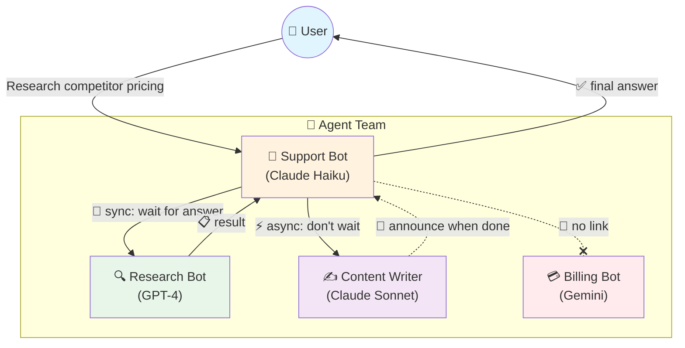
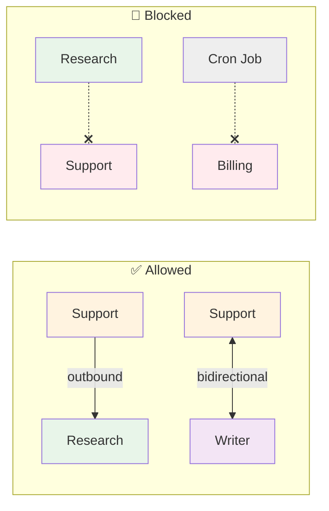
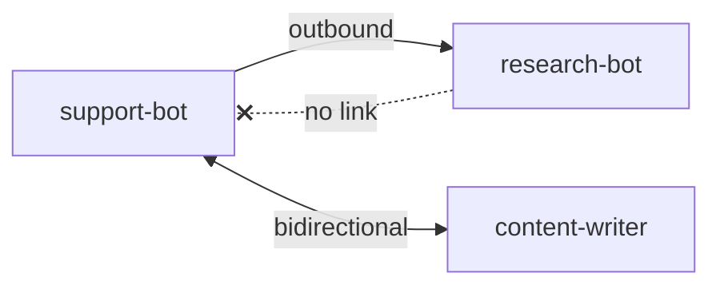
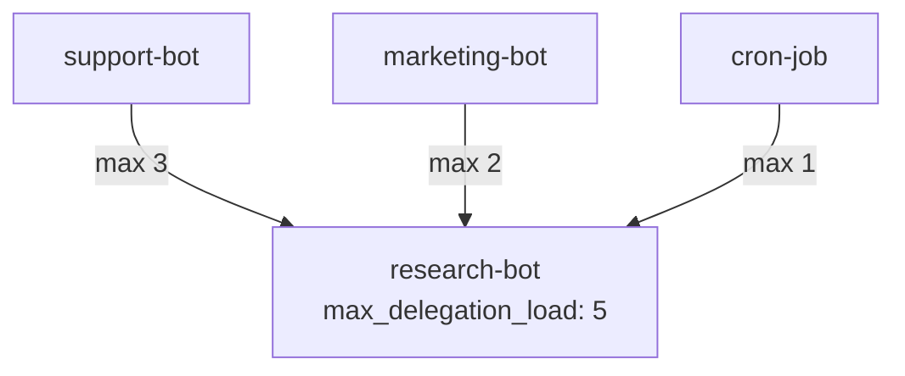
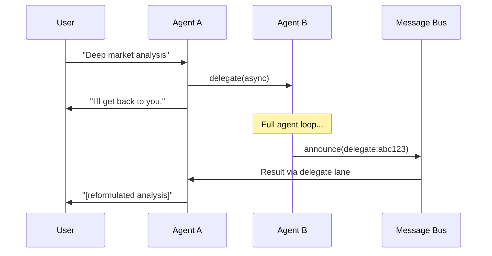

# Teaching Bots to Ask Other Bots for Help

**Date:** 2026-02-25
**Status:** Archived — Agent Links feature was removed in March 2026

---

You have a customer support bot. Someone asks "research competitor pricing and write a report." The bot tries — and hallucinates data, invents competitors, confidently presents garbage. Meanwhile, a research bot sits idle 50ms away, with web search tools and a better model for factual reasoning. They just can't talk to each other.

OpenClaw had "subagents" — anonymous clones of the parent. Same brain, same tools. We needed something different: Agent A asks Agent B, where B uses *its own* identity, tools, provider, and context files.

---

## How It Works — The Big Picture



**Two ways agents collaborate:**

| Mode | How it works | Best for |
|------|-------------|----------|
| **🔄 Sync** | Support bot asks Research bot and **waits**. Like calling a colleague and staying on the line. | Quick lookups, fact checks |
| **⚡ Async** | Support bot asks Writer bot and **moves on**. Writer announces the result later. | Long tasks, reports, deep analysis |

**What about permissions?** Not every bot can talk to every other bot. You explicitly create **links** — "Support can ask Research, but Research can't ask Support back." This prevents rogue bots from invoking expensive agents.



---

## The Import Cycle Wall

The `tools` package needed to call `agent.Router.Get()` → `agent.Loop.Run()`. But `agent` already imports `tools`. Classic Go import cycle.

The fix: a callback function. No interface gymnastics, no shared package:

```go
// tools package — no agent import needed
type AgentRunFunc func(ctx context.Context, agentKey string, req DelegateRunRequest) (*DelegateRunResult, error)
```

The `cmd` layer bridges both packages at initialization. The `tools` package never knows `agent` exists.

---

## Who Can Talk to Whom

We created `agent_links` — directed edges with permission control:



A single row `(A→B, outbound)` means A can delegate to B. Not the reverse. The `settings` JSONB on each link holds per-user deny/allow lists — premium users only, or block specific accounts.

`DELEGATION.md` is auto-injected into each agent's base context during resolution, listing available targets. When there are more than 15 targets, it switches to a search instruction pointing to the `delegate_search` tool (hybrid FTS + pgvector cosine). Uses `DELEGATION.md` (not `AGENTS.md`) to avoid collision with per-user `AGENTS.md` which contains workspace instructions for open agents.

---

## Context File Merging

For **open agents**, per-user context files (from `user_context_files`) are loaded at runtime and merged with base context files (from the resolver). Per-user files override same-name base files, but base-only files like `DELEGATION.md` are preserved.

```
Base files (resolver):     DELEGATION.md
Per-user files (DB):       AGENTS.md, SOUL.md, TOOLS.md, USER.md, ...
Merged result:             AGENTS.md, SOUL.md, TOOLS.md, USER.md, ..., DELEGATION.md ✓
```

---

## Cache Invalidation

When agent links are created, updated, or deleted, both source and target agent caches are invalidated. This forces the resolver to re-run `DelegateTargets()` and regenerate `DELEGATION.md` on the next request.

The `AgentLinksMethods` RPC handler holds a reference to `*agent.Router` and calls `InvalidateAgent(agentKey)` after each mutation. For delete operations, the link is fetched before deletion to capture the agent IDs.

---

## The Concurrency Puzzle

Agent B is popular — support, marketing, and cron jobs all delegate to it. Without limits, 50 concurrent delegations melt it.

Two layers:



| Layer | Config | Scope |
|---|---|---|
| Per-link | `agent_links.max_concurrent` | A→B specifically |
| Per-agent | `other_config.max_delegation_load` | B from all sources |

When limits hit, the error is written for LLM reasoning: *"Agent at capacity (5/5). Try a different agent or handle it yourself."* The LLM adapts.

---

## Sync, Async, Cancel

**Sync** blocks the caller. **Async** spawns a goroutine and announces the result back through the message bus — same pattern as subagent announces, using `SenderID: "delegate:abc123"`.



The gateway consumer routes delegate announces through a dedicated `delegate` lane (concurrency 100, env-configurable via `GOCLAW_LANE_DELEGATE`). Cancel works via `cancelFunc` on a detached context — same pattern as subagent cancellation.

---

## The `frontmatter` Naming Trap

Each agent needed a short expertise summary. The obvious column name: `description`. But `other_config.description` already existed — it's the LLM summoning prompt. Same word, completely different concept.

We picked `frontmatter` — borrowed from blog metadata. Different names for different things saved us from a guaranteed future confusion.

---

## What Changed

| File | What |
|---|---|
| `migrations/000002_agent_links.up.sql` | `agent_links` table + `frontmatter`, `tsv`, `embedding` on agents |
| `internal/store/agent_link_store.go` | Interface (11 methods: CRUD, permissions, FTS + vector search) |
| `internal/store/pg/agent_links.go` | PostgreSQL implementation (`linkSelectColsJoined` for JOIN queries) |
| `internal/tools/delegate.go` | `DelegateManager` — sync, async, cancel, concurrency, per-user checks |
| `internal/tools/delegate_tool.go` | Tool wrapper (action: delegate/cancel/list, mode: sync/async) |
| `internal/tools/delegate_search_tool.go` | Hybrid FTS + semantic agent discovery |
| `internal/agent/resolver.go` | `DELEGATION.md` injection (static ≤15, search >15) |
| `internal/agent/loop_history.go` | Context file merging (base + per-user, base-only files preserved) |
| `internal/gateway/methods/agent_links.go` | RPC handlers + `*agent.Router` cache invalidation on mutations |
| `internal/scheduler/lanes.go` | `delegate` lane + env overrides for all lanes |
| `cmd/gateway.go` | Agent links methods registration with `agentRouter` |
| `cmd/gateway_consumer.go` | Delegate announce handler |

---

## Takeaway

The callback that broke the import cycle also means we can swap execution strategy without touching the tools package. The `settings` JSONB means per-user restrictions without migrations. The `DelegateManager` as a separate layer means Phase 3 can add shared task lists without rewriting the delegation core. The context file merge ensures resolver-injected files survive alongside per-user customizations — a pattern that benefits any future auto-injected context. Architecture decisions that pay forward.
