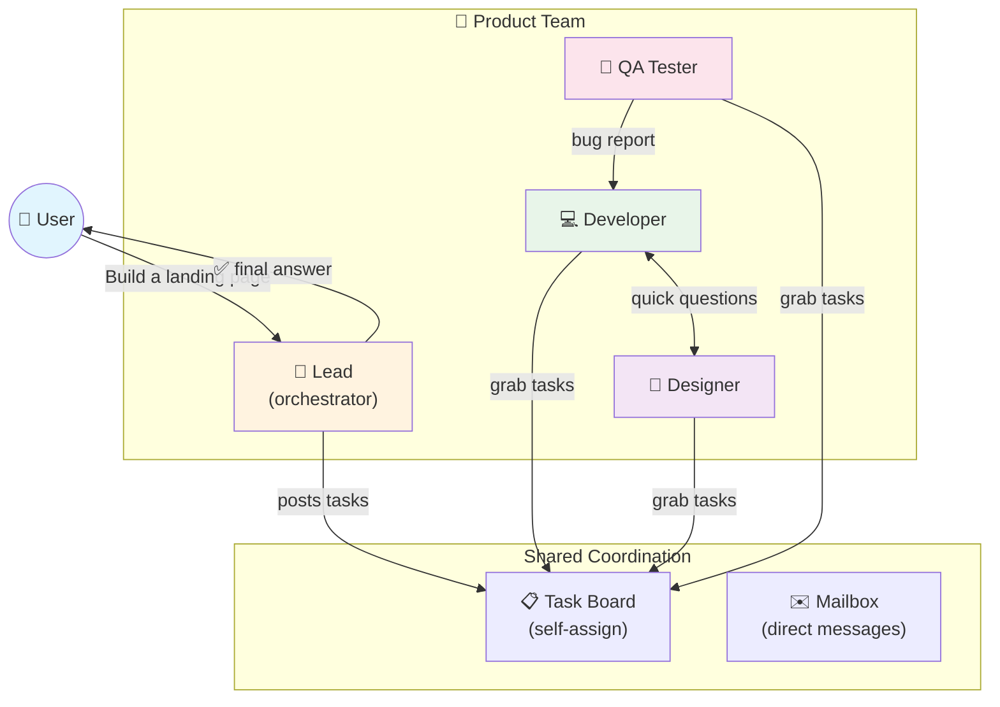
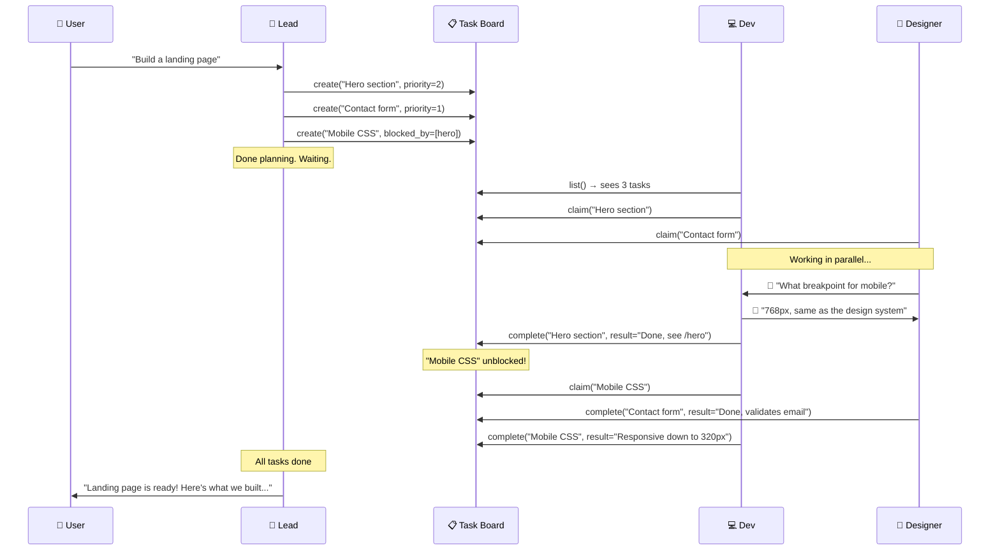

# The Day the Manager Bot Stopped Micromanaging

**Date:** 2026-02-25

---

A user types "Build me a landing page with hero section, contact form, and mobile responsive." The orchestrator bot gets to work. It delegates to the developer: "build the hero section." Waits. Gets the result. Delegates again: "now the contact form." Waits. Gets the result. Delegates to QA: "test this." Waits. Every task goes through the manager, one at a time, like a boss who insists on reviewing every email before it's sent.

Delegation works. But it's a phone call — one caller, one receiver, one result. The manager bot was the bottleneck, micromanaging every handoff. What if instead, the manager dropped a task list on the table and said "figure it out amongst yourselves"?

That's what Agent Teams does: a shared task board and a peer-to-peer mailbox. The lead creates tasks, teammates grab what they can, message each other when they need to coordinate, and the lead only steps back in to deliver the final answer.

---

## What It Brings



| | Before (Delegation only) | After (Teams) |
|---|---|---|
| Who decides what to do? | Manager picks one agent at a time | Teammates grab from a shared list |
| Can teammates talk? | Only through the manager | Directly, peer-to-peer |
| Manager involvement | Every. Single. Interaction. | Posts tasks → waits for results |
| Parallelism | One delegation at a time | All teammates work simultaneously |

The whole flow: admin creates a team via the dashboard, assigns a lead and members. When a user messages the lead, the lead sees its TEAM.md context — who's on the team, what tools are available. It posts tasks to the board. Teammates get activated, claim tasks, and start working. They message each other if they need to coordinate. When everyone's done, the lead synthesizes and replies to the user.

---

## How a Task Flows



Tasks can depend on each other — "Mobile CSS" can't start until "Hero section" is done. When the hero task completes, the dependent task automatically becomes available. Two agents grabbing the same task at once? Only one wins — the database handles that atomically.

---

## The Silent Teammate Problem

First test. Created a team: lead + developer + designer. User messages the lead. Lead creates tasks. Developer claims a task, completes it. The lead... hears nothing. Radio silence. The developer's response vanished.

Traced through the logs. The developer processed the message fine. The agent loop ran, produced a result. But the result went nowhere. It was like shouting into a soundproofed room.

The consumer had three message routing prefixes — `subagent:`, `delegate:`, and our new `teammate:`. The first two both had a step at the end: publish the agent's response back to the user's channel. The teammate handler? We'd written it to be "internal only" — thinking teammate chatter shouldn't leak to the end user.

Wrong. The lead *is* the user-facing agent. When a teammate finishes and the lead processes that update, the lead's response needs to reach the user. Same as delegation, same as subagent announces. All three need outbound delivery.

One missing `PublishOutbound` call. Teammates were doing the work, but the results evaporated before reaching anyone who could see them.

---

## The Bloated System Prompt

Second problem. Injected `TEAM.md` into every team member's system prompt — team name, member list, role description, tool usage examples, workflow guidelines. About 40 lines of context per agent.

Four-member team = four agents carrying team context at all times, even when three are idle. Worse, the tool usage examples in TEAM.md were redundant — they repeated what was already in the tool's `Description()` and `Parameters()`. The system prompt was getting fat for no reason.

Two fixes:

**Cut the fat.** Stripped TEAM.md down to the essentials — team name, your role, teammate list with one-line descriptions, and a single workflow sentence. Everything else the agent can discover through the tools themselves.

**Only the lead gets the context.** Teammates don't need to know about the team until they're activated. When a teammate message arrives, the message itself carries context: *"[Team message from lead]: please claim a task from the board."* The teammate calls `team_tasks(action="list")` and discovers everything it needs. No wasted tokens on idle agents.

---

## The Race for Tasks

Two agents see the same unclaimed task. Both call `claim()` at the same instant. Who wins?

This is the one place where we couldn't afford to be casual. Double-claiming a task means duplicate work — two agents writing the same CSS, two agents building the same form.

PostgreSQL handles it with a single atomic query:

```sql
UPDATE team_tasks
SET status = 'in_progress', owner_agent_id = $1
WHERE id = $2 AND status = 'pending' AND owner_agent_id IS NULL
```

One row updated = you got the task. Zero rows = someone beat you to it. Row-level locking, no distributed mutex, no Redis. The database was the coordination layer all along.

---

## What Changed

| File | What |
|---|---|
| `migrations/000003_agent_teams.up.sql` | 4 tables: teams, members, tasks, messages |
| `internal/store/team_store.go` | Constants + data structs + TeamStore interface |
| `internal/store/pg/teams.go` | PG implementation: atomic claiming, dependency unblocking |
| `internal/tools/team_tool_manager.go` | Shared backend for both team tools |
| `internal/tools/team_tasks_tool.go` | Task board: list, create, claim, complete |
| `internal/tools/team_message_tool.go` | Mailbox: send, broadcast, read |
| `internal/gateway/methods/teams.go` | RPC handlers + auto-linking teammates |
| `internal/agent/resolver.go` | TEAM.md injection (lead only) |
| `cmd/gateway_consumer.go` | `"teammate:"` message routing + outbound delivery |
| `cmd/gateway_managed.go` | Team tools registration |

---

## Takeaway

The biggest surprise was how little new infrastructure teams needed. The message bus, the scheduler lanes, the consumer routing pattern, the context file injection — all built in Phase 1-2 for delegation. Teams just added two coordination primitives (task board + mailbox) on top. The silent teammate bug was a reminder that consistency across message flows isn't optional — if one prefix publishes outbound, they all should. And the system prompt bloat taught us that agents don't need to know everything upfront; they can discover context on demand through their tools.
