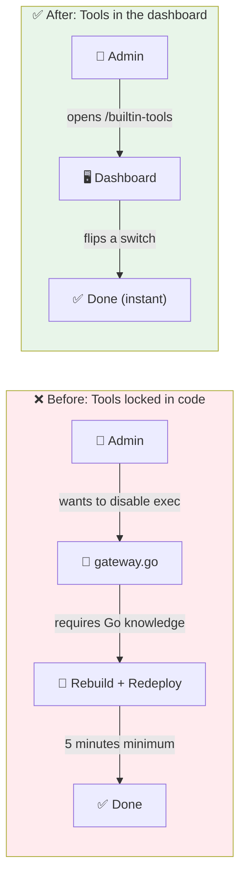

# The 28 Tools Nobody Could Touch

**Date:** 2026-02-27

---

A non-developer admin opens the dashboard. They want to disable `exec` — the shell execution tool — for a cautious internal deployment. They browse every page. Agents, Skills, Custom Tools, Config. Nothing. The 28 built-in tools that power every agent — read files, search the web, generate images, run commands — don't appear anywhere in the UI. They exist only as 28 lines of `toolsReg.Register()` in a Go file the admin has never seen and couldn't edit if they wanted to.

Want to disable a tool? Edit source code, rebuild, redeploy. Want to change the vision model from Gemini to Anthropic for all agents? Same drill. The tools were powerful. They were also untouchable.

---

## What It Brings



| | Before | After |
|---|---|---|
| Disable a dangerous tool | Edit Go, rebuild, redeploy | Toggle a switch in the dashboard |
| Change the default vision model | Find the right Go file, change priority list, rebuild | Edit JSON settings in the UI |
| See what tools agents have | Read source code | Browse a table with search |
| Override settings per agent | Impossible | Per-agent config, already supported |

---

## The Ownership Paradox

Here's the tension. Built-in tools are *code-defined* — they ship with the binary. Their names, descriptions, and categories are decided by developers. But whether a tool is enabled and how it's configured should be decided by the admin at runtime.

Code owns the definition. The database owns the configuration.

Every time the server starts, it seeds the latest tool list into Postgres. But it can't just `INSERT` — that would overwrite the admin's choices. And it can't skip existing rows — that would miss description updates from new releases.

```sql
INSERT INTO builtin_tools (name, display_name, description, category)
VALUES ($1, $2, $3, $4)
ON CONFLICT (name) DO UPDATE SET
    display_name = EXCLUDED.display_name,
    description  = EXCLUDED.description,
    category     = EXCLUDED.category,
    updated_at   = NOW()
```

The `ON CONFLICT` clause updates what the code owns (display name, description, category) and leaves alone what the admin owns (`enabled`, `settings`). Deploy a new version that renames "Read Image" to "Analyze Image" — the admin's decision to set it to use Anthropic instead of Gemini survives.

---

## Register Everything, Then Take Away

Two ways to handle disabled tools at startup. We could check the database before each of the 28 `Register()` calls — sprinkling `if enabled` checks across the entire startup sequence. Or we could register everything the normal way, then make one pass at the end to remove the disabled ones.

One function, one loop, zero scattered conditionals:

```go
disabled, _ := store.List(ctx)
for _, def := range disabled {
    if !def.Enabled {
        toolsReg.Unregister(def.Name)
    }
}
```

When an admin flips a switch in the dashboard, a cache event fires. The same function runs again — no restart needed. The tool vanishes (or reappears) from every agent's toolbox within seconds.

---

## Three Layers of "Who Decides?"

The admin sets `read_image` to use Anthropic globally. But one specific agent — the design assistant — needs Gemini for better image understanding. And if nobody configures anything, the hardcoded priority list (Gemini > Anthropic > OpenRouter) should kick in.

Three layers, each one overriding the last:

```
Hardcoded defaults (Go source)
    ↑ overridden by
Global settings (builtin_tools.settings in DB)
    ↑ overridden by
Per-agent config (agent's tools_config JSONB)
```

The design assistant gets Gemini. Everyone else gets Anthropic. A brand-new deployment with no configuration at all uses the hardcoded list. Nobody has to think about the layers — the most specific config wins, and there's always a fallback.

---

## The Nine Return Values

Adding the HTTP handler for builtin tools meant touching `wireManagedHTTP()` — the function that creates all managed-mode HTTP handlers. It already returned 8 values. Now it returned 9:

```go
chatH, agentsH, sessH, skillsH, cronH, provH, customToolsH, linksH, builtinToolsH := wireManagedHTTP(...)
```

The initial attempt forgot to add `builtinToolsH` to the return statement. Go's compiler caught it — 8 values returned where 9 expected. A quick fix, but a reminder that this function is one or two features away from needing a proper struct. For now, it follows the pattern every other handler set.

---

## The Missing Import

The settings cascade needed `read_image.go` to unmarshal JSON from the builtin settings map. Added a `resolveFromBuiltinSettings()` method that calls `json.Unmarshal` — and forgot to add `encoding/json` to the imports. The compiler's error was clear enough: `undefined: json`. One line fix, but the kind of thing you only catch when you actually build.

---

## The Pagination Trap

The web UI used `usePagination` — a shared hook across all list pages. Every other page called it with a plain number: `usePagination(filtered, 50)`. Except the hook's signature had changed at some point to take an options object. TypeScript's error was cryptic: `Type '50' has no properties in common with type 'UsePaginationOptions'`.

The fix: `usePagination(filtered, { defaultPageSize: 50 })`. A one-character-class-of-bug — the kind where you copy a pattern from memory instead of checking the actual API.

---

## What Changed

| File | What |
|---|---|
| `migrations/000006_builtin_tools.up.sql` | New table: name as PK, enabled, settings JSONB, category |
| `internal/store/builtin_tool_store.go` | Interface: List, Get, Update, Seed, ListEnabled, GetSettings |
| `internal/store/pg/builtin_tools.go` | Postgres implementation with idempotent seed |
| `internal/http/builtin_tools.go` | REST API: list, get, update (no create/delete — code-managed) |
| `cmd/gateway_builtin_tools.go` | Seed data for 28 tools across 13 categories |
| `cmd/gateway.go` | Seed + disable pass at startup |
| `cmd/gateway_managed.go` | Cache invalidation: re-filter tools on admin changes |
| `internal/agent/loop.go` + `resolver.go` | Load global settings, inject into agent context |
| `internal/tools/read_image.go` + `create_image.go` | Three-layer settings cascade |
| `ui/web/src/pages/builtin-tools/` | Dashboard page, settings dialog, API hook |

---

## Takeaway

The interesting pattern here isn't the table or the API — it's the ownership split. Code owns definitions, database owns configuration, and `ON CONFLICT` is the handshake between them. Every deploy can update descriptions and add new tools without touching what the admin customized. The "register then remove" approach kept tool registration simple — twenty-eight clean `Register()` calls, no conditionals, no database lookups at startup. One filter pass at the end. Sometimes the cleanest architecture is just doing everything and then undoing the parts you don't want.
