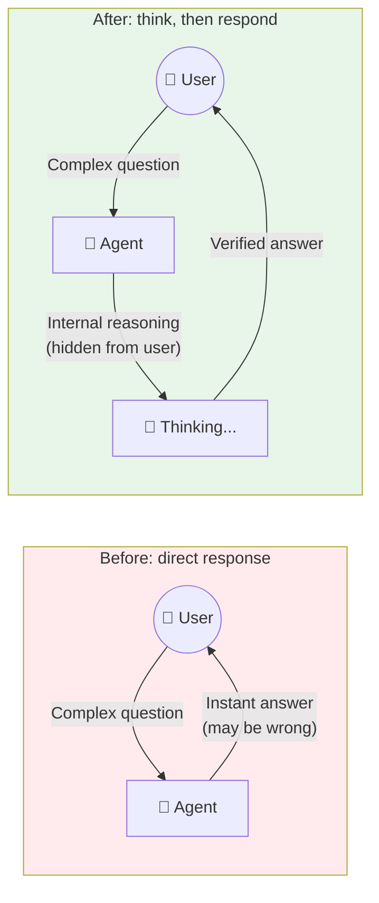
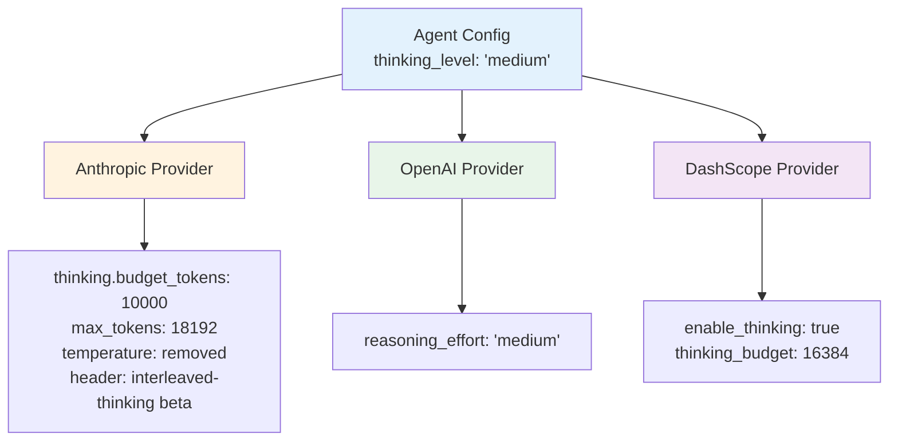
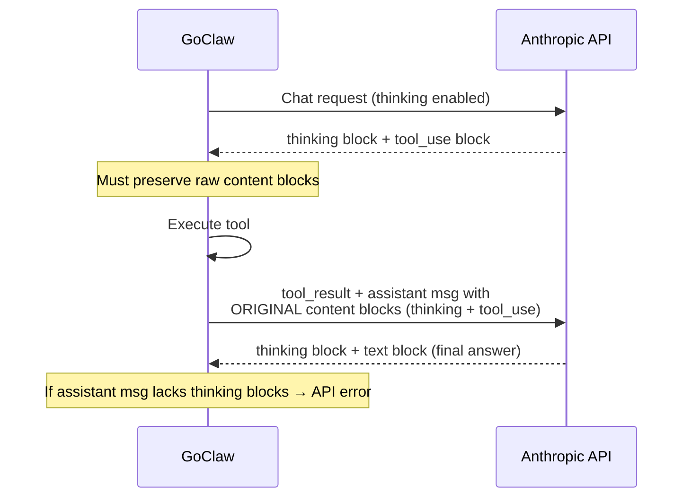
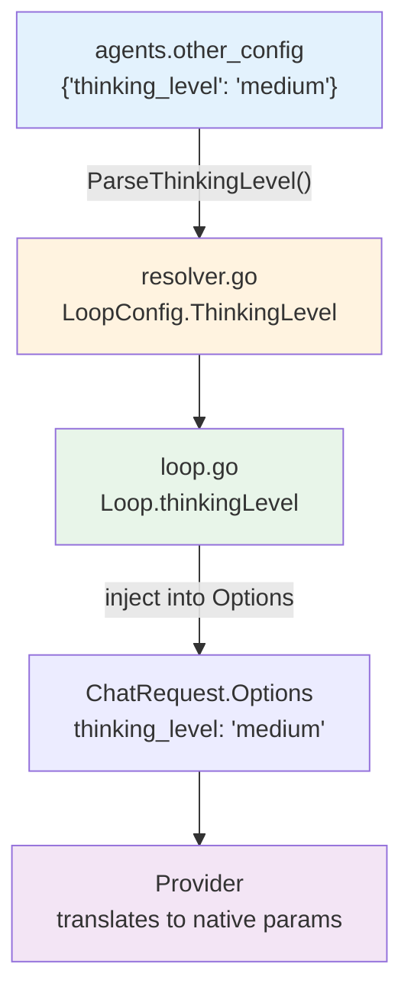

# Letting the Model Think Before It Speaks

**Date:** 2026-02-28

---

A user configures their support agent with Claude Sonnet 4. They ask a multi-step reasoning question — something about calculating pricing tiers with discounts and tax rules across regions. The model responds instantly. Confidently wrong. It skipped a discount rule, double-counted a tax bracket, and presented the result as fact.

The model *could* have gotten it right. Claude, GPT o-series, DeepSeek, Qwen — they all have a "think before answering" mode. A separate reasoning pass where the model works through the problem step by step, invisible to the final output. But GoClaw had no way to turn it on. The scaffolding existed — `StreamChunk.Thinking` was defined, `ChatEventThinking` had an event type — but nothing ever populated them. Extended thinking was a door with no handle.

---

## What It Brings



An admin opens the agent config page, selects a thinking level — Low, Medium, or High — and saves. The next time that agent handles a message, the model reasons before responding. The user sees a collapsible "Thinking..." block in the chat UI while the model works, then the final answer. In traces, thinking tokens show up alongside input/output counts.

No database migration. No new tables. The setting lives in the existing `other_config` JSONB column on agents. The thinking token count lives in the existing `metadata` JSONB on trace spans. Two unused fields, finally put to work.

---

## The Provider Translation Problem

Here's the catch: every provider invented their own way to enable thinking.

| Provider | How to enable | How to set budget | Quirks |
|----------|--------------|-------------------|--------|
| **Anthropic** | `thinking: {type: "enabled", budget_tokens: N}` | Direct token count | Must remove `temperature`. Must increase `max_tokens` to `budget + 8192`. Requires beta header. |
| **OpenAI** | `reasoning_effort: "low"/"medium"/"high"` | Abstract levels, no token count | Only works on o-series models. Other models silently ignore it. |
| **DashScope** (Qwen) | `enable_thinking: true` + `thinking_budget: N` | Direct token count | Top-level body params, not nested. Different budget scale than Anthropic. |

GoClaw needed a single abstraction — `thinking_level` — that each provider translates into its own dialect. The mapping:



Each provider reads `thinking_level` from the request Options map and transforms it. The agent loop doesn't know or care which provider runs underneath — it just sets `options["thinking_level"] = "medium"` and moves on.

---

## The Anthropic Content Block Puzzle

OpenAI and DashScope were straightforward — inject a few params, parse reasoning tokens from the response. Anthropic was not.

Anthropic's extended thinking uses a streaming protocol with multiple content block types: `thinking`, `text`, `tool_use`. Each block starts with a `content_block_start` event that declares the type, followed by deltas, then a `content_block_stop`. The thinking deltas carry the reasoning text. The text deltas carry the final answer. So far, manageable.

Then tool use enters the picture.

When a model with extended thinking calls a tool, the response contains thinking blocks *and* tool_use blocks. Anthropic requires that on the next turn — when you send the tool result back — the assistant message in the conversation history must include the *exact* content blocks from the previous response, thinking blocks and all. If you reconstruct the message from just `content` and `tool_calls` (as GoClaw did for every other provider), Anthropic rejects it.



The solution: `RawAssistantContent` — a `json.RawMessage` field on both `ChatResponse` and `Message`. The Anthropic provider collects the raw content blocks array during streaming and stores it verbatim. When the agent loop appends the assistant message for the tool result turn, it carries `RawAssistantContent` through. When `buildRequestBody()` encounters a message with this field set, it uses it directly as the `"content"` value instead of reconstructing from `Content` + `ToolCalls`.

```go
// In the agent loop, after a tool-calling response:
assistantMsg := providers.Message{
    Role:                "assistant",
    Content:             resp.Content,
    ToolCalls:           resp.ToolCalls,
    RawAssistantContent: resp.RawAssistantContent, // preserve for Anthropic
}
```

For non-Anthropic providers, `RawAssistantContent` is nil — `buildRequestBody()` falls through to the normal path. No behavior change for anything that doesn't need it.

---

## Anthropic's Temperature Constraint

A small thing that took time to track down: Anthropic does not allow `temperature` when thinking is enabled. The API returns a validation error. GoClaw's agent loop always sets `temperature: 0.7` in the Options map. The Anthropic provider now deletes it when thinking is active:

```go
if thinkingLevel != "" && thinkingLevel != "off" {
    body["thinking"] = map[string]interface{}{
        "type":         "enabled",
        "budget_tokens": anthropicThinkingBudget(thinkingLevel),
    }
    delete(body, "temperature")  // Anthropic constraint
    // Also increase max_tokens to budget + 8192
}
```

The `max_tokens` increase is necessary because Anthropic requires `max_tokens >= budget_tokens`. The agent loop's default of 8192 would be below the medium budget of 10000.

---

## DashScope's Option Map Cloning

A subtle bug nearly slipped through with DashScope. The provider modifies the Options map to inject `enable_thinking` and `thinking_budget`, then deletes `thinking_level` so it doesn't leak to the OpenAI base `buildRequestBody()`. But Options is a shared map — mutating it would corrupt the caller's state.

```go
// Clone the Options map before modifying
opts := make(map[string]interface{}, len(req.Options)+2)
for k, v := range req.Options {
    opts[k] = v
}
opts[OptEnableThinking] = true
opts[OptThinkingBudget] = dashscopeThinkingBudget(level)
delete(opts, OptThinkingLevel)
req.Options = opts
```

---

## The Wiring

The thinking level flows from config to request through three layers:



`ParseThinkingLevel()` is a method on `AgentData` that unmarshals just the `thinking_level` field from `OtherConfig`. The resolver calls it when building `LoopConfig`. The loop reads it once at construction and injects it into every `ChatRequest`'s Options map. Clean, no global state.

---

## The UI

Two UI pieces: config and display.

**Config** — a select dropdown in the agent config tab. Off, Low, Medium, High. Each option shows the approximate token budget. The value is extracted from `other_config` alongside `quality_gates` (same pattern — managed keys extracted, remaining JSON stays in the "Other" editor). On save, it's merged back.

**Chat display** — a collapsible `ThinkingBlock` component. While streaming, it's expanded by default with a blinking cursor. The brain icon and muted styling distinguish it from the actual response. The `use-chat-messages` hook accumulates `thinking` events into a ref, same pattern as `streamText` accumulation.

**Traces** — thinking tokens appear in the span detail view, purple-styled alongside the existing cache token display. No type changes needed — `metadata` is already `Record<string, unknown>`.

---

## Files

| File | What |
|---|---|
| `internal/providers/types.go` | `Opt*` constants, `RawAssistantContent` on ChatResponse + Message, `ThinkingTokens` on Usage |
| `internal/providers/anthropic.go` | Full extended thinking: request params, streaming parse, content block preservation, beta header |
| `internal/providers/openai.go` | `reasoning_effort` injection, `CompletionTokensDetails` parsing, DashScope key passthrough |
| `internal/providers/openai_types.go` | `openAICompletionDetails` struct with `ReasoningTokens` |
| `internal/providers/dashscope.go` | `thinking_level` → DashScope native params, Options map cloning |
| `internal/agent/loop.go` | `ThinkingLevel` on LoopConfig/Loop, Options injection, `RawAssistantContent` carry-over |
| `internal/store/agent_store.go` | `ParseThinkingLevel()` method |
| `internal/agent/resolver.go` | Wires `ThinkingLevel` into LoopConfig |
| `internal/agent/loop_tracing.go` | `thinking_tokens` in span metadata, thinking content in verbose preview |
| `ui/web/.../config-sections/thinking-section.tsx` | Thinking level selector (Off/Low/Medium/High) |
| `ui/web/.../agent-config-tab.tsx` | ThinkingSection integration, `thinking_level` extraction from `other_config` |
| `ui/web/.../thinking-block.tsx` | Collapsible thinking panel with streaming cursor |
| `ui/web/.../use-chat-messages.ts` | `thinking` event handling, thinkingText state |
| `ui/web/.../chat-thread.tsx` | ThinkingBlock rendering |
| `ui/web/.../trace-detail-dialog.tsx` | Thinking tokens in span breakdown |

---

## Takeaway

The hardest part wasn't any single provider — it was that "extended thinking" means something different to each one. Anthropic needs content block preservation and a beta header. OpenAI just takes a string. DashScope wants two separate body params with its own budget scale. A single `thinking_level` abstraction hides all of this, but the translation layer is where the complexity lives.

The `RawAssistantContent` pattern — carrying opaque provider data through the generic agent loop — will likely be needed again. Gemini's `thought_signature` (solved earlier with `ToolCall.Metadata`) was the same class of problem: provider-specific state that must survive a round trip through provider-agnostic code. The pattern is: add a `json.RawMessage` or `map[string]string` field, populate it in the provider, carry it in the loop, consume it in the provider. The loop never inspects the contents.
