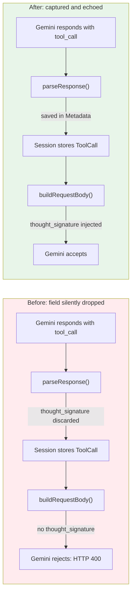

# The Signature You Must Not Forget

**Date:** 2026-02-27

---

An agent running Gemini 3 Flash receives a user question. It decides to call `web_search`. The tool runs, returns results. The agent loop sends the results back to Gemini for the next turn — tool call, tool result, please continue. Gemini rejects the entire request with HTTP 400:

```
Function call is missing a thought_signature in functionCall parts.
```

The agent had done everything right. Called the tool, got the result, formatted the response. But somewhere between Gemini's response and GoClaw's next request, a field was silently dropped — and Gemini refused to continue without it.

---

## What Changed



| Scenario | Before | After |
|----------|--------|-------|
| Gemini tool call → next turn | HTTP 400 crash | Works normally |
| Old session with Gemini tool calls | HTTP 400 crash | Tool calls collapsed to plain text, context preserved |
| Non-Gemini providers | Unaffected | Unaffected (Metadata empty, omitted from JSON) |

---

## What Is a Thought Signature?

Gemini 2.5 and later models include an encrypted `thought_signature` field alongside every tool call in their response. It's a cryptographic blob — the model's internal reasoning state, opaque to the caller. When you send the conversation history back for the next turn, Gemini expects that signature to be present on every function call part. If it's missing, the model can't verify its own reasoning chain, and the API rejects the request.

Other providers (OpenAI, Anthropic, DeepSeek) don't have this concept. GoClaw's internal `ToolCall` struct had three fields — ID, Name, Arguments. There was nowhere for `thought_signature` to live, so it was deserialized from the response and immediately discarded.

---

## The Four-Stage Data Loss

The fix required changes at every stage of the tool call lifecycle.

**Stage 1: Deserialization.** The `openAIFunctionCall` struct — shared by all OpenAI-compatible providers — needed the field:

```go
type openAIFunctionCall struct {
    Name             string `json:"name"`
    Arguments        string `json:"arguments"`
    ThoughtSignature string `json:"thought_signature,omitempty"`
}
```

**Stage 2: Internal storage.** The `ToolCall` struct needed somewhere to carry provider-specific metadata without leaking Gemini concepts into every provider. A generic `Metadata map[string]string` field — `omitempty` so it vanishes from JSON when empty:

```go
type ToolCall struct {
    ID        string                 `json:"id"`
    Name      string                 `json:"name"`
    Arguments map[string]interface{} `json:"arguments"`
    Metadata  map[string]string      `json:"metadata,omitempty"`
}
```

**Stage 3: Capture.** Both `parseResponse()` (non-streaming) and the streaming `toolCallAccumulator` needed to read `ThoughtSignature` and store it into `Metadata["thought_signature"]`.

**Stage 4: Injection.** `buildRequestBody()` reads `Metadata["thought_signature"]` and injects it back into the `function` map when rebuilding the conversation history.

With all four stages connected, the signature survives the round trip: Gemini → parse → session → rebuild → Gemini.

---

## The Ghost in the Session

The fix worked perfectly for new conversations. Then we tested it on an existing session — one that had been running before the fix was deployed. Same error. Position 22 in the message array.

The trace data told the story. The session history contained two old `web_search` tool calls from earlier in the conversation. Those messages had been stored when GoClaw was still discarding `thought_signature`. The field was gone — not just missing from the struct, but never captured in the first place. No amount of code changes could recover what was never saved.

```sql
-- Session messages: no metadata field on old tool_calls
SELECT messages::text LIKE '%"metadata"%' FROM sessions
WHERE session_key = 'agent:default:telegram:group:-5094204435';
-- false
```

Two options: tell users to start new sessions (acceptable for a fix, not for a product), or handle the missing signatures gracefully.

---

## Collapse, Don't Crash

The solution: when building a request for Gemini, detect old tool call cycles where `thought_signature` is missing, and rewrite them as plain text before sending.

An assistant message with tool calls becomes a plain assistant message describing what was called. The corresponding tool result messages merge into a single user message with the results. The conversation context survives — the model knows a search happened and what it returned — but without the structured tool call format that triggers Gemini's signature check.

```
BEFORE (rejected):
  assistant: "" + tool_calls: [{web_search, query: "..."}]
  tool: "Search results..."

AFTER (accepted):
  assistant: "[Called web_search({\"query\":\"...\"})]"
  user: "[web_search result]: Search results..."
```

The collapse function runs as a pre-processing step in `buildRequestBody()`, only for Gemini providers. It scans all assistant messages for tool calls missing `thought_signature`, collects their IDs, then rewrites the affected message pairs in a single pass. Messages with valid signatures pass through untouched.

As sessions get compacted and old messages are summarized away, the collapsed text naturally disappears. New tool calls carry proper signatures. The problem is self-healing — it just needed a bridge for the transition.

---

## Files

| File | What |
|---|---|
| `internal/providers/types.go` | `Metadata map[string]string` on `ToolCall` — generic provider metadata |
| `internal/providers/openai.go` | Capture in `parseResponse()` + streaming accumulator; inject in `buildRequestBody()` |
| `internal/providers/openai_types.go` | `ThoughtSignature` field on `openAIFunctionCall`; split from openai.go |
| `internal/providers/openai_gemini.go` | `collapseToolCallsWithoutSig()` — rewrites old tool calls as plain text |

---

## Takeaway

The `thought_signature` requirement is, in isolation, reasonable — a model wanting to verify its own reasoning chain across turns. The problem wasn't the requirement but the silence. The field arrived in the JSON response, was structurally present, and GoClaw's deserializer happily ignored it because the target struct had no matching field. Go's `json.Unmarshal` doesn't warn about unmapped fields. The signature was there, then it wasn't, and nothing complained until Gemini did.

The deeper lesson is about session state. A struct change that looks complete — capture here, inject there, done — only covers the live path. But sessions are time capsules. They carry messages from before your fix existed, serialized by code that didn't know what to preserve. Any change to wire format handling needs to answer: what happens to data that was already stored without this field? For `thought_signature`, the answer was collapse and move on. For other fields, it might be backfill, migration, or graceful degradation. But the question always needs asking.
