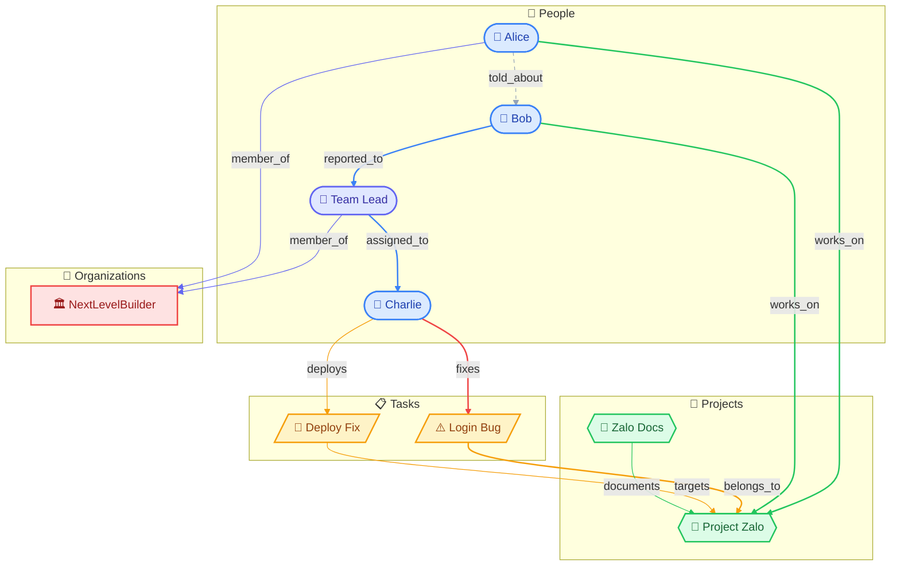
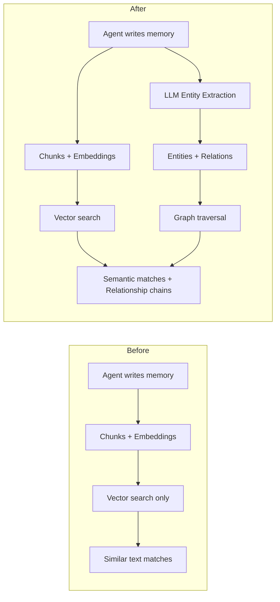
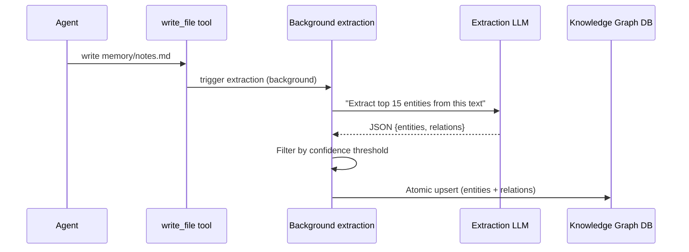

# When Vectors Aren't Enough: Building a Knowledge Graph on PostgreSQL

**Date:** 2026-03-09

---

An agent in a Telegram group chat handles 50 messages a day. Alice tells Bob about Project Zalo. Bob reports a bug to the team lead. The lead assigns the fix to Charlie. Three days later, someone asks: "Who is working on the Zalo bug?" The agent searches memory — vector similarity finds chunks mentioning "Zalo" and "bug" separately, but it can't connect the dots. Who told who? Who assigned what? The answer sits across three different conversations, linked by people and actions. That's where a knowledge graph comes in.

**Query: "Who is working on the Zalo bug?"** — Traverse: `Zalo` ←[belongs_to]— `Login Bug` ←[fixes]— `Charlie`. Answer: **Charlie**, reached in 2 hops. Vector search alone cannot follow this chain.

---

## What It Brings

The knowledge graph doesn't replace vector memory — it complements it. Vector search answers "find me something similar to X." The knowledge graph answers "who is connected to what, and how?"

| | Before | After |
|---|---|---|
| "Who works on Zalo?" | Finds chunks mentioning "Zalo" | Traverses `assigned_to` relation to find `Charlie` |
| Multi-hop | Can't connect A→B→C | Walks 2-3 hops via recursive CTE |
| Admin visibility | Data buried in vectors | Interactive graph visualization |

---

## How It Works

When an agent writes to memory, a background goroutine kicks off automatically. It reads KG settings from the database (provider, model, confidence threshold), sends the content to an LLM for entity extraction, then stores the results atomically.

Settings are read from the database on every call — no caching. Admin changes the extraction model in the UI? The very next memory write picks it up. No restart needed.

The extraction prompt is deliberately constrained: "top 15 entities only, descriptions under 50 chars, no code blocks." Without these limits, the LLM produces verbose output that gets truncated mid-JSON — we learned this the hard way.

---

## The Bugs That Bit Us

### The Silent Panic

The worst bug produced zero logs. The extraction goroutine ran in the background. When it panicked, nothing surfaced — the agent kept working normally, but KG stayed empty.

**Root cause:** The LLM returns entities with human-readable IDs like `"alice"`. Relations reference these IDs. But the database uses UUIDs. The code tried to parse `"alice"` as a UUID — instant panic, swallowed by the goroutine.

**Fix:** Upsert each entity with `RETURNING id`, build a lookup map from external_id to actual UUID. Relations resolve through this map. Unknown references are silently skipped instead of crashing.

### The Empty Global View

Clicking "Global" in the UI showed zero entities, even though the database had 26. The SQL was filtering `WHERE user_id = ''` — but every entity has a real user_id like `"group:telegram:-100xxx"`. Empty string matched nothing.

**Fix:** Dynamic WHERE clause. When user_id is empty, simply omit the filter. Applied to all four query methods.

### LLM Output Truncation

Early tests with Qwen showed `finish_reason=length` — the JSON was cut off mid-sentence. Three changes fixed it: input capped at 6K chars (was 12K), max_tokens bumped to 8192 (was 4096), and the prompt changed from "extract ALL" to "extract top 15." Less is more.

---

## The Graph Visualization

The UI offers both a table view and an interactive force-directed graph built with `@xyflow/react` and `d3-force`. Nodes are color-coded by entity type (person, project, task, etc.), edges show relation types, and clicking a node opens its detail dialog.

Getting the layout right took a few iterations. Disconnected clusters kept drifting apart because the only centering force was `forceCenter`, which acts on the centroid, not individual nodes. Adding `forceX`/`forceY` gravity forces solved it — they pull every node gently toward the center, keeping clusters visible without collapsing them.

---

## The Swappable Backend

Everything depends on a single Go interface: `KnowledgeGraphStore`. PostgreSQL is just one implementation. Traversal uses a recursive CTE with a 5-second timeout and cycle detection. If we ever hit PG limits with deep traversals or community detection, swapping in Neo4j means implementing the same interface with Cypher queries. The HTTP handlers, agent tools, and extraction pipeline don't change at all.

---

## Files

| File | What |
|---|---|
| `internal/store/knowledge_graph_store.go` | Interface + types |
| `internal/store/pg/knowledge_graph.go` | PostgreSQL CRUD, search, ingestion |
| `internal/store/pg/knowledge_graph_traversal.go` | Recursive CTE traversal |
| `migrations/000013_knowledge_graph.up.sql` | Schema + indexes |
| `internal/knowledgegraph/extractor.go` | LLM extraction pipeline |
| `internal/knowledgegraph/extractor_prompt.go` | Extraction prompt |
| `internal/tools/knowledge_graph.go` | Agent search/traversal tool |
| `internal/tools/memory_interceptor.go` | Auto-extraction hook |
| `cmd/gateway_managed.go` | Wiring + settings reader |
| `internal/http/knowledge_graph.go` | HTTP handler + routes |
| `internal/http/knowledge_graph_handlers.go` | API endpoints |
| `ui/web/src/pages/memory/kg-entities-tab.tsx` | Entity table + graph toggle |
| `ui/web/src/pages/memory/kg-graph-view.tsx` | Force-directed graph visualization |
| `ui/web/src/pages/memory/kg-entity-detail-dialog.tsx` | Entity detail dialog |
| `ui/web/src/pages/memory/kg-extract-dialog.tsx` | Manual extraction dialog |
| `ui/web/src/pages/memory/hooks/use-knowledge-graph.ts` | React hooks |

---

## Takeaway

Vector memory and knowledge graph serve different purposes. Vectors find similar content. Graphs find connected content. Together, they give agents both fuzzy recall and precise relationship chains.

The interface-based design paid off immediately — every bug fix happened in the PostgreSQL layer without touching anything above it. And the silent goroutine panic taught us a simple rule: always log at the entry point of background work, so you at least know the function was called before it blew up.
