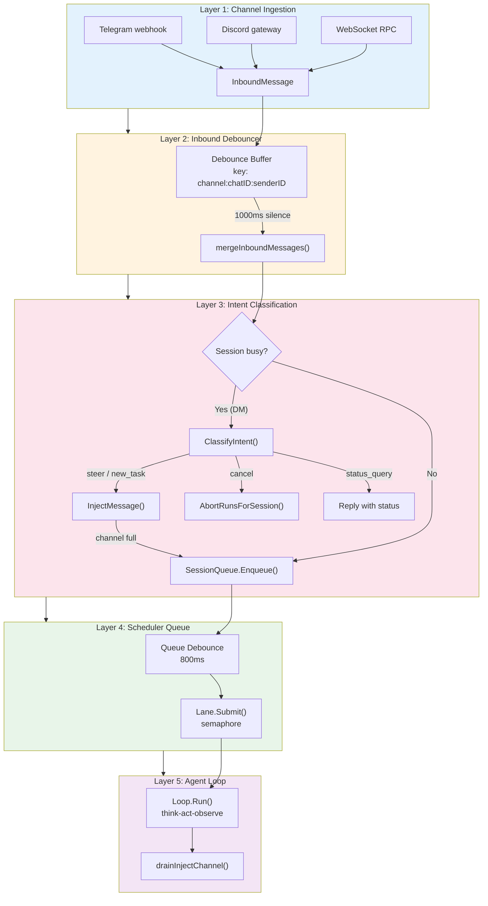
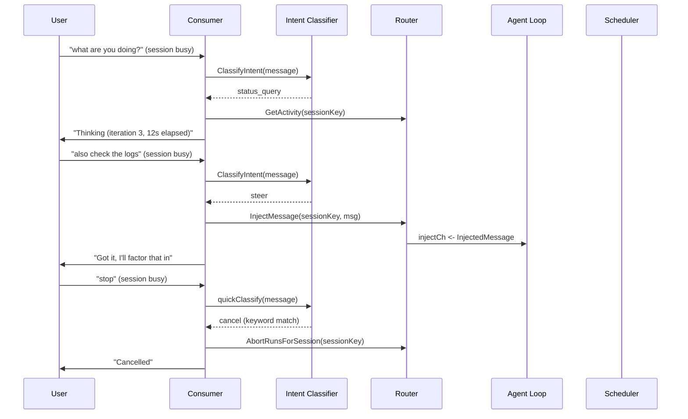
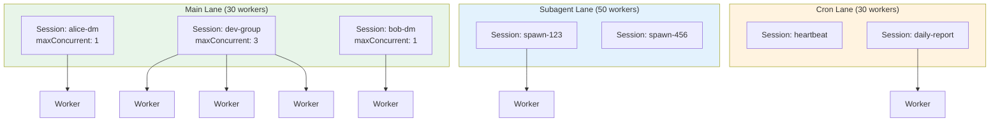
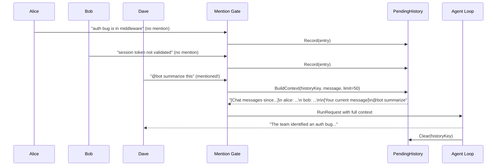

# The Anatomy of a Message: From Keystroke to Reply

**Date:** 2026-03-20

---

A user types "hey, check this error" into a Telegram group. The bot is already mid-way through a 30-second analysis for another user. What happens to that message? Does it queue? Does it merge with something? Does it get injected into the running turn? And what if three more messages land before the bot finishes?

This is the story of GoClaw's message pipeline — the five-layer system that turns chaotic, concurrent, multi-user chat input into orderly agent execution. It is not about a single feature. It is about the plumbing that makes everything else possible.

---

## The Five Layers

A message passes through five distinct processing stages, each with its own concurrency model and failure strategy. Understanding which layer does what — and where the handoff points are — is the key to reasoning about message behavior.



| Layer | File | What It Does | Concurrency |
|-------|------|--------------|-------------|
| Inbound Debouncer | `internal/bus/inbound_debounce.go` | Merges rapid messages from same sender | Per-sender timer, mutex |
| Intent Classifier | `internal/agent/intent_classify.go` | Detects status/cancel/steer intent when busy | Keyword fast-path + LLM fallback |
| Scheduler Queue | `internal/scheduler/queue.go` | Per-session FIFO with debounce + drop policy | Mutex, generation counter |
| Lane Manager | `internal/scheduler/lanes.go` | Global concurrency pools (semaphore channels) | Buffered channel tokens |
| Agent Loop | `internal/agent/loop.go` + `inject.go` | Think-act-observe with mid-run injection | Atomic counters, per-session TryLock |

---

## Layer 2: The Inbound Debouncer — Catching the Rapid Typist

Users don't send one polished message. They send three in quick succession:

```
"hey"
"can you check the auth bug"
"the one from yesterday"
```

Without debouncing, that is three separate agent runs — three LLM calls, three responses, three bills. The `InboundDebouncer` collapses them into one.

The mechanism is simple: buffer messages keyed by `channel:chatID:senderID`. Each new message resets a 1000ms timer. When silence arrives, flush.

```go
// inbound_debounce.go — the core pattern
buf.messages = append(buf.messages, msg)
if buf.timer != nil {
    buf.timer.Stop()
}
buf.timer = time.AfterFunc(d.debounceMs, func() {
    d.flushKey(key)
})
```

The merge function joins content with `\n` and concatenates media:

```go
func mergeInboundMessages(msgs []InboundMessage) InboundMessage {
    last := msgs[len(msgs)-1]
    parts := make([]string, 0, len(msgs))
    for _, m := range msgs {
        if m.Content != "" {
            parts = append(parts, m.Content)
        }
    }
    last.Content = strings.Join(parts, "\n")
    // ...media from all messages concatenated
}
```

One critical exception: **media messages bypass debounce entirely**. Images and documents flush any pending text buffer first, then process immediately. You don't want a photo stuck behind a 1-second timer.

---

## Layer 3: Intent Classification — The Smart Triage

This is where it gets interesting. A merged message arrives, but the session is already running an agent turn. What now?

For **groups** (maxConcurrent=3): skip classification, go straight to the scheduler. Multiple runs can execute in parallel.

For **DMs** (maxConcurrent=1): the system makes a fast decision. It classifies the user's intent into one of four categories before deciding whether to queue, inject, or respond immediately.



The classifier uses a two-tier approach. Short messages (under 60 chars) hit a keyword fast-path — `"stop"`, `"cancel"`, `"thoi"`, `"status"` — that costs zero LLM tokens. Longer messages fall through to a real LLM call with `max_tokens: 20` and `temperature: 0.0`, capped at a 5-second timeout.

```go
func quickClassify(msg string) (IntentType, bool) {
    lower := strings.ToLower(strings.TrimSpace(msg))
    if len(lower) > 60 {
        return "", false
    }
    for _, kw := range cancelKeywords {
        if strings.Contains(lower, kw) {
            return IntentCancel, true
        }
    }
    // ...status keywords
    return "", false
}
```

When the intent is `steer` or `new_task`, the message is injected into the running loop via a buffered channel (capacity 5). If the channel is full — five unprocessed injections already waiting — the system gives up on injection and falls through to the normal scheduler queue.

---

## Layer 4: The Scheduler — Lanes, Queues, and Debounce

The scheduler is where global concurrency meets per-session serialization. It has two dimensions:

**Lanes** (horizontal): four independent worker pools that never block each other.

```
main      (30 workers) — user-facing messages from channels
subagent  (50 workers) — delegate/spawn agent calls
team     (100 workers) — team collaboration tasks
cron      (30 workers) — scheduled jobs and heartbeats
```

Each lane is a semaphore implemented as a buffered channel. `lane.Submit()` blocks until a token is available:

```go
type Lane struct {
    sem chan struct{} // buffered channel with `concurrency` capacity
}

func (l *Lane) Submit(ctx context.Context, fn func()) error {
    l.pending.Add(1)
    select {
    case l.sem <- struct{}{}: // acquire token
        l.pending.Add(-1)
        l.active.Add(1)
        l.wg.Add(1)
        go func() {
            defer func() { <-l.sem; l.active.Add(-1); l.wg.Done() }()
            fn()
        }()
        return nil
    case <-ctx.Done():
        l.pending.Add(-1)
        return ctx.Err()
    }
}
```

**Session Queues** (vertical): per-session FIFO with its own debounce and concurrency limit.



The session queue has its own 800ms debounce timer, independent from the inbound debouncer. Why two debounce layers? The inbound debouncer collapses messages *before* routing (same sender, same chat). The queue debounce collapses *after* routing — it prevents a burst of merged messages from immediately spawning multiple agent runs on the same session.

When the queue overflows (default cap: 10), a drop policy kicks in. The default is `DropOld` — evict the oldest queued message, keep the newest. The evicted request gets `ErrQueueDropped` on its result channel so the consumer can notify the user.

One more safeguard: the **adaptive throttle**. When a session's history reaches 60% of the context window, `effectiveMaxConcurrent()` forces concurrency back to 1:

```go
func (sq *SessionQueue) effectiveMaxConcurrent() int {
    if sq.tokenEstimateFn == nil {
        return sq.maxConcurrent
    }
    tokens, contextWindow := sq.tokenEstimateFn(sq.key)
    if contextWindow > 0 && float64(tokens)/float64(contextWindow) >= 0.6 {
        return 1 // near summary threshold — serialize
    }
    return sq.maxConcurrent
}
```

This prevents a race condition where multiple concurrent runs all push the session past the 75% summarization threshold simultaneously.

---

## Layer 5: Mid-Run Injection — The Message That Doesn't Wait

The most elegant piece of the pipeline. When a message is classified as `steer` or `new_task` and the session is busy, it doesn't queue behind the current run. It gets injected *into* the running agent loop via a buffered channel.

The agent loop drains this channel at two strategic points:

**Point A** — After tool execution, before the next LLM call. The injected messages appear after tool results, so the LLM sees: `[tool results...] + [User sent a follow-up message while you were working]`.

**Point B** — When the LLM returns with no tool calls (about to exit). The loop saves the current assistant response, appends the injected messages, and *continues iterating*. The LLM gets another chance to respond to the new input.

```go
// Point B: inject.go + loop.go — the "almost done but wait" pattern
if forLLM, forSession := l.drainInjectChannel(req.InjectCh, emitRun); len(forLLM) > 0 {
    messages = append(messages, providers.Message{Role: "assistant", Content: resp.Content})
    messages = append(messages, forLLM...)
    pendingMsgs = append(pendingMsgs, providers.Message{Role: "assistant", Content: resp.Content})
    pendingMsgs = append(pendingMsgs, forSession...)
    continue // <-- back to the top of the loop
}
```

The injected messages are wrapped with a context hint so the LLM understands the timing:

```go
wrapped := fmt.Sprintf("[User sent a follow-up message while you were working]\n%s", content)
```

Security still applies: injected content goes through the same `InputGuard.Scan()` and truncation as regular messages. The `processInjectedMessage` function in `inject.go` handles this consistently.

---

## Group Messages: The Mention Gate Pattern

Groups add a unique challenge: dozens of messages from various users, most of which aren't addressed to the bot. The system uses a **mention gate** to filter signal from noise.

When `require_mention` is enabled (default for groups), messages where the bot is NOT mentioned are silently recorded into `PendingHistory` — a per-group RAM-first buffer with optional PostgreSQL persistence. No agent run happens. No LLM call. Just a `Record()` into the history map.

When someone finally @mentions the bot, the accumulated context is prepended to the current message:

```
[Chat messages since your last reply - for context]
  alice [15:04]: I think the auth bug is in the middleware
  bob [15:05]: yeah, the session token isn't being validated
  carol [15:06]: I can reproduce it on staging

[Your current message]
[From: dave]
@bot summarize this discussion and suggest a fix
```

The bot sees the full conversation thread, not just the single message that triggered it. After replying, `Clear()` wipes the pending history for that group so the next mention starts fresh.



Group sessions also get a special system prompt injected by the consumer:

> *"You are in a GROUP chat (multiple participants), not a private 1-on-1 DM. Messages may include a [Chat messages since your last reply] section... Keep responses concise and focused; long replies are disruptive in groups."*

And groups allow up to 3 concurrent agent runs (vs 1 for DMs), since multiple users can legitimately need responses simultaneously.

---

## The Generation Counter: Surviving Restarts

One subtle piece of machinery in the scheduler: the **generation counter**. When the process receives SIGUSR1 (in-process restart), the scheduler calls `Reset()` on every session queue. This bumps the generation, cancels all active runs, and drains the queue.

Why a counter instead of just cancelling? Because Go goroutines don't disappear instantly. A goroutine running `executeRun()` might finish its LLM call *after* the reset. Without the generation check, it would remove itself from `activeRuns` and trigger `scheduleNext()` — scheduling work from the old world into the new one.

```go
func (sq *SessionQueue) executeRun(ctx context.Context, runID string, runGeneration uint64, pending *PendingRequest) {
    result, err := sq.runFn(ctx, pending.Req)
    // ...
    sq.mu.Lock()
    if entry, ok := sq.activeRuns[runID]; ok && entry.generation == sq.generation {
        delete(sq.activeRuns, runID)
        sq.removeFromOrder(runID)
    } else if runGeneration != sq.generation {
        sq.mu.Unlock()
        return // stale completion from old generation — silently ignore
    }
    // ...
}
```

Similarly, `CancelAll()` sets an `abortCutoffTime`. Any message enqueued before that timestamp is skipped with `ErrMessageStale` when its turn comes. This prevents old messages from zombieing back to life after a `/stopall`.

---

## Files

| File | What |
|---|---|
| `internal/bus/inbound_debounce.go` | Layer 2: per-sender debounce with timer reset, media bypass |
| `internal/bus/bus.go` | Message bus: 500-buffered inbound/outbound channels |
| `internal/bus/types.go` | InboundMessage, OutboundMessage, MediaFile types |
| `internal/agent/intent_classify.go` | Layer 3: keyword fast-path + LLM intent classification |
| `internal/agent/inject.go` | InjectedMessage type, drainInjectChannel(), processInjectedMessage() |
| `internal/agent/router.go` | Run registry: RegisterRun(), InjectMessage(), IsSessionBusy() |
| `internal/agent/loop.go` | Agent loop with Point A and Point B injection drain |
| `internal/agent/loop_types.go` | RunRequest, RunResult, AgentEvent definitions |
| `internal/scheduler/lanes.go` | Lane manager: semaphore-based worker pools |
| `internal/scheduler/queue.go` | SessionQueue: FIFO, debounce, drop policy, adaptive throttle |
| `internal/scheduler/scheduler.go` | Top-level scheduler: session registry, ScheduleWithOpts() |
| `internal/scheduler/errors.go` | ErrQueueFull, ErrMessageStale, ErrGatewayDraining |
| `internal/channels/history.go` | PendingHistory: RAM-first group message buffer with LRU eviction |
| `internal/sessions/key.go` | BuildSessionKey(), BuildGroupTopicSessionKey() |
| `cmd/gateway_consumer_normal.go` | Consumer: routing, intent classify, group concurrency override |
| `cmd/gateway.go` | Scheduler initialization, lane config, token estimate wiring |

---

## Takeaway

The most surprising thing about this pipeline is that it's not one system — it's five systems composed in series, each ignorant of the others. The debouncer doesn't know about lanes. The intent classifier doesn't know about queue drop policies. The injection channel doesn't know about the session queue's generation counter.

This layered independence is what makes the system both resilient and evolvable. When we added group concurrency, we touched `maxConcurrent` in the consumer and `effectiveMaxConcurrent()` in the queue — nothing in the debouncer or agent loop needed to change. When we added intent classification, we inserted it between the debouncer and the scheduler — the scheduler didn't know or care.

The pattern to remember: **each layer owns exactly one concern** (deduplication, triage, ordering, capacity, execution) and communicates with the next via a simple interface (function call, channel, result channel). No layer reaches into another's internals. No shared mutable state crosses boundaries. The complexity lives in the composition, not the components.
