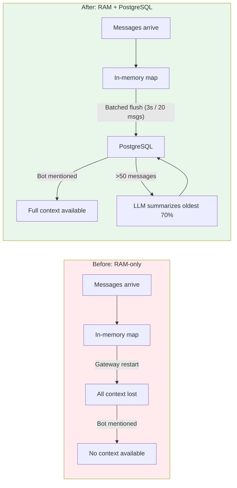
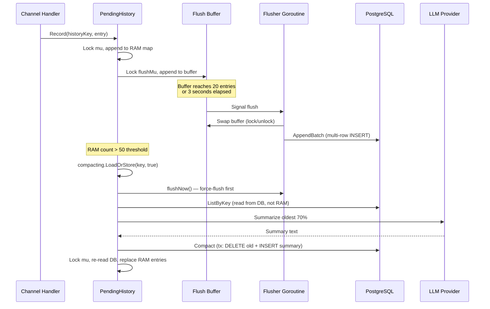

# When the Bot Forgets Everything You Just Said

**Date:** 2026-03-09

---

A team runs a Telegram group with a GoClaw bot. Throughout the day, five people discuss a bug — sharing stack traces, proposing fixes, debating approaches. Nobody @mentions the bot. Then someone finally does: "Hey bot, summarize what we've been discussing about the auth bug."

The bot responds: "I don't have context about any auth bug discussion."

Fifty messages of context, gone. Not because the data wasn't tracked — `PendingHistory` had been dutifully recording every message into a `map[string][]HistoryEntry`. But the gateway restarted overnight for a deploy. RAM cleared. History evaporated. The bot acts like it just walked into the room.

---

## What It Brings



| Aspect | Before | After |
|--------|--------|-------|
| Persistence | RAM only — lost on restart | PostgreSQL with batched writes |
| Scalability | Unlimited RAM growth until OOM | Auto-compaction at 50 messages via LLM |
| Visibility | None — no way to see buffered messages | Web UI dashboard with group view |
| Cleanup | Manual — or never | 7-day TTL sweep via `DeleteStale()` |
| Management | SSH + restart | Compact / Clear buttons in the browser |

---

## Architecture: RAM-First, Flush Later

The core design tension: group chats can be high-throughput (dozens of messages per second during active discussion), but every message must eventually reach PostgreSQL. Writing to the database on every `Record()` call would be a bottleneck. The solution: RAM-first with batched async flush.



Three separate locks prevent contention:

- **`ph.mu`** (sync.Mutex): Protects the in-memory `entries` map. Held for microseconds during append/read.
- **`ph.flushMu`** (sync.Mutex): Protects the flush buffer. Never held during DB I/O — the buffer is swapped atomically, then written outside the lock.
- **`ph.compacting`** (sync.Map): Per-key boolean guard preventing concurrent compactions on the same history key.

The critical insight in `runCompaction`: it reads entries from the **database**, not from RAM. During the 30-second LLM call, new messages keep flowing into RAM and the flush buffer. Reading from DB after `flushNow()` gives the compactor a consistent snapshot without holding `ph.mu` for the entire duration.

```go
// history_compaction.go — Step 6: RAM reconciliation after compaction
ph.mu.Lock()
if _, exists := ph.entries[historyKey]; !exists {
    // Key was Clear()ed during compaction — remove stale summary
    ph.mu.Unlock()
    _ = ph.store.DeleteByKey(ctx, ph.channelName, historyKey)
    return
}
// Re-read from DB for complete state (summary + kept + new entries)
fresh, err := ph.store.ListByKey(ctx, ph.channelName, historyKey)
if err == nil {
    rebuilt := make([]HistoryEntry, 0, len(fresh))
    for _, f := range fresh {
        rebuilt = append(rebuilt, HistoryEntry{
            Sender: f.Sender, Body: f.Body,
            Timestamp: f.CreatedAt, MessageID: f.PlatformMsgID,
        })
    }
    ph.entries[historyKey] = rebuilt
}
ph.mu.Unlock()
```

---

## The Multi-Row INSERT Trick

The store layer uses a single multi-row INSERT instead of N individual inserts. For a batch of 20 messages, that's one round-trip instead of twenty:

```go
// pending_message_store.go — AppendBatch
const cols = 10
placeholders := make([]string, len(msgs))
args := make([]any, 0, len(msgs)*cols)

for i := range msgs {
    base := i * cols
    placeholders[i] = fmt.Sprintf("($%d,$%d,$%d,$%d,$%d,$%d,$%d,$%d,$%d,$%d)",
        base+1, base+2, base+3, base+4, base+5, base+6, base+7, base+8, base+9, base+10)
    args = append(args, msgs[i].ID, msgs[i].ChannelName, msgs[i].HistoryKey,
        msgs[i].Sender, msgs[i].SenderID, msgs[i].Body, msgs[i].PlatformMsgID,
        msgs[i].IsSummary, now, now)
}
```

Each message gets a UUID v7 (time-ordered) primary key. The `Compact()` method wraps DELETE + INSERT in a single transaction — either both succeed or neither does.

---

## Channel Type Constants: Killing Magic Strings

A side quest during implementation: the string `"telegram"` appeared in 8 different files. `"zalo_personal"` showed up in 5. A typo in any of them — `"telegam"`, `"zalo-personal"` — would silently route messages to nowhere.

```go
// internal/channels/channel.go
const (
    TypeTelegram     = "telegram"
    TypeDiscord      = "discord"
    TypeSlack        = "slack"
    TypeFeishu       = "feishu"
    TypeWhatsApp     = "whatsapp"
    TypeZaloOA       = "zalo_oa"
    TypeZaloPersonal = "zalo_personal"
)
```

Now `channels.TypeTelegram` is used everywhere — factory registration, channel construction, history tracking, slog attributes. The compiler catches typos instead of users discovering broken routing in production.

---

## The Web UI: Making the Invisible Visible

Before this change, the only way to know what messages were buffered was to query the database directly. The dashboard adds a `/pending-messages` page following the established `DelegationsHandler` pattern:

| Endpoint | Method | Purpose |
|----------|--------|---------|
| `/v1/pending-messages` | GET | List groups with counts, summary status |
| `/v1/pending-messages/messages` | GET | List individual messages for a group |
| `/v1/pending-messages` | DELETE | Clear all messages for a group |
| `/v1/pending-messages/compact` | POST | Trigger compaction (MVP: clear only) |

The frontend groups messages by `channel_name + history_key` and shows a table with message counts, compaction status badges ("Raw" vs "Compacted"), and last activity timestamps. Clicking a row opens a dialog with the full message list — summary rows highlighted in amber.

```typescript
// use-pending-messages.ts — the hook follows useHttp() pattern
const loadGroups = useCallback(async () => {
  setLoading(true);
  try {
    const res = await http.get<PendingMessageGroup[]>("/v1/pending-messages");
    setGroups(res ?? []);
  } finally {
    setLoading(false);
  }
}, [http]);
```

---

## Challenge: The Clear-During-Compaction Race

The trickiest concurrency scenario: a user clicks "Clear" on the web UI while an LLM compaction is running in the background for the same group.

1. Compaction goroutine starts. Reads 60 entries from DB. Calls LLM (30 seconds).
2. User clicks Clear. `DeleteByKey()` removes all 60 rows from DB. RAM entries deleted.
3. LLM returns. Compaction calls `store.Compact()` — deletes rows (already gone, no-op) and inserts a summary.
4. Now there's a stale summary row in the DB for a group that was intentionally cleared.

The fix is in Step 6 of `runCompaction`: after the DB transaction, it checks if the key still exists in RAM. If it doesn't — meaning `Clear()` was called — it deletes the stale summary from DB:

```go
if _, exists := ph.entries[historyKey]; !exists {
    ph.mu.Unlock()
    _ = ph.store.DeleteByKey(ctx, ph.channelName, historyKey)
    slog.Info("compaction.cleared_stale", "channel", ph.channelName, "key", historyKey)
    return
}
```

---

## Files

| File | What |
|---|---|
| `migrations/000012_channel_pending_messages.up.sql` | Table schema with UUID v7 PK, sender_id, indexes |
| `internal/store/pending_message_store.go` | Interface + PendingMessage/PendingMessageGroup types |
| `internal/store/pg/pending_message_store.go` | PostgreSQL implementation with multi-row INSERT |
| `internal/channels/history.go` | RAM-first pending history with persistence hooks |
| `internal/channels/history_flush.go` | Background batched flusher goroutine |
| `internal/channels/history_compaction.go` | LLM-based summarization with concurrency guards |
| `internal/channels/channel.go` | Channel type constants (TypeTelegram, etc.) |
| `internal/http/pending_messages.go` | HTTP handler for 4 REST endpoints |
| `internal/gateway/server.go` | Handler registration in gateway server |
| `cmd/gateway.go` | Wiring pending store into channel factories |
| `cmd/gateway_http_handlers.go` | HTTP handler instantiation |
| `cmd/gateway_channels_setup.go` | Channel registration with type constants |
| `internal/channels/telegram/channel.go` | Telegram channel with persistent history |
| `internal/channels/discord/discord.go` | Discord channel with persistent history |
| `internal/channels/slack/channel.go` | Slack channel with persistent history |
| `internal/channels/feishu/feishu.go` | Feishu channel with persistent history |
| `internal/channels/zalo/personal/channel.go` | Zalo Personal channel with persistent history |
| `ui/web/src/pages/pending-messages/` | React page, dialog, hook, types (4 files) |
| `ui/web/src/lib/constants.ts` | Added PENDING_MESSAGES route |
| `ui/web/src/routes.tsx` | Lazy route registration |
| `ui/web/src/components/layout/sidebar.tsx` | Navigation item with Inbox icon |

---

## Takeaway

The RAM-first + batched flush pattern is a general solution for any feature that needs both low-latency writes and durable storage. The key architectural choice — reading from DB during compaction instead of locking RAM — means the critical path (`Record()`) stays sub-microsecond while background operations can take 30+ seconds without blocking message processing.

This also establishes a pattern for future channel-level persistence: any per-group data that currently lives only in RAM (typing indicators, reaction counts, user presence) can follow the same architecture — fast in-memory map protected by a mutex, async flush to Postgres, background cleanup. The `PendingMessageStore` interface and `MakeHistory()` factory make it trivial to opt channels in or out of persistence per deployment.
