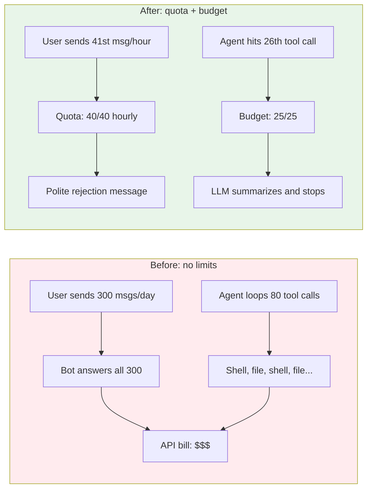
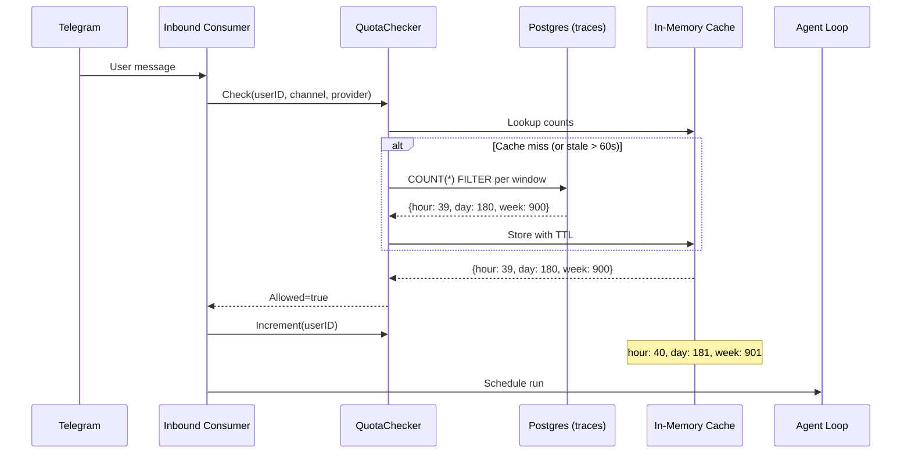

# The Bot That Couldn't Say No

**Date:** 2026-03-04

---

A Telegram group with 40 members. One bot. A few curious users discover it can write code, summarize articles, translate documents. Word spreads. Within a week, two power users are sending 200+ messages per day. The Anthropic bill triples. The admin checks the dashboard — no way to limit anyone. The bot dutifully answers every single message, no matter how many have come before. It simply cannot say no.

This is the story of teaching the gateway to count — and to politely decline when the count gets too high. But also, quietly, of teaching each agent to stop calling tools before it's run up an infinite tab.

---

## Two Problems, One Deployment

The quota system addresses two distinct abuse vectors that share no code but share a common philosophy: measure, warn, stop gracefully.



| Scenario | Before | After |
|----------|--------|-------|
| Power user sends 200+ msgs/day | All answered, full API cost | Capped at configured limits per hour/day/week |
| Agent enters tool loop (shell, read, shell, read...) | Runs until `maxIterations` (20 LLM calls) | Soft stop at 25 tool calls, LLM summarizes |
| Admin wants different limits per group | Not possible | Config overrides: Group > Channel > Provider > Default |
| Quota config change via UI | Requires restart | Hot-reloaded via pub/sub |

---

## Part A: Channel Quota Limiter

The quota checker sits in the inbound message pipeline — after agent resolution, before scheduling. It counts top-level traces (parent_trace_id IS NULL) per user across three rolling windows: hour, day, week.



The decisive query uses PostgreSQL's `FILTER` clause to count all three windows in a single pass, backed by a partial index:

```sql
-- Migration 000009
CREATE INDEX CONCURRENTLY IF NOT EXISTS idx_traces_quota
ON traces (user_id, created_at DESC)
WHERE parent_trace_id IS NULL AND user_id IS NOT NULL;
```

```go
err := qc.db.QueryRowContext(ctx, `
    SELECT
        COUNT(*) FILTER (WHERE created_at >= $2) AS hour_count,
        COUNT(*) FILTER (WHERE created_at >= $3) AS day_count,
        COUNT(*) FILTER (WHERE created_at >= $4) AS week_count
    FROM traces
    WHERE user_id = $1 AND parent_trace_id IS NULL AND created_at >= $4`,
    userID, hourAgo, dayAgo, weekAgo,
).Scan(&counts.hour, &counts.day, &counts.week)
```

When a user exceeds their limit, the consumer short-circuits — no agent call, no API cost. The message goes straight to a polite rejection:

```
Hourly request limit reached (40/40). Please try again later.
```

### The Optimistic Increment Trick

A naive implementation would check the DB, allow the request, then hope the next check (60 seconds later, after cache expires) catches the updated count. But within that 60-second cache window, a fast user could send 40 messages and all would pass the check against the same stale count.

The fix: after accepting a request, optimistically bump the cached counts. The DB is the source of truth on cache refresh, but between refreshes, the in-memory count tracks the true pace.

```go
func (qc *QuotaChecker) Increment(userID string) {
    qc.mu.Lock()
    defer qc.mu.Unlock()
    if c, ok := qc.cache[userID]; ok {
        c.hour++
        c.day++
        c.week++
    }
}
```

---

## Part B: Per-Run Tool Budget

The second guardrail is quieter. It lives inside the agent loop itself. Some conversations trigger the agent into a productive-looking but expensive spiral: read a file, run a shell command, read another file, run another command, 50 tool calls later the context window is full and the user gets a mediocre answer that cost 10x what it should have.

The tool budget is a soft stop. When total tool calls exceed the per-agent limit (default 25), the agent doesn't crash or error — it gets one final LLM call to summarize what it's found so far:

```go
totalToolCalls += len(resp.ToolCalls)
if l.maxToolCalls > 0 && totalToolCalls > l.maxToolCalls {
    slog.Warn("security.tool_budget_exceeded",
        "agent", l.id, "total", totalToolCalls, "limit", l.maxToolCalls)
    messages = append(messages, providers.Message{
        Role:    "user",
        Content: fmt.Sprintf("[System] Tool call budget reached (%d/%d). "+
            "Do NOT call any more tools. Summarize results so far "+
            "and respond to the user.", totalToolCalls, l.maxToolCalls),
    })
    continue // one more LLM call for summarization
}
```

The pattern mirrors `maxIterations` — no error thrown, the LLM gracefully wraps up. The key distinction: `maxIterations` counts LLM round-trips (think-act cycles), while `maxToolCalls` counts individual tool invocations. An agent that calls 5 tools in parallel burns 5 tool calls but only 1 iteration.

The default (25) and per-agent override live in the config:

```go
type AgentDefaults struct {
    MaxToolIterations int `json:"max_tool_iterations"`
    MaxToolCalls      int `json:"max_tool_calls,omitempty"` // 0 = unlimited, default 25
}
```

---

## Challenge: The Stale Config Problem

The first version worked on restart. Change quota limits in the config file, restart the gateway, limits update. But changing limits through the Web UI? The UI called `config.patch`, which updated the in-memory `*Config` and saved to disk — but `QuotaChecker` held its own copy of `QuotaConfig` from startup. The UI showed the new values. The checker enforced the old ones.

The fix used the existing pub/sub infrastructure. `ConfigMethods` broadcasts `TopicConfigChanged` after every `handlePatch` and `handleApply`:

```go
func (m *ConfigMethods) broadcastChanged() {
    if m.eventBus != nil {
        m.eventBus.Broadcast(bus.Event{
            Name: bus.TopicConfigChanged, Payload: m.cfg,
        })
    }
}
```

The gateway subscribes at startup and feeds the updated config into the checker:

```go
msgBus.Subscribe("quota-config-reload", func(evt bus.Event) {
    if evt.Name != bus.TopicConfigChanged {
        return
    }
    updatedCfg, ok := evt.Payload.(*config.Config)
    if !ok || updatedCfg.Gateway.Quota == nil {
        return
    }
    config.MergeChannelGroupQuotas(updatedCfg)
    quotaChecker.UpdateConfig(*updatedCfg.Gateway.Quota)
})
```

No restart. No config file watcher race. The same pub/sub bus that powers cache invalidation across the system now carries config changes too.

---

## Challenge: The Config Merge Priority

Quotas aren't one-size-fits-all. A Telegram group of paying customers should get more requests than the default. An expensive provider (Claude Opus) should be more restricted than a cheap one (Haiku). The resolution order matters:

```
Groups["group:telegram:-100123"]  →  most specific, wins
Channels["telegram"]              →  channel-level default
Providers["anthropic"]            →  provider-level default
Default{hour: 40, day: 200}      →  fallback
```

Per-group quotas can be set at two levels: directly in `gateway.quota.groups`, or inside the channel config at `channels.telegram.groups[chatID].quota`. At startup and on config reload, `MergeChannelGroupQuotas()` flattens the channel-level quotas into the central map so the checker only needs to look in one place.

---

## Part C: The Config Page That Couldn't Scroll

The Web UI had its own problem. The config page was a single vertical stack of 10+ sections. Quota — the new feature admin would need most — was buried somewhere in the middle. Finding it meant scrolling past Gateway, Providers, Agents, Tools, Channels, and Sessions. Every other section had the same problem: important settings hidden by sheer vertical distance.

The refactor replaced the two-tab layout (UI | Raw Editor) with a vertical sidebar navigation:

| Tab | Sections |
|-----|----------|
| General | Gateway (host, port, CORS, owner IDs) |
| Quota | Quota limits (managed mode only) |
| Agents | Providers + Agent defaults |
| Tools | Tool configuration |
| Connections | Sessions + Channels |
| Advanced | TTS, Cron, Telemetry, Bindings |
| Raw Editor | Full JSON editor |

The Quota section uses `Select` dropdowns populated from `useProviders()` and `useChannelInstances()` hooks — no manual typing of provider names or channel types.

---

## Files

| File | What |
|---|---|
| `internal/channels/quota.go` | QuotaChecker: DB-backed quota with in-memory cache, config merge priority |
| `internal/config/config_channels.go` | QuotaConfig, QuotaWindow types, MergeChannelGroupQuotas() |
| `internal/config/config_load.go` | Default MaxToolCalls=25, ResolveAgent per-agent override |
| `internal/config/config.go` | MaxToolCalls field on AgentDefaults + AgentSpec |
| `internal/agent/loop.go` | Tool budget check in runLoop, ProviderName() accessor |
| `internal/agent/types.go` | ProviderName() on Agent interface |
| `internal/bus/types.go` | TopicConfigChanged constant |
| `internal/gateway/methods/config.go` | broadcastChanged() after handleApply/handlePatch |
| `internal/store/stores.go` | DB field on Stores for quota checker |
| `internal/store/pg/factory.go` | Expose *sql.DB in Stores |
| `internal/upgrade/version.go` | RequiredSchemaVersion bumped to 9 |
| `migrations/000009_add_quota_index.up.sql` | Partial index on traces for quota counting |
| `cmd/gateway.go` | QuotaChecker init + pub/sub subscription |
| `cmd/gateway_consumer.go` | Quota check in inbound pipeline |
| `cmd/gateway_errors.go` | formatQuotaExceeded message |
| `cmd/gateway_agents.go` | MaxToolCalls in LoopConfig |
| `cmd/gateway_methods.go` | Pass msgBus to NewConfigMethods |
| `ui/web/src/pages/config/config-page.tsx` | Vertical sidebar tabs layout |
| `ui/web/src/pages/config/sections/quota-section.tsx` | Quota UI with dropdown overrides |
| `ui/web/src/pages/config/hooks/use-config.ts` | Fixed patch() to serialize raw JSON + baseHash |

---

## Takeaway

The quota system is architecturally simple — a counter, a cache, a comparison. What made it interesting was the integration surface. The checker needed the raw `*sql.DB` (not a store interface), which meant threading the database connection through `Stores` for the first time. The config reload needed pub/sub, which meant extending the event bus beyond cache invalidation into live config propagation. The tool budget needed a counter inside a loop that already tracked iterations, context percentage, and loop detection — one more number, but in exactly the right place.

The pattern that emerged: abuse prevention works best when it's layered. Channel quotas stop volume abuse at the gateway edge. Tool budgets stop cost abuse inside the agent loop. Neither alone is sufficient — a user within quota can still trigger an expensive 80-tool-call run, and a budget-constrained agent still drains the quota. Together, they form a cost ceiling that the admin can tune from the UI without touching a config file or restarting the server.
