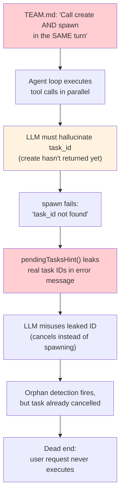
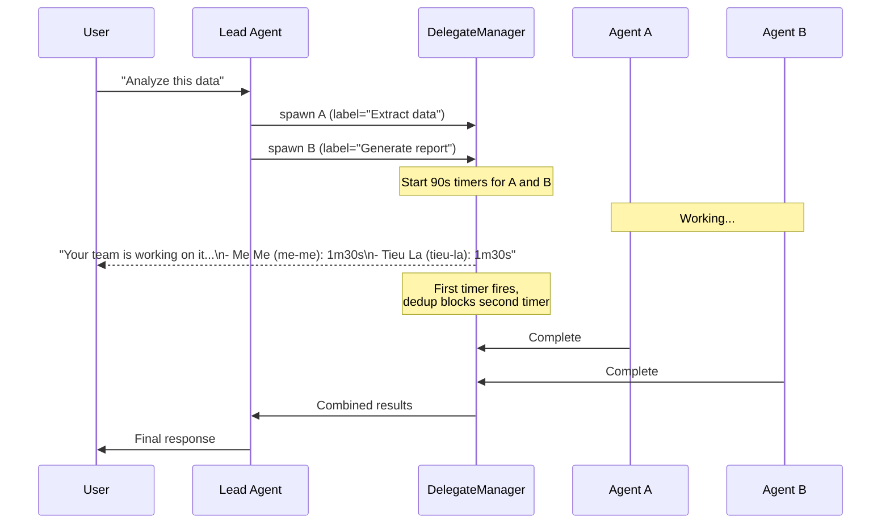

# The Two-Step Dance That Made Agents Hallucinate

**Date:** 2026-03-04

---

A lead agent receives a user request: "Extract text from this image and analyze it." The lead needs to delegate to Tieu La for image extraction and Me Me for analysis. The system prompt says: create a team task, get the ID, then call spawn with that ID. Two tools, two steps, one response.

The agent calls both `team_tasks create` and `spawn` in the same response. The agent loop executes them in parallel. But spawn needs the task ID that create hasn't returned yet. So the LLM does the only thing it can: it guesses. It fabricates a UUID that looks plausible — `019cb6c5-1e8a-7c96-...` — but doesn't exist.

Spawn fails. The error message helpfully lists real pending tasks: "Pending tasks: 019cb6c1 (Extract text...)". The LLM grabs that leaked ID, decides to cancel it instead of using it, and the task dies. The orphan detector fires a retry, but the task is already cancelled. Dead end. The user's request never executes.

This happened twice in a single trace. The two-step create-then-spawn workflow — a design that seemed clean on paper — was fundamentally incompatible with parallel tool execution.

---

## The Root Cause Chain

Three things conspired to produce this bug:



**Root cause 1: The prompt.** TEAM.md told the LLM to call `team_tasks create` and `spawn` in the "SAME turn," with an example showing all four calls together. The LLM interpreted this as one response — parallel execution.

**Root cause 2: The hint.** When spawn failed, `pendingTasksHint()` queried the database for pending tasks and injected their IDs into the error message. This was meant to help the LLM self-correct. Instead, it leaked task IDs across contexts. The LLM would grab a leaked ID and misuse it — cancelling a task it should have spawned, or retrying with an ID that was already completed by another process.

**Root cause 3: The counter.** Orphan detection counted `team_tasks create` calls vs `spawn` calls. If the counts diverged, it injected a retry prompt. But if the LLM cancelled the orphaned task before the retry fired, the retry was useless — the task was already dead.

---

## The Fix: One Call, Zero Hallucinations

The solution was to eliminate the two-step dance entirely. When `spawn` is called without a `team_task_id`, the system auto-creates the team task internally — atomically, with no LLM involvement in the ID assignment.

```go
// Before: error when team_task_id is missing
if team != nil && opts.TeamTaskID == uuid.Nil {
    hint := dm.pendingTasksHint(ctx, team.ID)
    return nil, nil, fmt.Errorf("spawn requires a valid team_task_id...%s", hint)
}

// After: auto-create the task
if team != nil && opts.TeamTaskID == uuid.Nil {
    subject := opts.Label
    if subject == "" {
        subject = opts.Task
        if len(subject) > 100 {
            subject = subject[:100] + "..."
        }
    }
    taskData := &store.TeamTaskData{
        TeamID:  team.ID,
        Subject: subject,
        Status:  store.TeamTaskStatusPending,
        UserID:  store.UserIDFromContext(ctx),
        Channel: ToolChannelFromCtx(ctx),
    }
    dm.teamStore.CreateTask(ctx, taskData)
    opts.TeamTaskID = taskData.ID
}
```

| | Before | After |
|---|---|---|
| **LLM calls needed** | 2 (`team_tasks create` + `spawn`) | 1 (`spawn`) |
| **Hallucination risk** | High (parallel execution) | Zero (system assigns ID) |
| **Task ID in error** | Leaked via `pendingTasksHint` | Never exposed |
| **TEAM.md example** | 4 tool calls across 2 steps | 2 tool calls, one step |

The TEAM.md prompt went from a ceremony:

```
team_tasks action=create, subject="Create illustration" → task_id=A
spawn agent=artist, task="...", team_task_id=A
```

To a single line:

```
spawn agent=artist, task="Create illustration for...", label="Create illustration"
```

The `label` parameter sets the task title on the board. If omitted, the system truncates the task description to 100 characters.

---

## What Else Changed

### Progress Notifications

Before this fix, there was a related problem: when delegations run for minutes, the user sees nothing. No typing indicator (those max out at 60 seconds), no status update, just silence.

A `time.AfterFunc` timer now fires after a configurable delay (default 90 seconds, tunable via `estimated_duration` parameter). When it fires, it sends a grouped status message directly to the user's channel via `PublishOutbound` — bypassing the agent loop entirely:



The dedup mechanism (`progressSent sync.Map`, keyed by `sourceAgentID:chatID`) ensures only one grouped notification is sent, even when multiple timers fire. The dedup key is cleared when the last delegation completes.

### Orphan Detection Hardened

The counter-based orphan detection (`teamTaskCreates > teamTaskSpawns`) produced false positives when the LLM mixed explicit creates with auto-create spawns. The fix: query the database for actual pending tasks instead of counting tool calls.

```go
// Before: trust the counter
if teamTaskCreates > teamTaskSpawns && !teamTaskRetried {
    // inject retry — but task might already be cancelled
}

// After: verify against DB
if teamTaskCreates > teamTaskSpawns && !teamTaskRetried {
    if tasks, _ := l.teamStore.ListTasks(ctx, team.ID, ...); ... {
        var pendingIDs []string
        for _, t := range tasks {
            if t.Status == store.TeamTaskStatusPending {
                pendingIDs = append(pendingIDs, t.ID.String())
            }
        }
        if len(pendingIDs) > 0 {
            // Only retry if pending tasks actually exist
        }
    }
}
```

### Cross-Session Reminder Tightened

The in-progress task reminder (injected at the start of each lead agent turn) was changed from "Wait for their results" to "Their results will arrive automatically. Do NOT cancel, re-create, or re-spawn these tasks." The old wording was passive; the new wording is an explicit prohibition. This prevents the LLM from "helpfully" cancelling tasks it sees as stalled.

---

## The Scoping Question

Auto-creating tasks inside `spawn` raised a critical question: would the task be correctly scoped to the right user and channel?

Team tasks are filtered by `user_id` — a group composite ID like `"group:telegram:-1003701523276"`. If auto-create used the wrong user_id, tasks from one Telegram group would leak into another.

The analysis confirmed safety through three layers:

1. **Context propagation**: `store.UserIDFromContext(ctx)` returns the group composite ID, set at the very start of the agent run. Auto-create inherits this automatically.
2. **ListTasks filter**: The SQL query includes `WHERE ($2 = '' OR t.user_id = $2)` — tasks are invisible to other groups.
3. **Delegation preservation**: When delegating to another agent, the `DelegateRunRequest` copies `UserID: task.UserID` from the parent context. Nested delegations preserve the original group's scope.

Concurrent parallel spawns (multiple `spawn` calls in one LLM response) are also safe — each `CreateTask` is an independent INSERT with a UUID v7 primary key. No shared state, no race condition.

---

## Files

| File | What |
|---|---|
| `internal/tools/delegate.go` | Auto-create task in `prepareDelegation()`, remove `pendingTasksHint()`, fix error messages, progress notification, dedup logic |
| `internal/tools/subagent_spawn_tool.go` | Wire `label` to `DelegateOpts.Label`, include `team_task_id` in spawn result JSON |
| `internal/agent/resolver.go` | Rewrite TEAM.md workflow: one-step delegation, remove two-step example |
| `internal/agent/loop.go` | Orphan detection queries DB, in-progress reminder wording tightened |
| `internal/tools/delegate_state.go` | `progressSent` dedup clear on last sibling completion |

---

## Takeaway

The two-step create-then-spawn workflow was a classic case of **designing for human reasoning, not LLM reasoning.** A human developer would naturally call create, read the returned ID, then call spawn. An LLM, presented with a list of tools and told to "do both in the same turn," will try to call them simultaneously — and hallucinate any value it can't wait for.

The fix follows a principle: **if the system can derive a value, don't ask the LLM to pass it.** The team task ID was always derivable — the system had the team, the subject, and the user context. Requiring the LLM to relay it through a two-step tool chain was an unnecessary round trip that created a failure mode.

`pendingTasksHint` was a well-intentioned safety net that became a trap. Injecting database state into error messages gave the LLM information it wasn't equipped to use correctly. The replacement — "omit team_task_id to auto-create" — is both simpler and safer. It tells the LLM what to do, not what exists. The lesson: error messages for LLMs should contain instructions, not data.
