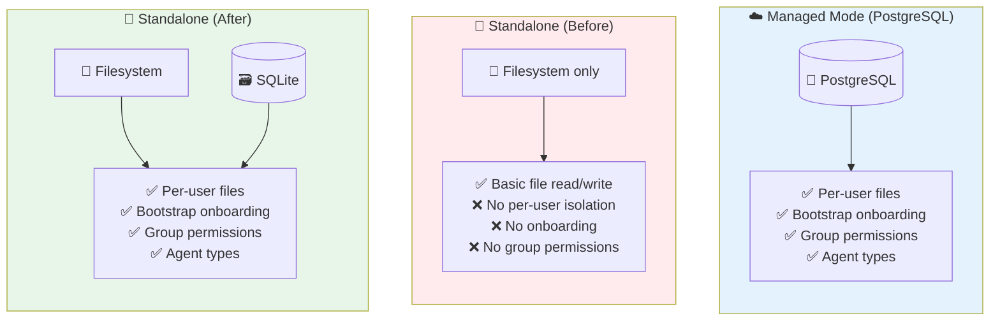
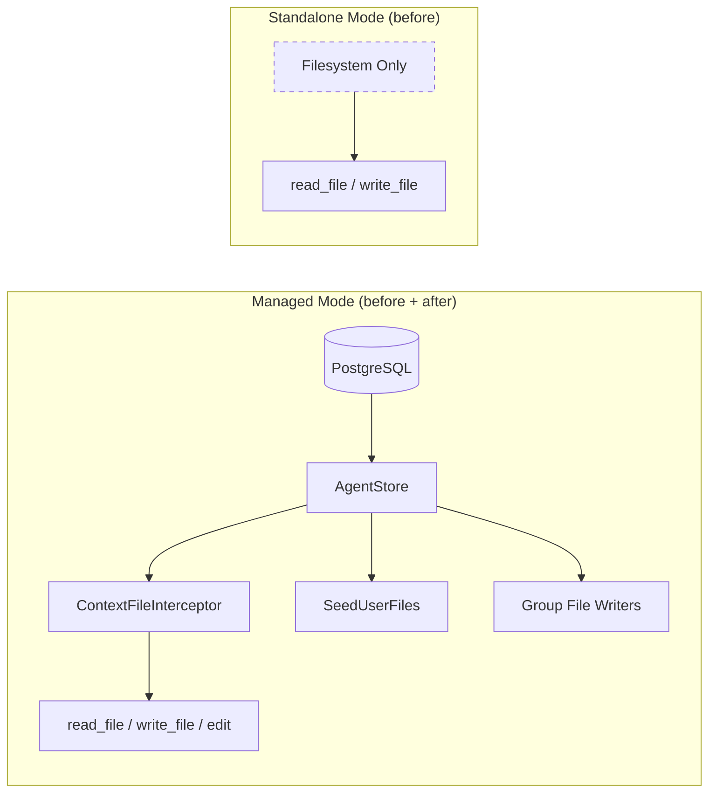
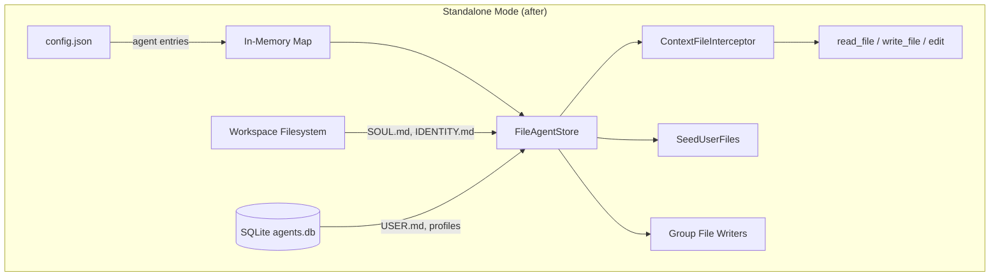

# The Second-Class Citizen Gets a Promotion

**Date:** 2026-02-25

---

Managed mode had it all: per-user context files in Postgres, bootstrap onboarding, group file writer permissions, agent type awareness. Standalone mode? It shared one workspace, one set of files, zero user isolation. A Telegram group with three users writing to SOUL.md was a game of musical chairs — last writer wins.

The irony: the architecture was already interface-based. `store.AgentStore`, `ContextFileInterceptor`, `bootstrap.SeedUserFiles()` — all designed to work with any backing store. But standalone mode had no store. It was a mode that never grew up.

---

## What Users Get Now



| Feature | Before (Standalone) | After (Standalone) | Managed |
|---------|--------------------|--------------------|---------|
| Per-user context files | ❌ | ✅ (SQLite) | ✅ (PostgreSQL) |
| Bootstrap onboarding | ❌ | ✅ | ✅ |
| Group file permissions | ❌ | ✅ | ✅ |
| Agent types (open/predefined) | ❌ | ✅ | ✅ |
| Requires database | — | No (SQLite auto-created) | Yes (PostgreSQL) |

---

## The Problem: One Store to Rule Them All (But Only for Postgres)



Managed mode had a full `PGAgentStore` implementing 34 methods. Standalone had... `os.ReadFile()`. No user profiles, no per-user context files, no group permissions, no bootstrap flow. The `ContextFileInterceptor` — the component that routes `read_file USER.md` to the right user's data — simply didn't exist in standalone.

---

## The Insight: SQLite is the Postgres of One Machine

We didn't need Postgres. We needed the *interface*. The `store.AgentStore` contract doesn't care about connection pools or replication — it cares about `GetUserContextFiles()`, `SetUserContextFile()`, `GetOrCreateUserProfile()`.

The split was natural:

| Data | Managed (PG) | Standalone (new) |
|---|---|---|
| Agent metadata | `agents` table | In-memory from config |
| Agent-level files (SOUL.md, etc.) | `agent_context_files` table | Filesystem at workspace root |
| Per-user files (USER.md, BOOTSTRAP.md) | `user_context_files` table | SQLite |
| User profiles | `user_agent_profiles` table | SQLite |
| Group file writers | `group_file_writers` table | SQLite |

Agent-level files stay on disk — users can edit SOUL.md with their favorite editor. Per-user data goes to SQLite at `~/.goclaw/data/agents.db`, safely outside the workspace where agents can't touch it.



Same interceptor. Same seed logic. Same tool wiring. Different backing store.

---

## The UUID Riddle

Managed mode assigns UUIDs from Postgres sequences. Standalone has no database at startup — agents are defined in `config.json`. We needed stable, deterministic IDs so that SQLite rows survive restarts.

UUID v5 to the rescue: `uuid.NewSHA1(namespace, "goclaw-standalone:default")` always produces the same UUID for the same agent key. No coordination, no sequences, no collisions.

---

## The Import Cycle That Moved a File

The plan said: extract shared callbacks into `internal/bootstrap/callbacks.go`. Clean, logical. But Go's compiler had opinions:

```
bootstrap → agent (for EnsureUserFilesFunc type)
agent → bootstrap (for ContextFile, SeedUserFiles)
```

Circular. The callbacks needed both `agent` types (for the function signatures) and `bootstrap` functions (for seeding). Neither package could import the other.

The fix: move the callbacks to `cmd/gateway_callbacks.go`. The `cmd` package already imports both `agent` and `bootstrap` — it's the wiring layer, the place where dependencies converge. Two functions, shared by `wireManagedExtras()` and `wireStandaloneExtras()`, zero duplication.

---

## The Guard That Locked the Door

In `loop.go`, per-user workspace isolation was gated by:

```go
if l.agentUUID != uuid.Nil && l.workspace != "" {
```

In managed mode, `agentUUID` was always set (from Postgres). In standalone mode, it was always `uuid.Nil` — so this entire block was dead code. No per-user subdirectories, no workspace injection, no isolation.

The fix was one character:

```go
if l.workspace != "" {
```

The inner `if req.UserID != ""` already prevents subdirectory creation for WebSocket connections (no user ID). Removing the UUID guard unlocked the entire isolation pipeline for standalone.

---

## The Hidden Directory Problem

With agents now writing to user subdirectories, one concern remained: what if an agent tries to read `~/.goclaw/data/agents.db`? With `restrict_to_workspace: true`, it can't escape the workspace. But what about `.goclaw` directories *inside* the workspace?

We added `PathDenyable` — a simple interface that lets tools reject paths matching denied prefixes:

```go
type PathDenyable interface {
    DenyPaths(...string)
}
```

All four filesystem tools (`read_file`, `write_file`, `list_files`, `edit`) implement it. `list_files` goes a step further: it filters denied directories from its output entirely. The agent doesn't even know `.goclaw` exists.

---

## The Full Lifecycle

```mermaid
sequenceDiagram
    participant CFG as config.json
    participant FAS as FileAgentStore
    participant SQL as SQLite
    participant LOOP as Agent Loop
    participant ALICE as Alice (first message)
    participant INTC as ContextFileInterceptor

    CFG->>FAS: Build entries (default: open, support: predefined)
    FAS->>SQL: CREATE TABLE IF NOT EXISTS ...
    FAS->>FAS: Seed predefined agents to disk

    ALICE->>LOOP: "Hello!"
    LOOP->>LOOP: workspace = base + "/user_alice/"
    LOOP->>FAS: GetOrCreateUserProfile() → isNew=true
    FAS->>SQL: INSERT user_profiles
    LOOP->>FAS: SeedUserFiles() → USER.md + BOOTSTRAP.md
    FAS->>SQL: INSERT user_context_files
    LOOP->>INTC: LoadContextFiles()
    INTC->>FAS: GetAgentContextFiles() → reads SOUL.md from disk
    INTC->>FAS: GetUserContextFiles() → reads USER.md from SQLite
    INTC-->>LOOP: [SOUL.md, USER.md, BOOTSTRAP.md]
    LOOP->>ALICE: "What's your name?"
    ALICE->>LOOP: "I'm Alice"
    LOOP->>INTC: write_file USER.md
    INTC->>FAS: SetUserContextFile()
    FAS->>SQL: UPSERT user_context_files
```

Next time Alice chats, `GetOrCreateUserProfile()` returns `isNew=false`. No seeding, no bootstrap. Just her personalized context, loaded from SQLite, injected into the system prompt.

---

## What Changed

| File | What |
|---|---|
| `internal/config/config.go` | Added `AgentType` to `AgentDefaults` and `AgentSpec` |
| `internal/config/config_load.go` | Merge `AgentType` in `ResolveAgent()` |
| `internal/store/file/agents.go` | **New**: `FileAgentStore` — filesystem + SQLite backend |
| `cmd/gateway_callbacks.go` | **New**: Shared `buildEnsureUserFiles()` + `buildContextFileLoader()` |
| `cmd/gateway_standalone.go` | **New**: `wireStandaloneExtras()` — the standalone wiring hub |
| `cmd/gateway_managed.go` | Replaced inline callbacks with shared builders |
| `cmd/gateway.go` | Call `wireStandaloneExtras()`, pass store + callbacks to agent loops |
| `cmd/gateway_agents.go` | Resolve AgentUUID/Type from store, wire into LoopConfig |
| `internal/agent/loop.go` | Removed `agentUUID != uuid.Nil` guard |
| `internal/tools/types.go` | Added `PathDenyable` interface |
| `internal/tools/filesystem.go` | `deniedPrefixes` + `checkDeniedPath()` helper |
| `internal/tools/filesystem_write.go` | Deny path support |
| `internal/tools/filesystem_list.go` | Deny path support + directory filtering |
| `internal/tools/edit.go` | Deny path support |

---

## Takeaway

The hardest part wasn't building the SQLite store — it was recognizing that the architecture already supported it. Every interface, every interceptor, every seeding function was designed to be store-agnostic. The only thing missing was a second implementation and the wiring to connect it.

Standalone mode went from "single user, shared files, no isolation" to "per-user workspaces, bootstrap onboarding, group permissions, agent types" — all reusing managed mode's battle-tested code paths. The `ContextFileInterceptor` doesn't know (or care) whether it's talking to Postgres or SQLite. That's the whole point.
