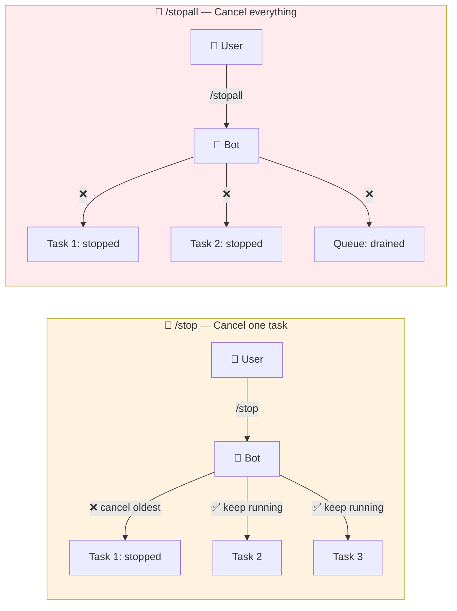
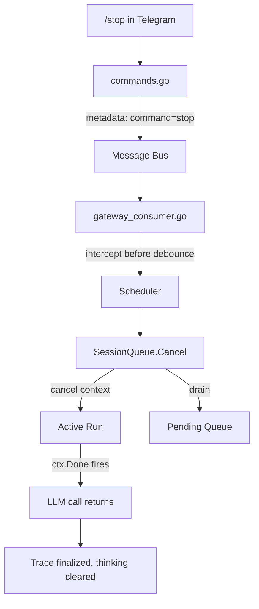

# The Kill Switch That Didn't Exist

**Date:** 2026-02-24

---

Picture this: you accidentally ask the bot to "rewrite my entire codebase in Rust." The agent happily spins up, starts calling tools, reading files, generating code. You realize your mistake 2 seconds in. But there's no cancel button. No escape hatch. You sit there, watching the bot churn through 15 tool calls for the next 3 minutes, knowing the output is useless.

WebSocket clients had `chat.abort`. Telegram users had... nothing.

---

## What Users See

| Command | What happens | Use case |
|---------|-------------|----------|
| **`/stop`** | Cancel the oldest running task, others keep going | "I changed my mind about that one" |
| **`/stopall`** | Cancel everything + drain the queue | "Shut up, let me think" |

---

## The Plumbing Was Already There

Here's the thing — the scheduler already stored a `context.CancelFunc` for every active run. It just never exposed it. The entire fix was about wiring an existing kill switch to a user-facing button.

The key decision: **intercept before the debouncer**. If `/stop` went through the normal 800ms debounce window, it would be delayed — or worse, merged with the next message the user types. "Stop... actually, new question" becoming one fused message would be chaos.

---

## The Context Afterlife Problem

When the run's context gets cancelled, everything downstream dies — LLM calls, tool executions, even the database writes for trace finalization. But we *want* to record that the run was cancelled. Traces with status `"cancelled"` are valuable for debugging.

The trap: `FinishTrace(ctx, ...)` calls `store.UpdateTrace(ctx, ...)` which uses the cancelled context for the DB query. Dead on arrival.

The fix was almost embarrassingly simple: detect `ctx.Err() != nil` and switch to `context.Background()` for the final trace write. Record the status as `"cancelled"` instead of `"error"`.

One subtle thing we got for free: context *values* survive cancellation. The `traceID` and `collector` stored in context values are still readable even after cancel. Only `ctx.Done()` and `ctx.Err()` change. So the trace finalization finds everything it needs — it just needs a living context to make the DB call.

---

## The Race That Wasn't

What if the run finishes naturally at the exact moment `/stop` arrives? `Cancel()` calls `cancel()` on a completed context. `drainQueue()` runs on an empty queue. Both are no-ops. `CancelFunc` is idempotent by design. No special handling needed.

---

## The Empty Outbound Trick

When a run is cancelled, the consumer receives `RunOutcome{Err: context.Canceled}`. Instead of sending the user an error message ("context canceled" — helpful to nobody), we publish an empty outbound. This triggers the channel's cleanup path:

1. Stop the "thinking..." animation
2. Remove the placeholder message
3. Clear any status reactions

The user already saw "Stopping current task..." from the `/stop` command handler. Clean slate, ready for the next message.

---

## What Changed

| File | What |
|---|---|
| `internal/scheduler/queue.go` | Exposed `Cancel()` — cancel active run + drain pending queue |
| `internal/channels/telegram/commands.go` | `/stop` command handler, help text, menu registration |
| `cmd/gateway_consumer.go` | Intercept `command: "stop"` before debounce, suppress cancelled errors |
| `internal/agent/loop.go` | `context.Background()` fallback for trace finalization on cancel |
