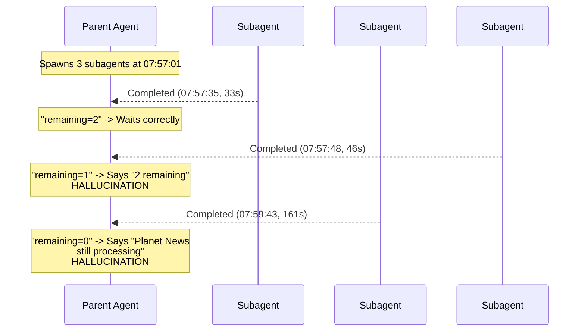
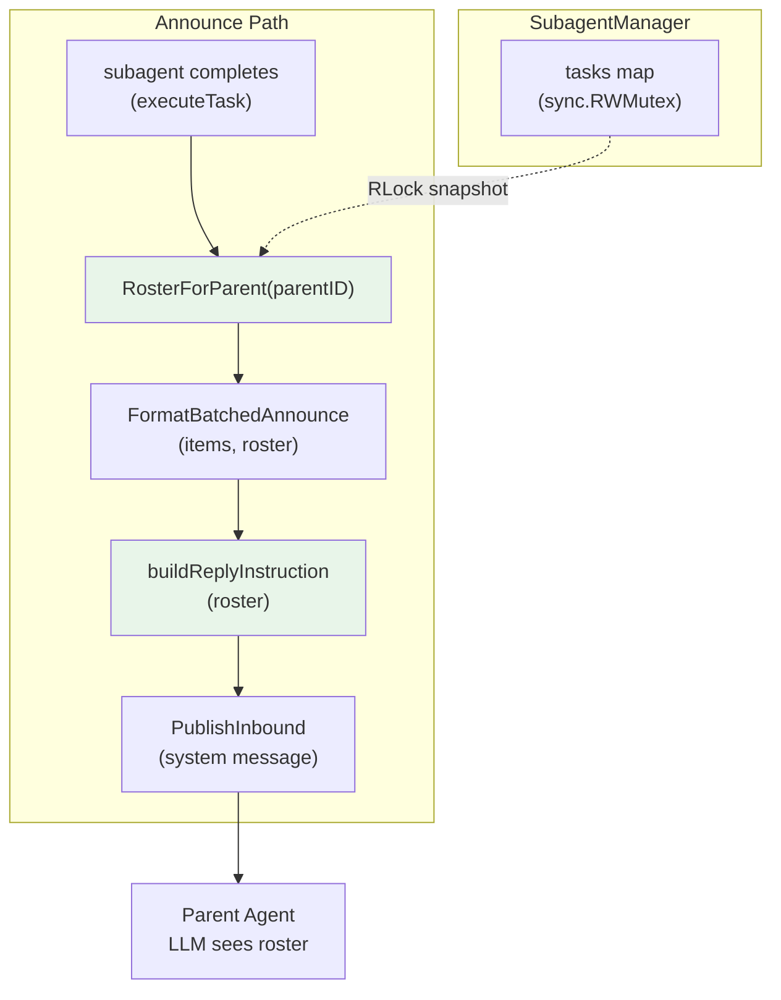

# The Model That Forgot Which Children Came Home

**Date:** 2026-03-19

---

A user on Telegram asks their agent to summarize three AI news articles. The agent spawns three subagents — one per article. They run in parallel. Planet News finishes first (33 seconds), KersAI second (46 seconds), The AI Track last (2 minutes 41 seconds). Each result is announced back to the parent agent for delivery.

The first announce arrives correctly: "Planet News done, 2 still running." The parent waits. Good.

The second announce arrives: "KersAI done, 1 still running." But the parent responds with "Waiting for **2** more subagents" and leaks the full KersAI summary even though it was told to wait. It miscounted.

The third announce arrives: "The AI Track done, 0 running — deliver now." The parent responds with "Still waiting for **Planet News**" — a task that finished two minutes ago and was already announced in the first message.

The model was hallucinating about its own children. Trace `019d0516-4955-7d87-94fe-1d794edd7c5b`, staging, March 19 2026.

---

## The Bare Number Problem

The root cause was in `buildReplyInstruction()` — the function that tells the parent LLM what to do after receiving a subagent result. Here is what the model saw:

```
There are still 1 active subagent run for this session.
If they are part of the same workflow, wait for the remaining results
before sending a user update.
```

A bare number. No names. No list. The model had to reconstruct which subagents were done and which were running by re-reading its own conversation history — a sequence of system messages, assistant replies, and earlier announces. With three concurrent subagents completing out of order and the history growing with each announce, the model lost track.



The per-session announce mutex serialized the announces correctly — no race condition there. The announces arrived in order, with accurate counts. But the model couldn't map a count back to names.

---

## The Fix: A Deterministic Roster

The solution replaces the bare count with a full roster — every subagent listed by name and status. The model no longer has to guess.

**Before:**
```
There are still 1 active subagent run for this session.
```

**After:**
```
Subagent roster (3 spawned, max 5 per agent):
  [completed]  Summarize AI News #1 - Planet News
  [completed]  Summarize AI News #3 - KersAI
  [running  ]  Summarize AI News #2 - The AI Track

1 subagent(s) still running. Wait for remaining results...
```

The model sees exactly which tasks are done, which are running, and the agent's configured max. No reconstruction from history needed. No guessing.

---

## How It Works

A new `RosterForParent()` method on `SubagentManager` snapshots all tasks for a parent:

```go
type SubagentRosterEntry struct {
    Label  string
    Status string // "running", "completed", "failed", "cancelled"
}

type SubagentRoster struct {
    Entries     []SubagentRosterEntry
    Total       int // total tasks for this parent
    MaxPerAgent int // from spawnConfig.MaxChildrenPerAgent
}
```

The roster reads from the existing in-memory `tasks` map under `RLock` — zero new storage. `MaxPerAgent` comes from `task.spawnConfig`, which was already resolved at spawn time with per-agent config overrides merged. No additional context plumbing needed.



The sort order is deliberate: completed/failed/cancelled tasks appear first, running tasks last. The model reads top-down — "these are done, these are pending" — matching natural scanning order. `slices.SortFunc` with `cmp.Compare` ensures deterministic alphabetical ordering within each group, since Go map iteration is non-deterministic.

---

## The Config Synchronization Detail

Each agent can override subagent limits via `config.SubagentsConfig` — different `MaxConcurrent`, `MaxChildrenPerAgent`, `MaxSpawnDepth` per agent. This config flows through:

```
config.SubagentsConfig (DB/JSON)
  → loop.subagentsCfg
    → tools.WithSubagentConfig(ctx)
      → effectiveConfig(ctx)
        → task.spawnConfig (stored on each SubagentTask at spawn time)
```

`RosterForParent` reads `MaxChildrenPerAgent` from the first task's `spawnConfig` — already merged with per-agent overrides. The roster header shows "max 5 per agent" (or whatever the agent's actual limit is), not a system-wide default. The LLM sees the real constraint for its specific agent.

---

## The Dead Code That Wasn't

After implementing `RosterForParent`, the code review caught that `CountRunningForParent` — the original bare-count method — had zero remaining callers. The `Spawn()` method counts running tasks inline (it already holds the write lock), so `CountRunningForParent` was purely an announce-path function. With the roster replacing it, it became dead code. Removed.

The `AnnounceQueue` also had a dead `rosterFunc` field — stored in the struct but never read. The roster was always retrieved inside the `onDrain` closure and the direct-publish path, making the field a passthrough to nowhere. Removed the field and simplified `NewAnnounceQueue` from 4 parameters to 3.

---

## Error Handling Verification

A secondary question prompted this investigation: when a subagent fails, does it properly return to the main agent and decrement the running count?

The answer is yes, through two mechanisms:

1. **Status transition**: `executeTask()` sets `task.Status = TaskStatusFailed` immediately on LLM error. `RosterForParent` (and the old `CountRunningForParent`) filter by status — failed tasks show as `[failed]` in the roster, not as running.

2. **Announce delivery**: `runTask()` runs the announce path regardless of success or failure. A failed subagent appears in the announce with `status: "failed"` and the error as its result. The parent LLM sees both the failure and the roster showing the correct state.

Cancellation follows the same pattern: `TaskStatusCancelled` removes the task from running count, and the announce fires with "was cancelled."

---

## Files

| File | What |
|---|---|
| `internal/tools/subagent.go` | Added `SubagentRosterEntry`, `SubagentRoster`, `RosterForParent()`. Removed dead `CountRunningForParent()` |
| `internal/tools/announce_queue.go` | Changed `FormatBatchedAnnounce` and `buildReplyInstruction` to accept `SubagentRoster`. Removed dead `rosterFunc` field. Simplified `NewAnnounceQueue` to 3 params |
| `internal/tools/subagent_exec.go` | Direct announce path: `CountRunningForParent` → `RosterForParent` |
| `cmd/gateway.go` | Batched announce wire-up: updated `onDrain` callback, removed unused roster lambda |

---

## Takeaway

The hallucination was caused by an information asymmetry: the system knew exactly which subagents were running, but it told the LLM only a count. The LLM had to reconstruct the missing names from a growing, interleaved conversation history — a task it consistently failed at.

The fix follows a principle that echoes the spawn-auto-create lesson from two weeks ago: **if the system knows a fact, state it explicitly — don't make the LLM derive it.** `CountRunningForParent` gave a count; `RosterForParent` gives a manifest. The difference is that a manifest is self-contained — the LLM doesn't need external context to interpret it.

This pattern generalizes: any time an LLM must track state across multiple asynchronous events (subagent results, team task completions, multi-step workflows), injecting a full state snapshot at each event is more reliable than injecting deltas and hoping the model accumulates them correctly. State snapshots are idempotent; delta accumulation is fragile. The roster is ~80 tokens for 8 subagents — negligible cost for deterministic behavior.
