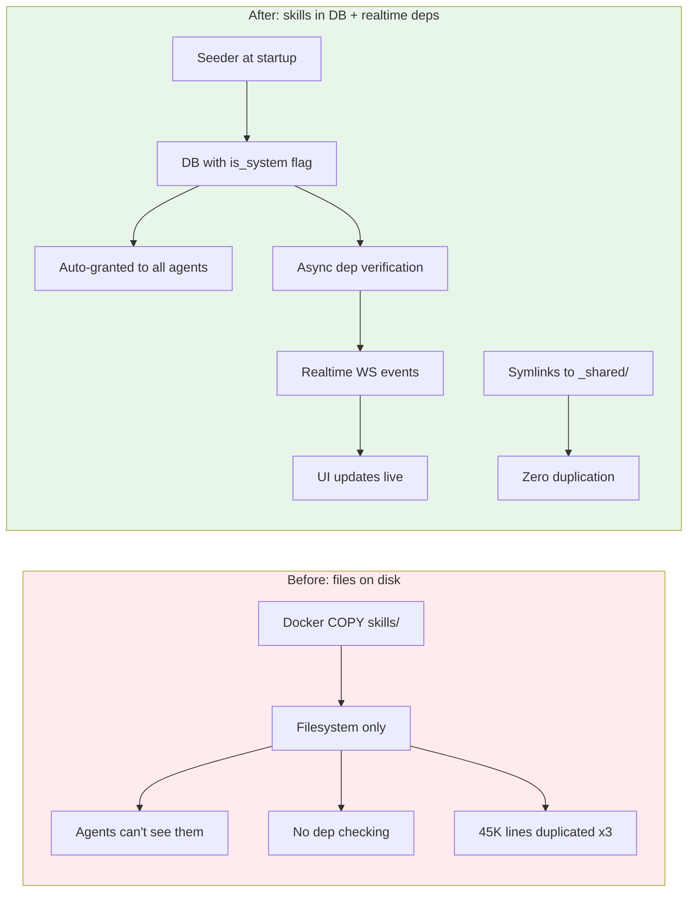
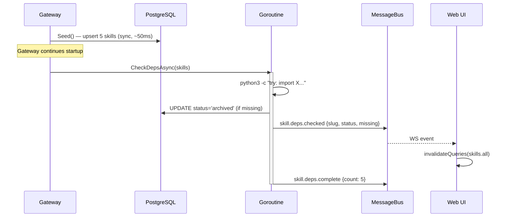

# The Skills That Didn't Exist

**Date:** 2026-03-11

---

An admin deploys the Docker image with five bundled skills: PDF extraction, DOCX manipulation, XLSX processing, PPTX generation, and a skill creator. The Dockerfile copies them into `/app/bundled-skills/`. The gateway starts. Agents try to use the skills. Nothing happens. The skills are sitting as files on a filesystem that no agent can see, because they never made it into the database. No access control, no dependency verification, no admin toggle. Five directories of Python scripts, invisible to the system they're supposed to serve.

Meanwhile, three of those five skills — docx, xlsx, pptx — each carry a full copy of a shared `office/` package: pack, unpack, validate, schemas, validators. The same 45,000 lines of Python, triplicated. Change a schema? Fix it in three places. Miss one? Silent inconsistency.

---

## What It Brings



| | Before | After |
|---|---|---|
| Bundled skill visibility | Filesystem only — agents can't discover them | Seeded into DB, auto-granted to all agents |
| Dependency checking | None — skill fails silently at runtime | Auto-scanned + verified before activation |
| Admin control | None | Toggle active/archived per skill |
| Startup impact | N/A | Zero blocking — deps checked async |
| Shared code (office/) | 45K lines copied 3x | Symlinks to single `_shared/office/` |
| Delete protection | Anyone could delete | System skills return 403 |

---

## The Two-Phase Startup

The naive approach — seed skills, check dependencies, update status, all synchronously — blocks the gateway for 5-10 seconds while subprocess calls to `python3` and `node` verify packages. For five skills, tolerable. For twenty, a hard stall.

The solution splits seeding into two phases: a fast synchronous DB upsert that gets the gateway running, followed by an async goroutine that verifies dependencies and emits WebSocket events as each skill is checked.



The sync phase runs `UpsertSystemSkill` for each bundled directory — an `ON CONFLICT(slug)` upsert that only touches the row if the `file_hash` changed. Five skills seed in under 100ms. All start as `status = 'active'`.

```go
// Seed returns fast — no subprocess calls, no dep checking.
func (s *Seeder) Seed(ctx context.Context) (seeded int, skipped int, skills []seededSkill, err error) {
    for _, e := range entries {
        hash := fmt.Sprintf("%x", sha256.Sum256([]byte(content)))
        id, changed, _ := s.store.UpsertSystemSkill(ctx, p)
        skills = append(skills, seededSkill{id: id, slug: slug, baseDir: destDir})
    }
    return seeded, skipped, skills, nil
}
```

Then `CheckDepsAsync` fires a goroutine. For each skill, it scans for a `skill-manifest.json` (or falls back to static analysis of `scripts/*.py` imports), runs the batched dependency check, and emits a `skill.deps.checked` event. The UI listens via `useWsEvent` and invalidates the skills query cache — the skill list updates in realtime without polling.

---

## The Dependency Scanner: Two Tiers

How do you know what a skill needs? Asking the skill author to declare dependencies is the obvious answer, but authors forget. Static analysis is the safety net.

**Tier 1: Explicit manifest** — if `skill-manifest.json` exists, trust it completely:

```json
{ "requires": ["python3"], "requires_python": ["defusedxml", "lxml"] }
```

**Tier 2: Static scan** — regex over `scripts/*.py` and `scripts/*.js`:

```go
pyImportRe  = regexp.MustCompile(`^import\s+(\w+)`)
pyFromRe    = regexp.MustCompile(`^from\s+(\w+)`)
nodeRequireRe = regexp.MustCompile(`require\(['"]([^'"./][^'"]*)['"]\)`)
```

The tricky part is mapping Python imports back to pip package names. `import cv2` means `pip install opencv-python`. `import yaml` means `pip install pyyaml`. A bidirectional lookup table handles the common mismatches, and Python's stdlib (200+ modules) is filtered out via a known set.

The batched checker runs a single Python process for all packages:

```go
// One process, N import checks — not N processes
sb.WriteString("import sys\n")
for _, pkg := range packages {
    importName := pipToImport(pkg)
    sb.WriteString(fmt.Sprintf(
        "try:\n import %s\nexcept ImportError:\n print(%q)\n",
        importName, pkg))
}
cmd := exec.CommandContext(ctx, "python3", "-c", sb.String())
```

If python3 isn't installed, all Python deps are reported missing and the skill gets archived. No crash, no panic — just a status change and a WebSocket event.

---

## The Deduplication Problem

Three skills — docx, xlsx, pptx — shared a common `office/` package for XML manipulation: pack/unpack OOXML archives, validate against schemas, sanitize content. The same code existed in three places:

```
skills/docx/scripts/office/  (18,000 lines)
skills/xlsx/scripts/office/  (18,000 lines)
skills/pptx/scripts/office/  (18,000 lines)
```

The fix uses filesystem symlinks:

```
skills/_shared/office/          # The single source of truth
skills/docx/scripts/office  ->  ../../_shared/office
skills/xlsx/scripts/office  ->  ../../_shared/office
skills/pptx/scripts/office  ->  ../../_shared/office
```

The seeder's `copyDir` function resolves the symlink at the top level via `filepath.EvalSymlinks`, then `filepath.Walk` follows through and copies real files. Docker `COPY` also follows symlinks. The result: source code is deduplicated, but runtime copies (in `skills-store/`) contain real files — no symlink fragility in production.

```go
func copyDir(src, dst string) error {
    resolved, err := filepath.EvalSymlinks(src)
    if err != nil {
        resolved = src
    }
    return filepath.Walk(resolved, func(path string, info os.FileInfo, err error) error {
        rel, _ := filepath.Rel(resolved, path)
        target := filepath.Join(dst, rel)
        // ... copy file
    })
}
```

The `_shared/` prefix prevents the seeder from treating it as a skill (no `SKILL.md`), but a dedicated `copySharedDir` method copies it to `managedDir/_shared/` so scripts can reference it via `PYTHONPATH`.

Also removed: `soffice.py` — a LibreOffice automation module that can't work in containers (no X11, no gcc, `/tmp` is noexec). Three skills had dead code they could never run.

---

## Challenges

### The Rescan That Never Revived

The admin rescan endpoint (`POST /v1/skills/rescan-deps`) is supposed to re-check all skills and flip archived skills back to active when their dependencies become available. The initial implementation used `ListSkills()` — which filters `WHERE status = 'active'`. Archived skills were invisible to the rescan. You could install `python3`, hit rescan, and nothing would change.

The fix: `ListAllSkills()` — a separate query with no status filter, used only by the admin rescan path.

### Status vs Visibility Field Confusion

The `SkillCreateParams` struct already had a `Visibility` field (`public`/`private`/`internal`). When adding `Status` (`active`/`archived`), the initial `UpsertSystemSkill` accidentally wrote `p.Visibility` into the `status` column. Skills were being inserted with `status = 'public'` instead of `status = 'active'`. A subtle bug caught during code review — the query compiled fine, the insert succeeded, but the status value was semantically wrong.

### The rows.Err() Gap

`ListSkills()` caches its results in memory for performance. The original code looped through `rows.Next()`, built the list, then cached it. But it never called `rows.Err()` — if the database connection dropped mid-read, partial results would be cached as if complete. A user would see 3 of 5 skills and wonder where the rest went. Adding `rows.Err()` after the loop prevents caching partial data.

### Zip Slip in Office Unpacker

The shared `unpack.py` extracts OOXML archives (which are ZIP files). A crafted archive with entries like `../../etc/passwd` could write outside the target directory. The fix validates every entry's resolved path stays within the output directory:

```python
for info in zf.infolist():
    target = (output_path / info.filename).resolve()
    if not str(target).startswith(str(output_path.resolve())):
        raise ValueError(f"Zip entry escapes target: {info.filename}")
```

---

## Files

| File | What |
|---|---|
| `migrations/000017_system_skills.up.sql` | `is_system` column + partial index |
| `internal/upgrade/version.go` | Schema version bump to 17 |
| `internal/store/skill_store.go` | `IsSystem` + `Status` fields on `SkillInfo` |
| `internal/store/pg/skills.go` | `UpsertSystemSkill`, `ListAllSkills`, `IsSystemSkill`, delete protection |
| `internal/store/pg/skills_grants.go` | `ListAccessible` auto-includes `is_system = true` |
| `internal/skills/seeder.go` | Two-phase seeder: sync DB + async dep check with WS events |
| `internal/skills/dep_scanner.go` | Static analysis of scripts/ + manifest parsing |
| `internal/skills/dep_checker.go` | Batched subprocess dep verification |
| `internal/http/skills.go` | Delete guard, slug conflict, rescan endpoint |
| `internal/http/skills_upload.go` | Dep check on upload, warning in response |
| `internal/agent/systemprompt.go` | Conditional Python package hints |
| `cmd/gateway.go` | Wire seeder + async dep check into startup |
| `pkg/protocol/events.go` | `skill.deps.checked` + `skill.deps.complete` events |
| `skills/_shared/office/` | Extracted shared code (pack, unpack, validate, schemas) |
| `skills/{docx,xlsx,pptx}/scripts/office` | Symlinks to `../../_shared/office` |
| `skills/*/skill-manifest.json` | Explicit dependency declarations per skill |
| `ui/web/src/hooks/use-query-invalidation.ts` | WS listener for skill dep events |
| `ui/web/src/pages/skills/skills-page.tsx` | System badge, status toggle, rescan button |
| `ui/web/src/pages/agents/agent-detail/agent-skills-tab.tsx` | "Always available" for system skills |
| `ui/web/src/i18n/locales/{en,vi,zh}/skills.json` | i18n keys for system/deps UI |

---

## Takeaway

The pattern that emerged: **seed fast, verify async, notify realtime**. The database gets the truth first (these skills exist), the verification layer runs without blocking anything, and WebSocket events let every connected client see the results as they come in. This same pattern applies anywhere a startup task involves slow external checks — health probes, network connectivity, license validation.

The symlink deduplication is worth noting as a pattern too. Source-time symlinks that get resolved to real files at deployment time give you the editing ergonomics of a single codebase with the runtime robustness of independent copies. The seeder doesn't need to know about symlinks — `filepath.EvalSymlinks` at the top of `copyDir` handles it transparently.

The `is_system` flag creates a clean ownership boundary: the binary decides what system skills exist, the admin decides which ones are active, and neither can accidentally break the other's domain. `ON CONFLICT` upserts preserve admin choices across upgrades. The same two-number pattern from the schema migration system (binary version vs DB version) appears here as file hash comparison — if the hash matches, skip; if it differs, update.
