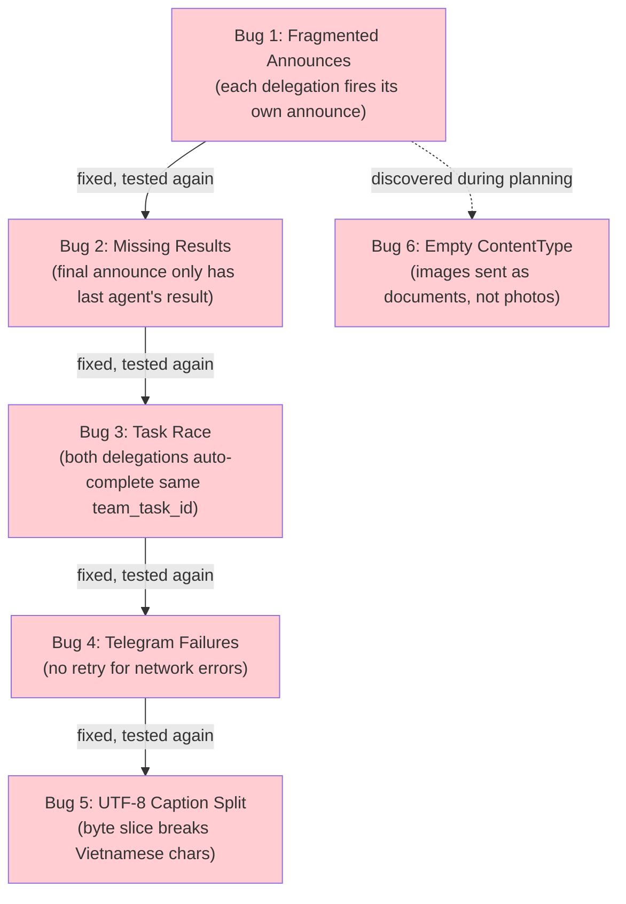
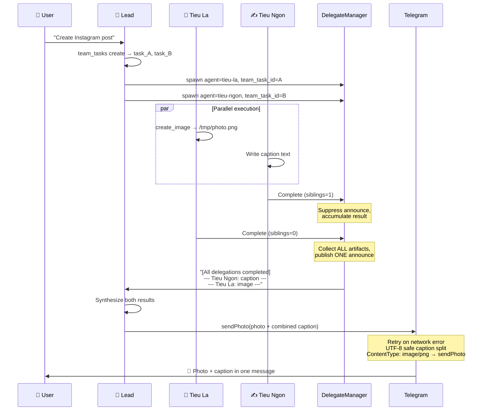

# The Day Two Agents Tried to Talk at Once

**Date:** 2026-03-01

---

A user messages the lead bot: "Create an Instagram post — photo of a girl working, with a lively caption." The lead delegates to two team members in parallel: Tieu La (image generation) and Tieu Ngon (copywriting). Both agents finish within seconds of each other. The user gets... two separate Telegram messages. One with the image, one with the caption. No synthesis. No combined delivery. The lead bot spoke twice when it should have spoken once.

Then things got worse. On the next test, Tieu Ngon's caption had HTML `<code>` tags that Telegram couldn't parse. The photo failed to send — `sendPhoto: api: 400 "Bad Request: can't parse entities"`. The bot went silent. On the third test, a DNS timeout killed the entire delivery: `lookup api.telegram.org: i/o timeout`. No retry. The message vanished.

This was a cascading series of bugs that went from "annoying UX" to "complete message loss" — all discovered through live testing of the team delegation feature.

---

## Five Bugs, One Session

The root cause was that parallel async delegations had never been tested with a real team. Each bug revealed the next:



---

## Bug 1: The Fragmented Announce

When two agents work in parallel, they finish at different times. Each completion triggered an independent announce to the lead agent. The lead received Tieu Ngon's caption, responded immediately ("Here's the caption!"), then received Tieu La's image and responded again ("And here's the photo!"). Two separate messages to the user.

The first attempted fix was a `NO_REPLY` instruction in intermediate announces: "Reply ONLY: NO_REPLY". This relied on the LLM (MiniMax-M2.5) to comply. It didn't. The model cheerfully ignored the instruction and responded with its own commentary.

The real fix: suppress intermediate announces entirely at the code level. When a delegation completes and siblings are still running (`siblingCount > 0`), don't publish anything to the message bus. Instead, accumulate artifacts into a `DelegateArtifacts` struct. Only when the last delegation finishes (`siblingCount == 0`), collect everything and publish one combined announce.

```go
if siblingCount > 0 {
    // Intermediate: accumulate, don't announce
    arts := &DelegateArtifacts{
        Media:   result.MediaPaths,
        Results: []DelegateResultSummary{{
            AgentKey: task.TargetAgentKey,
            Content:  result.Content,
            HasMedia: len(result.MediaPaths) > 0,
        }},
    }
    dm.accumulateArtifacts(task.SourceAgentID, arts)
} else {
    // Last: collect all + publish once
    artifacts := dm.collectArtifacts(task.SourceAgentID)
    // ... append own result, publish combined announce
}
```

The accumulator uses a `sync.Map` keyed by `sourceAgentID` — each lead has its own artifact bucket, and the lock-free map handles the concurrent goroutine access.

---

## Bug 2: The Lost Results

After fixing the announce suppression, the lead received one notification — but it only contained Tieu La's result (the last agent to finish). The lead said: "Waiting for Tieu Ngon to finish the caption!" Tieu Ngon had finished 10 seconds ago. Its result was accumulated but never included in the final announce.

The issue: `formatDelegateAnnounce` only received the *last* delegation's `DelegateRunResult`. All previously accumulated results were invisible. The announce message had one agent's work, not all of them.

Fix: extend `DelegateArtifacts` to hold `Results []DelegateResultSummary` alongside `Media []string`. Each intermediate completion appends its result summary. The final `formatDelegateAnnounce` renders ALL results:

```go
func formatDelegateAnnounce(task *DelegationTask, artifacts *DelegateArtifacts, ...) string {
    msg := "[System Message] All team delegations completed.\n\n"
    for i, r := range artifacts.Results {
        msg += fmt.Sprintf("--- Result from %q ---\n%s\n", r.AgentKey, r.Content)
        if r.HasMedia {
            msg += "[media file(s) attached — will be delivered automatically.]\n"
        }
    }
    msg += "Present a comprehensive summary combining ALL results above to the user."
    return msg
}
```

Now the lead sees every agent's contribution in a single system message and can synthesize them into one coherent response.

---

## Bug 3: The Task Race

Both delegations shared the same `team_task_id`. When Tieu Ngon finished first, it called `autoCompleteTeamTask()` — success. When Tieu La finished second, it also called `autoCompleteTeamTask()` with the same task ID — `"task not in progress or not found"`. The task was already completed.

This was a prompt guidance problem combined with a code safety issue:

**Prompt fix** — the lead's TEAM.md now explicitly says "ONE task per ONE delegation" with a concrete example:

```
team_tasks action=create, subject="Create illustration" → task_id=A
team_tasks action=create, subject="Write caption" → task_id=B
spawn agent=artist, task="...", team_task_id=A
spawn agent=writer, task="...", team_task_id=B
```

**Code safety** — even if the lead reuses a task ID, only the last delegation (`isLastDelegation`) calls `autoCompleteTeamTask()`:

```go
if isLastDelegation {
    dm.autoCompleteTeamTask(task, resultContent)
}
```

---

## Bug 4: The Silent Bot

```
ERROR sendPhoto: request call: fasthttp do request: lookup api.telegram.org: i/o timeout
```

A DNS resolution timeout. Transient network blip. The `sendPhoto` call failed, the error bubbled up to the channel manager, got logged... and that was it. No retry. The user's message — image, caption, everything the team had produced — was gone.

Every Telegram send function (`sendHTML`, `sendPhoto`, `sendVideo`, `sendAudio`, `sendDocument`) had the same pattern: one attempt, fail fast. There was existing retry logic for HTML parse errors (a Telegram-specific 400 response when markup is malformed), but nothing for network failures.

The fix: a `retrySend` wrapper with 3 attempts and escalating delays (2s, 4s, 6s):

```go
func retrySend(ctx context.Context, name string, resetFn func(), fn func() error) error {
    for attempt := 1; attempt <= sendMaxRetries; attempt++ {
        err := fn()
        if err == nil {
            return nil
        }
        if parseErrRe.MatchString(err.Error()) {
            return err // parse errors handled by caller's HTML fallback
        }
        if !isRetryableNetworkErr(err) || attempt == sendMaxRetries {
            return err
        }
        slog.Warn("telegram send retry", "func", name, "attempt", attempt)
        if resetFn != nil {
            resetFn() // e.g. file.Seek(0, 0) for media uploads
        }
        select {
        case <-ctx.Done():
            return ctx.Err()
        case <-time.After(sendRetryDelay * time.Duration(attempt)):
        }
    }
    return err
}
```

Key design decisions:
- Parse errors skip retry (retrying a 400 won't help — the caller's plain-text fallback will)
- File handles are reset via `resetFn` before each retry (`file.Seek(0, 0)`)
- Context cancellation is respected between retries
- Network error detection: `timeout`, `connection reset`, `broken pipe`, `EOF`, `lookup`

---

## Bug 5: The Invisible Byte

```
sendPhoto: api: 400 "Bad Request: text must be encoded in UTF-8"
```

Vietnamese text in the caption. Telegram's caption limit is 1024 bytes. The split code:

```go
// BEFORE (broken)
caption = caption[:telegramCaptionMaxLen]
```

This slices by byte position. Vietnamese characters like "ả" are 3 bytes in UTF-8. If byte 1024 falls in the middle of a multi-byte character, the resulting string is invalid UTF-8. Telegram rejects it.

Fix: walk backwards from the cut point until we land on a valid rune boundary:

```go
cutAt := telegramCaptionMaxLen
for cutAt > 0 && !utf8.RuneStart(caption[cutAt]) {
    cutAt--
}
caption = caption[:cutAt]
```

---

## Bug 6: The Phantom Documents (Preemptive Fix)

This one was found during code review, not live testing. When forwarding media from delegations, the agent loop created `MediaResult{Path: p}` with an empty `ContentType`. The Telegram channel routes by ContentType — `image/*` goes to `sendPhoto`, `video/*` to `sendVideo`, everything else to `sendDocument`. Empty ContentType falls into "everything else." Generated images were being sent as document attachments instead of inline photos.

Three locations had this bug — single tool result processing, parallel tool result processing, and `ForwardMedia` delegation forwarding:

```go
// BEFORE
mediaResults = append(mediaResults, MediaResult{Path: p})

// AFTER
mediaResults = append(mediaResults, MediaResult{
    Path:        p,
    ContentType: mimeFromExt(filepath.Ext(p)),
})
```

While fixing this, we also extended `mimeFromExt` from media-only types (image, video, audio) to include document types (`.txt`, `.pdf`, `.csv`, `.json`, `.html`, `.zip`, `.doc`, `.xls`). And added a `deliver` parameter to the `write_file` tool, so any file an agent writes can be forwarded to the user as an attachment:

```go
result := SilentResult(fmt.Sprintf("File written: %s (%d bytes)", path, len(content)))
if deliver {
    result.Media = []string{resolved}
}
```

This connects `write_file` to the existing media forwarding pipeline — the same path that `create_image` uses.

---

## The Combined Flow (After All Fixes)



---

## Files

| File | What |
|---|---|
| `internal/tools/delegate.go` | Sibling-aware announce suppression, artifact accumulation, `isLastDelegation` for auto-complete |
| `internal/tools/delegate_state.go` | `accumulateArtifacts()` / `collectArtifacts()` helpers using `pendingArtifacts sync.Map` |
| `internal/tools/delegate_events.go` | `formatDelegateAnnounce()` rewritten to render ALL delegation results |
| `internal/channels/telegram/send.go` | `retrySend()` wrapper for network errors, UTF-8 safe caption split |
| `internal/agent/loop.go` | `mimeFromExt()` called for `result.Media` and `ForwardMedia` paths; document MIME types added |
| `internal/tools/filesystem_write.go` | `deliver` parameter: `write_file` can now forward files as user attachments |
| `internal/agent/resolver.go` | TEAM.md prompt: "ONE task per ONE delegation" with example |
| `internal/upgrade/version.go` | `RequiredSchemaVersion` bumped from 6 to 7 |
| `ui/web/src/pages/traces/traces-page.tsx` | GitFork icon for delegation traces in trace list |

---

## Takeaway

The session exposed a pattern: **parallel async operations need a coordination layer, not just concurrent execution.** The delegation system had the ability to run agents in parallel from day one, but it treated each completion as independent. No accumulation. No "wait for siblings." No combined delivery.

The `DelegateArtifacts` accumulator is the coordination primitive that was missing. It's generic by design — `Media []string` for any file type, `Results []DelegateResultSummary` for any text output. When we add new artifact types (structured data, streaming partial results), they slot into the same pattern.

The Telegram resilience work reinforced a different lesson: **every network call is a lie.** DNS resolves today, times out tomorrow. The `retrySend` wrapper is six lines of retry logic that turned "bot goes silent" into "bot retries and delivers." The UTF-8 caption bug was a reminder that Go's `string` is bytes, not characters — and any byte-position slice near the boundary of a non-ASCII language is a ticking bomb.

The `deliver` parameter on `write_file` is small but architecturally significant. It means any tool that produces a file can participate in the artifact pipeline. The existing chain — `Result.Media` → `MediaResult` with ContentType → delegation forwarding → Telegram routing by MIME type — was already generic. We just needed one boolean to connect `write_file` to it.
