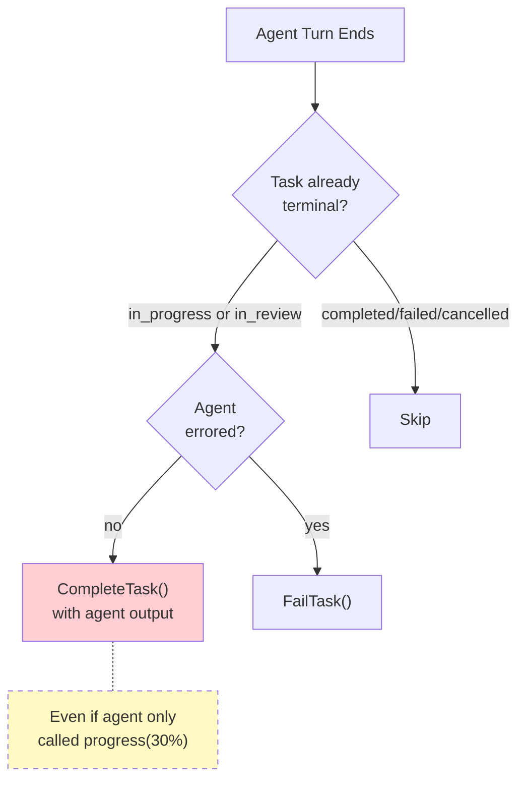
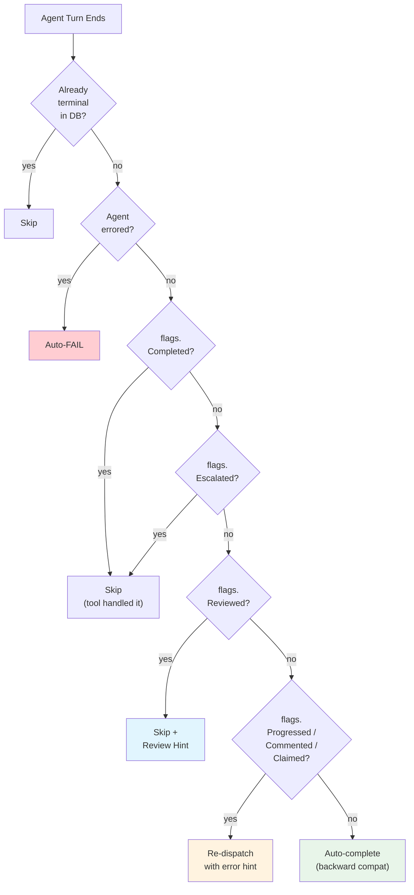
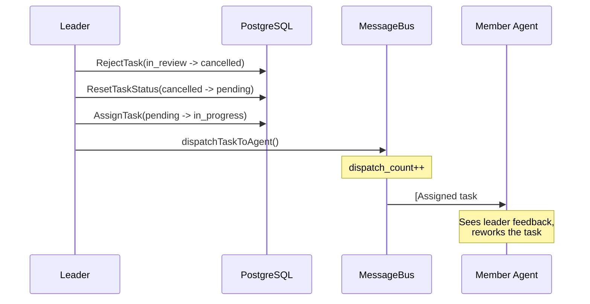

# The Phantom Completion: When the System Closed Tasks Nobody Finished

**Date:** 2026-03-24

---

A team member agent gets dispatched a task: "Research competitors and produce a report." It calls `team_tasks(action="progress", percent=30, text="Scanning websites...")` — solid start. Then its turn ends. The gateway consumer sees a successful `RunResult`, checks if the task is already completed in the DB (it isn't — still `in_progress`), and fires `CompleteTask()` with the agent's raw output as the "result." Task marked done. Leader gets notified: "Research completed." Except the report is 30% done. The agent updated progress but never called `action="complete"`. The system closed the ticket anyway.

This wasn't a theoretical concern. The auto-complete logic in `gateway_consumer_handlers.go` had no way to know *what the agent did* during its turn — only whether the task was already terminal in the database. Every successful agent turn triggered `CompleteTask()` unless the task had already reached a terminal status. Progress updates, comments, partial work — all got stamped as "completed."

---

## The Blind Consumer

The root issue: the consumer operates post-turn with no visibility into the agent's tool calls. Here's the actual decision logic at line 342 of `gateway_consumer_handlers.go`:

```go
alreadyTerminal := taskErr == nil && currentTask != nil &&
    (currentTask.Status == store.TeamTaskStatusCompleted ||
        currentTask.Status == store.TeamTaskStatusFailed ||
        currentTask.Status == store.TeamTaskStatusCancelled)

if !alreadyTerminal {
    if outcome.Err != nil {
        teamStore.FailTask(ctx, teamTaskID, teamID, outcome.Err.Error())
    } else if outcome.Result != nil {
        teamStore.CompleteTask(ctx, teamTaskID, teamID, result)
    }
}
```

Three statuses count as terminal: `completed`, `failed`, `cancelled`. Notice what's missing: `in_review`. If the member calls `team_tasks(action="review")`, the task moves to `in_review` — but the consumer doesn't recognize that status. It tries `CompleteTask()`, which hits the SQL guard `WHERE status = 'in_progress'` and fails silently. The task survives by accident, not by design.



---

## Five Gaps in the Safety Net

Tracing through the full dispatch lifecycle revealed five gaps beyond the phantom completion:

| Gap | Status affected | Detection? | Recovery? |
|-----|----------------|------------|-----------|
| Auto-complete on progress-only turns | `in_progress` | None | Task wrongly closed |
| `in_review` tasks stuck forever | `in_review` | TaskTicker ignores this status | None — leader must remember |
| Recovery clears `owner_agent_id` | `pending` (after recovery) | Ticker recovers, notifies | `DispatchUnblockedTasks` skips ownerless tasks |
| Orphaned blocked tasks | `blocked` | None | Stuck if `unblockDependentTasks` TX rolls back |
| Leader notification runs can modify tasks | Any | Soft hint only: "Do NOT modify tasks" | LLM may ignore instruction |

The TaskTicker at `internal/tasks/task_ticker.go` runs a 3-phase cycle every 5 minutes:

```go
const (
    defaultRecoveryInterval = 5 * time.Minute
    defaultStaleThreshold   = 2 * time.Hour
)
```

Phase 1: process followup reminders. Phase 2: recover in_progress tasks with expired locks (30-minute window). Phase 3: mark pending tasks older than 2 hours as stale. Nothing for `in_review`. Nothing for `blocked` tasks whose blockers have all completed.

---

## The Solution: Action Flags

The fix is a lightweight struct injected into context before the agent runs. Each `team_tasks` tool call sets a boolean:

```go
type TaskActionFlags struct {
    Completed  bool // action="complete"
    Reviewed   bool // action="review"
    Escalated  bool // action="comment", type="blocker"
    Progressed bool // action="progress"
    Commented  bool // action="comment"
    Claimed    bool // action="claim"
}
```

No mutex needed — single goroutine writes (agent loop), consumer reads after the turn ends. The consumer's post-turn logic becomes a priority chain:



The critical row: if the member updated progress or added a comment but never completed, the system re-dispatches the task *back to the same agent* with an error message forcing a terminal action. This counts against the circuit breaker (`maxTaskDispatches = 3`) — after three attempts without resolution, the task auto-fails.

---

## Ticker Expansion: Watching Every Status

The TaskTicker gains two new phases:

**Phase 4 — In-review timeout:** Tasks sitting in `in_review` for over 4 hours are marked stale. The SQL mirrors the existing `MarkAllStaleTasks` pattern:

```sql
UPDATE team_tasks t SET status = 'stale', updated_at = NOW()
FROM agent_teams tm
WHERE t.team_id = tm.id AND tm.status = 'active'
  AND COALESCE((tm.settings->>'version')::int, 0) >= 2
  AND t.status = 'in_review' AND t.updated_at < $threshold
RETURNING t.id, t.team_id, ...
```

**Phase 5 — Orphaned blocked tasks:** Finds blocked tasks where every blocker has reached a terminal status, yet the task itself is still stuck:

```sql
UPDATE team_tasks t
SET blocked_by = '{}', status = 'pending', updated_at = NOW()
FROM agent_teams tm
WHERE t.team_id = tm.id AND tm.status = 'active'
  AND t.status = 'blocked'
  AND array_length(t.blocked_by, 1) > 0
  AND NOT EXISTS (
    SELECT 1 FROM unnest(t.blocked_by) AS bid(id)
    JOIN team_tasks bt ON bt.id = bid.id
    WHERE bt.status NOT IN ('completed', 'failed', 'cancelled')
  )
```

This is a safety net. The normal path — `unblockDependentTasks()` inside the completion transaction — handles 99.9% of cases atomically. Phase 5 catches the 0.1% where a DB connection drop caused a transaction rollback after the parent task committed but before the unblock propagated.

---

## Notification Guardrails

The existing `TeamNotifyConfig` supports a `"leader"` mode where task events are routed through the leader agent, which composes a human-friendly reply. The problem: the leader gets an instruction — `"Do NOT create, retry, reassign, or modify any tasks"` — but it's a prompt hint, not an enforcement mechanism.

The fix uses the existing `RunKind` field on `RunRequest`. Notification runs get `RunKind: "notification"`, and the `TeamTasksTool` checks this before executing:

```go
if runKind == "notification" && !isReadOnlyAction(action) {
    return ErrorResult(
        "This is a notification run. Your role is to relay task " +
        "status to the user in a natural, conversational style. " +
        "Do not modify tasks.")
}
```

Read-only actions (`list`, `search`) pass through. Mutations are blocked at the tool level, not the prompt level.

---

## The Reject-Dispatch Loop

A subtle design issue: `executeReject` used `CancelTask()` internally — the generic cancel path that accepts any non-terminal status. A dedicated `RejectTask()` exists in the store with a strict `WHERE status = 'in_review'` guard, but the tool layer never called it.

The fix tightens semantics *and* adds automatic re-dispatch:



The circuit breaker still applies uniformly — reject increments `dispatch_count` like any other dispatch, auto-failing the task after 3 attempts. `ResetTaskStatus` gains `cancelled` as an allowed source status (previously only `stale` and `failed`).

---

## Recovery Without Orphaning

The current `RecoverAllStaleTasks` clears `owner_agent_id` when resetting a task to pending. This means `DispatchUnblockedTasks` — which filters on `task.OwnerAgentID != nil` — will never pick it up. The leader must manually call `retry`.

The fix: keep the owner during recovery. The ticker publishes a `recovery:dispatch` event via the inbound bus. The consumer picks it up and calls `DispatchUnblockedTasks`, which now finds pending tasks with owners and re-dispatches them. No new coupling between the ticker and the tool manager — the message bus acts as the decoupling layer.

---

## System Architecture: Before & After

### Before (gaps marked)

```
LEADER TURN
  Leader creates task → PendingTeamDispatch.Add(teamID, taskID)
       │
       ▼ (post-turn: drainTeamDispatch)
  ProcessPendingTasks() → validate → AssignTask(pending→in_progress)
       │
       ▼ dispatchTaskToAgent()
  ┌─────────────────────────────────────────┐
  │ MessageBus.inbound [chan, buf:500]       │
  └────────────────┬────────────────────────┘
                   │ ConsumeInbound()
                   ▼
MEMBER TURN (go func, per dispatch)
  Scheduler.Schedule(LaneSubagent) → agent loop
  │ tool calls: progress/comment/complete/review/blocker
  │ (NO action tracking — consumer doesn't know what happened)
  ▼ outcome := <-outCh
  ┌───────────────────────────────────────────────┐
  │ POST-TURN (TOO AGGRESSIVE)                     │
  │ Check alreadyTerminal (completed/failed/cancel)│
  │  YES → skip                                    │
  │  NO  → outcome.Err? auto-FAIL                  │
  │        outcome.Result? auto-COMPLETE ← BUG     │
  │        (even if member only did progress)       │
  │ DispatchUnblockedTasks() — ALWAYS called        │
  └────────────────────────────────────────────────┘

TICKER (1 goroutine, every 5min)
  Phase 1: Followup reminders
  Phase 2: Recover expired locks → clear owner → notify leader
           → NO auto re-dispatch (leader must retry)     ← GAP
  Phase 3: Mark stale (pending >2h → stale)
  ✗ No in_review monitoring                               ← GAP
  ✗ No orphaned blocked detection                         ← GAP

NOTIFICATIONS (leader mode)
  Soft hint: "Do NOT modify tasks"                        ← GAP
  No enforcement — leader can ignore
```

### After (all gaps resolved)

```
LEADER TURN (unchanged)
  Leader creates task → PendingTeamDispatch.Add(teamID, taskID)
       │
       ▼ dispatchTaskToAgent()
  ┌─────────────────────────────────────────┐
  │ MessageBus.inbound [chan, buf:1000]  NEW │
  └────────────────┬────────────────────────┘
                   │ ConsumeInbound()
                   ▼
MEMBER TURN (go func, per dispatch)
  ┌─ Inject TaskActionFlags into ctx ────────────────┐ NEW
  │  Scheduler.Schedule(LaneSubagent) → agent loop    │
  │  │ tool calls SET FLAGS:                          │
  │  │  progress → flags.Progressed = true            │
  │  │  comment  → flags.Commented = true             │
  │  │  blocker  → flags.Escalated = true             │
  │  │  complete → flags.Completed = true             │
  │  │  review   → flags.Reviewed = true              │
  │  │  claim    → flags.Claimed = true               │
  │  ▼ outcome := <-outCh                             │
  └──────────────────┬─────────────────────────────────┘
                     ▼
  ┌───────────────────────────────────────────────────┐
  │ POST-TURN DECISION (smart, flag-based)        NEW │
  │ 1. alreadyTerminal in DB?    → skip               │
  │ 2. outcome.Err?              → auto-FAIL          │
  │ 3. flags.Completed?          → skip (tool did it) │
  │ 4. flags.Escalated?          → skip (tool failed) │
  │ 5. flags.Reviewed?           → skip + REVIEW HINT │
  │ 6. flags.Progressed/Comment? → renew lock only    │
  │ 7. !flags.HasAny()?          → auto-COMPLETE      │
  │ THEN: DispatchUnblockedTasks() — always            │
  └───────────────────────────────────────────────────┘

REJECT FLOW (changed)                                  NEW
  Leader reject → RejectTask (strict: WHERE in_review)
  → ResetTaskStatus (accepts cancelled)
  → AssignTask → dispatchTaskToAgent with feedback
  → Circuit breaker still applies (max 3 dispatches)

TICKER (1 goroutine, every 5min)
  Phase 1: Followup reminders (unchanged)
  Phase 2: Recover expired locks
           → KEEP owner_agent_id (don't clear)     FIXED
           → notify leader
  Phase 3: Mark stale pending >2h (unchanged)
  Phase 4: Mark in_review stale >4h                  NEW
  Phase 5: Fix orphaned blocked tasks                NEW
  Phase 6: Prune cooldowns (unchanged)

NOTIFICATIONS (leader mode)
  RunKind="notification" in metadata                   NEW
  TeamTasksTool blocks mutations when notification     NEW
  Read-only actions (list, search) still allowed
```

---

## Files

| File | What |
|---|---|
| `internal/tools/team_task_action_flags.go` | New: context-based boolean flags tracking member actions per turn |
| `internal/tools/team_tasks_mutations.go` | Set Progressed, Commented, Escalated, Claimed flags |
| `internal/tools/team_tasks_lifecycle.go` | Set Completed, Reviewed flags; fix reject to use RejectTask + auto re-dispatch |
| `cmd/gateway_consumer_handlers.go` | Smart post-turn decision based on flags; review hint injection |
| `internal/tasks/task_ticker.go` | Phases 4-5: in_review stale detection, orphaned blocked task recovery |
| `internal/store/team_store.go` | New interface methods: MarkInReviewStaleTasks, FixOrphanedBlockedTasks |
| `internal/store/pg/teams_tasks_progress.go` | New SQL queries; recovery keeps owner; ResetTaskStatus accepts cancelled |
| `internal/bus/bus.go` | Inbound buffer 500 -> 1000 |
| `cmd/gateway.go` | Add RunKind="notification" to notify inbound messages |
| `internal/tools/team_tasks_tool.go` | Block mutations when RunKind="notification" |
| `internal/tools/context_keys.go` | New: WithRunKind/RunKindFromCtx context helpers |
| `cmd/gateway_consumer_normal.go` | Propagate run_kind from metadata to context |

---

## Takeaway

The pattern here is **action observability at the boundary**. The agent loop and the post-turn consumer operate in different goroutines with no shared state except context and the database. The database captures *what changed*, but not *what the agent intended*. A task at `in_progress` could mean "agent is halfway through" or "agent finished but used the wrong tool." The `TaskActionFlags` struct bridges this gap — a write-once, read-once signal that flows through context and disappears when the turn ends.

This is the same pattern as HTTP middleware reading request-scoped values: cheap, scope-limited, no persistence overhead. The broader lesson: when two components communicate through a shared resource (the DB), they need a sideband for intent — not just state. The flags don't replace the database checks; they complement them with "here's what I *tried* to do," letting the consumer make an informed decision rather than a default one.

The ticker expansion follows a different principle: **defense in depth for state machines**. Every status in the task lifecycle now has a watchdog. `in_progress` has lock expiration. `pending` has the 2-hour stale threshold. `in_review` gets a 4-hour timeout. `blocked` gets orphan detection. The only unmonitored statuses are the terminal ones — `completed`, `failed`, `cancelled` — which is correct, because terminal states don't need recovery.
