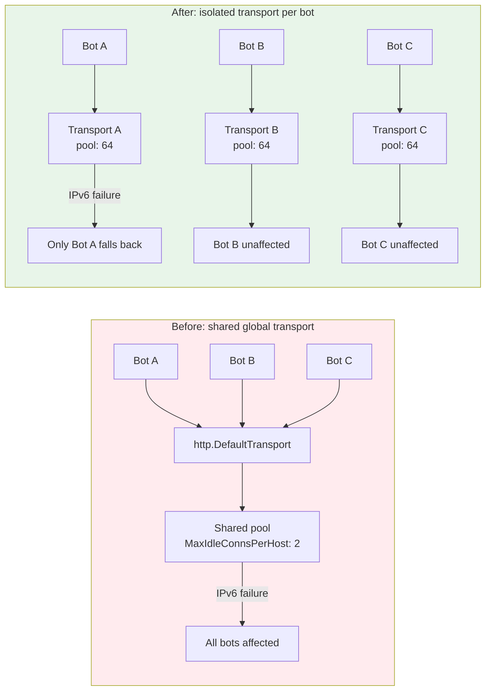
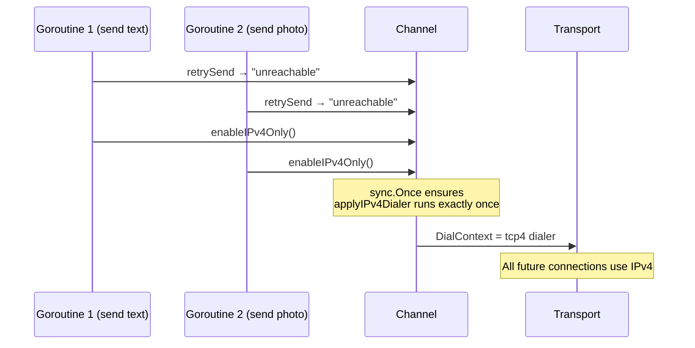

# When One Bot's Bad Route Poisons Everyone Else

**Date:** 2026-03-19

---

A customer runs three Telegram bots on a single GoClaw instance — one for sales, one for support, one for internal ops. The VPS has flaky IPv6 routing. The sales bot sends a message, hits `network is unreachable` on the IPv6 path, retries, eventually succeeds via IPv4 fallback. But something strange happens: the support bot, handling a completely unrelated conversation, starts failing too. Same error. Same `sendMessage` timeouts. All three bots stumble in unison.

The root cause: Go's `http.DefaultTransport` is a singleton. When no proxy is configured, all bots share it — same connection pool, same idle connections, same dialer. When one bot's connection attempt taints the pool, every bot drinking from the same well tastes the poison.

---

## What It Brings



| Scenario | Before | After |
|----------|--------|-------|
| Multi-bot, one has bad IPv6 | All bots degrade | Only affected bot switches to IPv4 |
| Single bot, 200 concurrent sends | Connection churn (pool size 2) | 64 idle connections reused |
| IPv6 known broken on VPS | No config option, runtime heuristic only | `force_ipv4: true` in config |
| Concurrent sends trigger IPv4 fallback | Data race on `DialContext` write | `sync.Once` guarantees safety |

---

## The Three-Layer Fix

The problem had three layers, and each needed its own solution.

### Layer 1: Transport Isolation

The one-line fix that matters most. Previously, bots without a proxy got `&http.Client{}` with no explicit transport — Go defaults to the global `http.DefaultTransport`. Now every bot clones its own:

```go
transport := http.DefaultTransport.(*http.Transport).Clone()
transport.MaxIdleConnsPerHost = 64
```

That `MaxIdleConnsPerHost` bump is critical. The Go default is 2. For a bot handling hundreds of concurrent conversations, all hitting `api.telegram.org`, only 2 connections get reused — the rest create a new TCP+TLS handshake every time and get discarded after use. With 64, the pool actually works.

### Layer 2: Explicit IPv4 Config

The original PR detected IPv6 failures at runtime by string-matching error messages — `"unreachable"`, `"timeout"`, `"no such host"`. The problem: `"timeout"` also matches Telegram rate limiting. `"no such host"` is a DNS issue, not IPv6. One false positive and every future request on that bot is forced to IPv4 unnecessarily.

The fix: add an explicit config option. If you know your VPS has broken IPv6, say so:

```json
{
  "channels": {
    "telegram": {
      "force_ipv4": true
    }
  }
}
```

The runtime auto-detect stays as a safety net, but narrowed to only `"unreachable"` — the one error message that genuinely signals an IPv6 routing problem.

### Layer 3: Race-Safe Fallback



The original code used a nil-check on `transport.DialContext` as a guard — but check-then-set is not atomic. With 200 goroutines hitting `retrySend` concurrently, two could both pass the nil check before either writes. Go's race detector would flag it. `sync.Once` is the idiomatic fix — one goroutine applies the dialer, the rest skip cleanly.

---

## The Subtlety: Media Downloads Share the Transport

One thing worth noting for future work: `media.go` does this:

```go
dlClient := *c.httpClient  // shallow copy — shares Transport
dlClient.Timeout = 0       // up to 5 minutes
```

Media downloads (potentially 200MB files over 5 minutes) share the same transport and connection pool as API sends. Under high load with many concurrent media downloads, long-lived download connections could starve the API send pool. The `MaxIdleConnsPerHost: 64` helps, but a truly busy bot might benefit from a separate transport for downloads in the future.

---

## Files

| File | What |
|---|---|
| `internal/channels/telegram/channel.go` | Transport isolation, pool tuning, `sync.Once` IPv4, `applyIPv4Dialer` helper, `ForceIPv4` config |
| `internal/channels/telegram/send.go` | Narrowed auto-detect heuristic to `"unreachable"` only |
| `internal/channels/telegram/constants.go` | `sendOverallTimeout`, `probeOverallTimeout` constants |
| `internal/channels/telegram/factory.go` | `ForceIPv4` field in instance config, wired to `TelegramConfig` |
| `internal/config/config_channels.go` | `ForceIPv4` field on `TelegramConfig` struct |

---

## Takeaway

The root cause was a single shared resource (`http.DefaultTransport`) leaking failures across tenant boundaries. The fix was one line: `.Clone()`. Everything else — IPv4 fallback, overall timeouts, retry heuristics — was treating symptoms.

This is a pattern worth internalizing: when debugging multi-tenant reliability issues, check shared globals first. In Go, `http.DefaultTransport`, `http.DefaultClient`, and `net.DefaultResolver` are the usual suspects. Clone early, configure per-tenant, and resist the urge to add clever runtime detection when explicit configuration will do.

The `MaxIdleConnsPerHost` lesson is equally important. Go's default of 2 is tuned for general-purpose HTTP clients hitting many different hosts. When your workload is many-goroutines-to-one-host (which is exactly what a Telegram bot is), that default silently destroys performance. Know your traffic shape; tune your pool.
