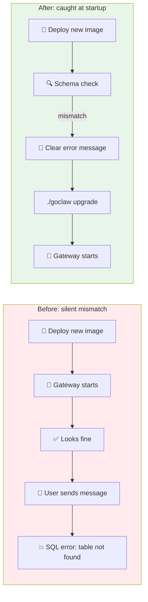
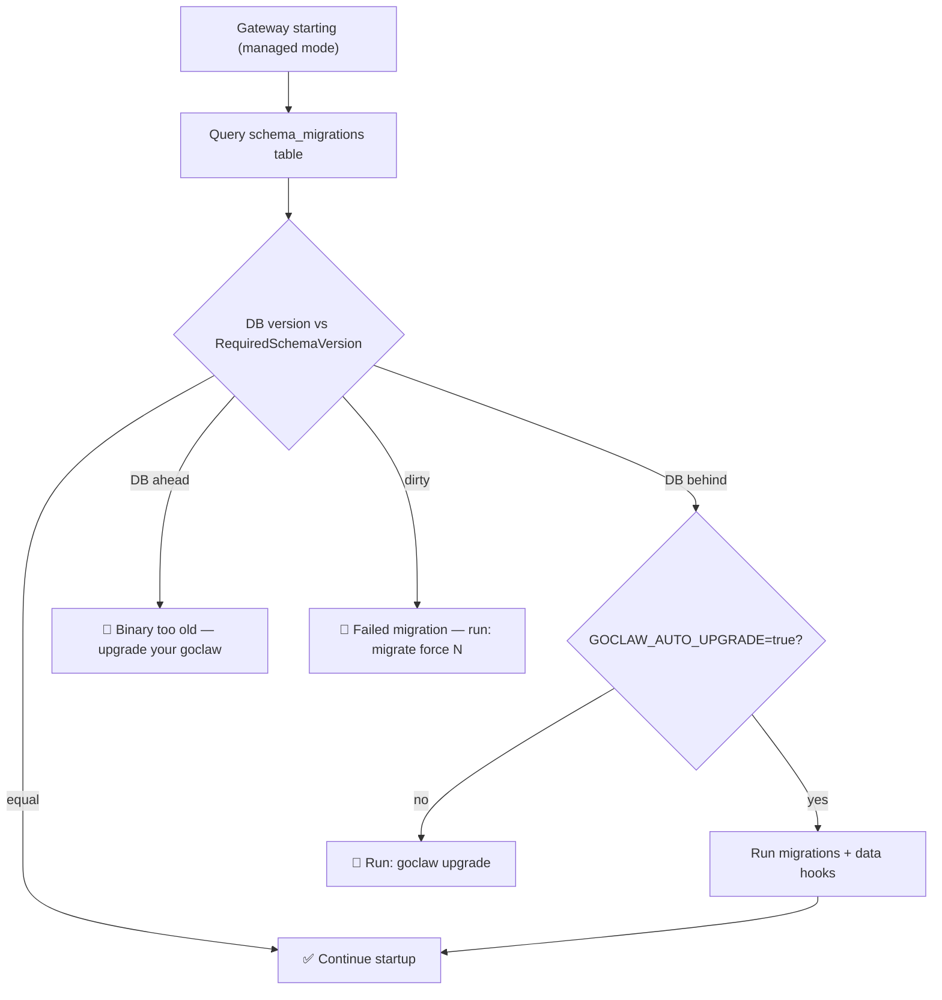

# The Silent Drift

**Date:** 2026-02-27

---

You pull the latest Docker image. You restart the container. Everything starts up fine — logs look normal, connections established, agents loaded. Then a user sends a message. The bot crashes with `relation "builtin_tools" does not exist`. Your Postgres schema is two migrations behind the binary you just deployed, and nobody told you.

The migration system existed. `./goclaw migrate up` worked perfectly. The problem was that nobody — not the binary, not the entrypoint, not the startup logs — ever checked whether the database matched the code. The binary assumed the schema was correct. The schema assumed someone had manually upgraded it. Between those two assumptions lived a silent gap that only surfaced as a runtime SQL error, minutes or hours after deployment.

---

## What Users See Now



| Scenario | Before | After |
|----------|--------|-------|
| Deploy new binary, forget to migrate | Runtime SQL crash | Startup blocked with clear instructions |
| Docker Compose upgrade | Manual `migrate up` required | Entrypoint runs `goclaw upgrade` automatically |
| Check if DB matches binary | Read migration files and count manually | `goclaw upgrade --status` or `goclaw doctor` |
| Data transformation after schema change | Not possible (SQL-only migrations) | Go-based data hooks, tracked and idempotent |

---

## The Gap Between Two Numbers

The core idea is almost trivially simple: a constant compiled into the binary, and a number stored in the database.

```
Binary: RequiredSchemaVersion = 6
Database: schema_migrations.version = 5
```

If they don't match, something needs to happen before the gateway starts. The `upgrade` package has one job — compare these two numbers and decide what to do.



The check runs before `pg.NewPGStores()` — the function that creates all the store objects. This is the critical ordering. If the schema is wrong, we want a human-readable error message, not a stack trace from a failed SQL query somewhere deep in the store layer.

---

## Three Ways to Upgrade

The upgrade path depends on how you deploy.

**Binary users** get a new CLI command:

```
$ ./goclaw upgrade --status
  App version:     0.3.0 (protocol 3)
  Schema current:  5
  Schema required: 6
  Status:          UPGRADE NEEDED (5 -> 6)

$ ./goclaw upgrade
  Applying SQL migrations... OK (v5 -> v6)
  Running data hooks... none pending
  Upgrade complete.
```

**Docker Compose users** get automatic upgrades. The entrypoint now runs `goclaw upgrade` before starting the gateway — replacing the old `migrate up` call. For those who want explicit control, a new `docker-compose.upgrade.yml` overlay runs the upgrade as a one-shot container:

```bash
# Preview what would change
docker compose -f docker-compose.yml -f docker-compose.managed.yml \
  -f docker-compose.upgrade.yml run --rm upgrade --dry-run

# Apply, then restart
docker compose -f docker-compose.yml -f docker-compose.managed.yml \
  -f docker-compose.upgrade.yml run --rm upgrade
```

**CI/CD pipelines** set `GOCLAW_AUTO_UPGRADE=true`. The startup check detects the outdated schema and runs the upgrade inline — no extra step in the pipeline.

---

## Beyond SQL: Data Hooks

SQL migrations handle schema changes — `CREATE TABLE`, `ALTER COLUMN`, `ADD INDEX`. But some upgrades need Go code. Encrypting plaintext API keys that were stored before encryption was added. Backfilling a computed column. Migrating data between restructured tables.

Data hooks are Go functions registered against a schema version. They run after the SQL migration for that version has been applied. A `data_migrations` table tracks which hooks have already run — making them idempotent across restarts.

```
SQL Migration 000008 runs     →  New column added
Data Hook "008_backfill_xyz"  →  Go code fills the column
data_migrations table         →  Records "008_backfill_xyz" as applied
Next restart                  →  Hook skipped (already in data_migrations)
```

The hook registry starts empty — no data hooks exist today. But the infrastructure is in place for the first release that needs one. Register a function, give it a name, and the upgrade system handles the rest.

---

## Doctor Learns to Read the Database

The `doctor` command had a blind spot. It showed providers and channels from `config.json` — which is correct for standalone mode. But in managed mode, providers live in `llm_providers` and channels live in `channel_instances`. An admin who configured MiniMax through the dashboard would see `(not configured)` in the doctor output.

Now `doctor` checks the mode. In managed mode with a healthy DB connection, it queries the actual tables:

```
  Database:
    Mode:        managed
    Schema:      v6 (up to date)
    Data hooks:  all applied

  Providers:
    minimax:         enabled
    openrouter:      enabled

  Channels:
    telegram/my-bot:     enabled
    telegram/dev-bot:    enabled
```

One incidental fix: the version string `"0.2.0"` was hardcoded in both `gateway.go` and `doctor.go`, ignoring the `cmd.Version` variable that gets set by build flags. Both now use the variable — so the version you see is the version you built.

---

## What Changed

| File | What |
|---|---|
| `internal/upgrade/version.go` | `RequiredSchemaVersion` constant — single source of truth |
| `internal/upgrade/checker.go` | `CheckSchema()` + `SchemaStatus` + `FormatError()` |
| `internal/upgrade/data_hooks.go` | `RegisterDataHook()`, `RunPendingHooks()`, `data_migrations` table |
| `internal/upgrade/hooks.go` | Hook registration file (empty — ready for first use) |
| `cmd/upgrade.go` | `goclaw upgrade` command + startup schema gate |
| `cmd/gateway.go` | Schema check before `pg.NewPGStores()`, version fix |
| `cmd/doctor.go` | DB providers, DB channels, schema status in managed mode |
| `cmd/migrate.go` | Data hooks run after `migrate up` |
| `cmd/root.go` | Register `upgradeCmd()` |
| `docker-entrypoint.sh` | `goclaw upgrade` replaces `migrate up` |
| `docker-compose.upgrade.yml` | One-shot upgrade service for explicit control |
| `README.md` | Upgrade commands, Docker upgrade workflow, doctor notes |

---

## Takeaway

The interesting thing about this change is how little code does the heavy lifting. The schema checker is a single SQL query comparing two numbers. The data hook runner is a loop with a tracking table. The auto-upgrade is an `if` statement checking an environment variable. None of it is clever. But before these 200-odd lines existed, every deployment of a new binary was a quiet gamble — would the schema match? Usually yes. Sometimes no. And "sometimes no" at 2 AM in production is the kind of surprise that makes you wish someone had written a simple comparison check six months ago.
