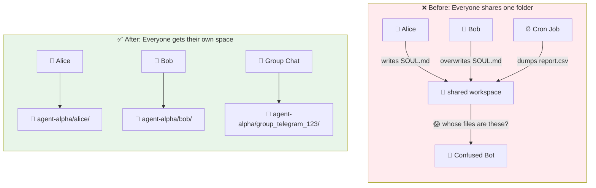
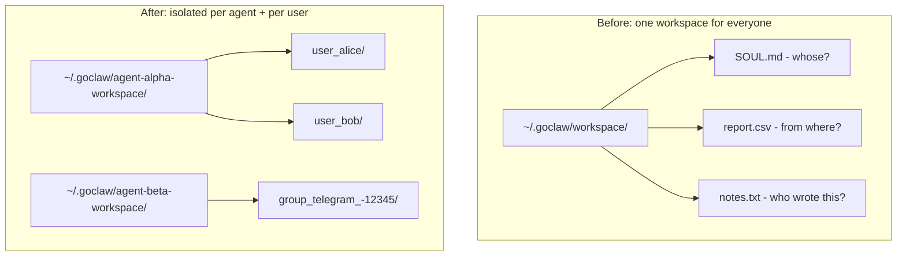
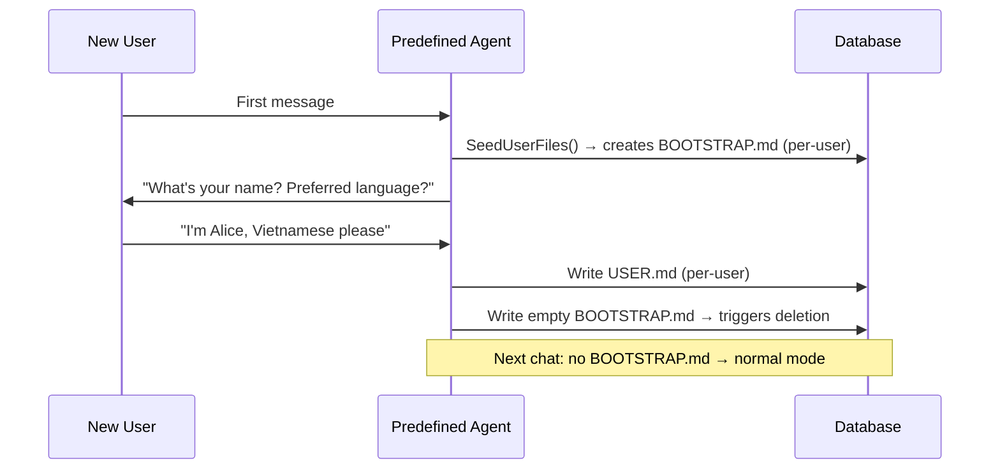
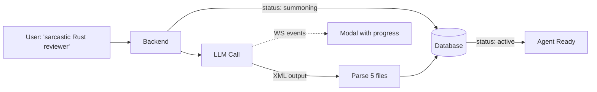

# The Day User A Read User B's Diary

**Date:** 2026-02-23

---

All agents shared one directory: `~/.goclaw/workspace`. Every user, every agent, every file — one big happy folder. User A writes their SOUL.md. User B overwrites it. A scheduled cron job dumps a report and suddenly everyone's workspace has a mystery CSV in it.

In standalone mode (single user, trusted team), this is fine. In managed mode with dozens of users across multiple agents? It's a recipe for data leaks and confused LLMs.

---

## What Changed for Users



| | Before | After |
|---|---|---|
| Alice's SOUL.md | Shared — Bob can overwrite it | Private to Alice |
| Bot's workspace | One folder, everyone's files mixed | Per-user subdirectory |
| Cron job reports | Dumped where everyone can see | Isolated by agent |

---

## Two Levels of "Get Your Own Room"



**Level 1 — Per-agent**: Each agent gets its own base directory (`~/.goclaw/{agent-key}-workspace/`). Agent Alpha's files never mix with Agent Beta's.

**Level 2 — Per-user**: Within each agent, every user (or group) gets a subdirectory. Alice's workspace is `agent-alpha-workspace/user_alice/`, Bob's is `agent-alpha-workspace/user_bob/`.

---

## The Context Injection Pattern

The elegant part: tools are registered once at startup, shared across all agents and users. So how does `read_file` know *whose* workspace to use?

The answer was already in the codebase. Tools like `exec` already read `channel`, `chatID`, and `peerKind` from `context.Context`. We added one more value: `ToolWorkspace`.

```mermaid
sequenceDiagram
    participant REQ as Incoming Request
    participant LOOP as Agent Loop
    participant CTX as context.Context
    participant TOOL as read_file tool

    REQ->>LOOP: UserID = "alice", AgentKey = "alpha"
    LOOP->>LOOP: workspace = base + "/" + sanitize("alice")
    LOOP->>CTX: WithToolWorkspace(ctx, workspace)
    LOOP->>TOOL: Execute(ctx, args)
    TOOL->>CTX: ToolWorkspaceFromCtx(ctx)
    TOOL-->>TOOL: Reads from alice's directory
```

No tool code changed. They just read from context instead of a hardcoded path. Standalone mode still works — the fallback reads from the struct field as before.

---

## The Sanitization Trap

User IDs look like `group:telegram:-1001234567890`. That colon-and-minus salad makes a terrible directory name. We sanitize with a simple rule: anything outside `[a-zA-Z0-9_-]` becomes an underscore.

`group:telegram:-1001234567890` → `group_telegram_-1001234567890`

Boring, but it prevents path traversal, filesystem errors, and cross-platform issues in one stroke.

---

## Predefined Agents Get a Personal Touch

Open agents had `BOOTSTRAP.md` — a first-run ritual where the agent learns the user's name and preferences. Predefined agents (shared context, curated personality) skipped this entirely. Four different code paths conspired to block it:

1. Predefined agents weren't in the seed list for BOOTSTRAP.md
2. `WriteFile()` blocked any non-USER.md writes for predefined agents
3. `ReadFile()` only resolved USER.md per-user
4. `LoadContextFiles()` silently dropped user-only files that didn't exist at agent level

We fixed all four. Now, on first chat with a predefined agent:



The sneakiest bug: the empty-write deletion for BOOTSTRAP.md had to happen *before* the predefined write block in `WriteFile()`. Otherwise the agent could never complete the bootstrap — it would try to delete BOOTSTRAP.md, hit the "no writes for predefined agents" wall, and loop forever.

---

## Agent Summoning — Skip the Paperwork

Creating a predefined agent means manually writing SOUL.md, IDENTITY.md, AGENTS.md, TOOLS.md, and HEARTBEAT.md. Five files, each with specific formatting conventions. Tedious.

With summoning, the user describes what they want in plain language — "a sarcastic code reviewer who loves Rust" — and the LLM generates all five files in one shot.



**Why not give the LLM `write_file`?** The `ContextFileInterceptor` blocks predefined file writes from chat — by design. We could bypass it, but that opens a security hole. Instead: one LLM call with structured XML output, parsed server-side, written directly to the store. One call instead of 5+ tool iterations. Cheaper, faster, more reliable.

If the LLM fails (timeout, bad XML, no provider), the agent falls back to template files and goes active anyway. The user can retry with "Edit with AI" later.

---

## What Changed

| File | What |
|---|---|
| `internal/agent/loop.go` | Compute per-user workspace, inject via `WithToolWorkspace(ctx)` |
| `internal/tools/` | All filesystem tools read workspace from context (fallback to struct field) |
| `internal/bootstrap/seed_store.go` | Seed BOOTSTRAP.md for predefined agents per-user |
| `internal/tools/context_file_interceptor.go` | Allow BOOTSTRAP.md deletion before predefined write block |
| `internal/http/summoner.go` | LLM-powered agent setup with XML parsing |

---

## Takeaway

Isolation is one of those things you don't think about until two users step on each other's files at 3 AM. The fix was mostly plumbing — context injection, path sanitization, seed ordering — but the payoff is massive: every user gets their own little world, and the shared infrastructure never knows the difference.
